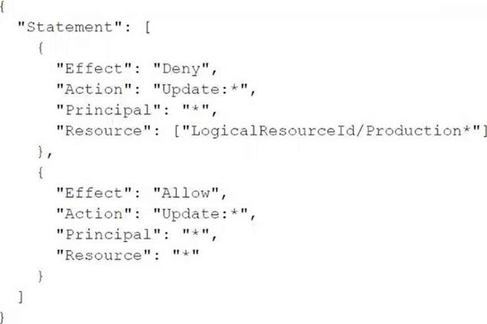
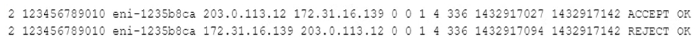
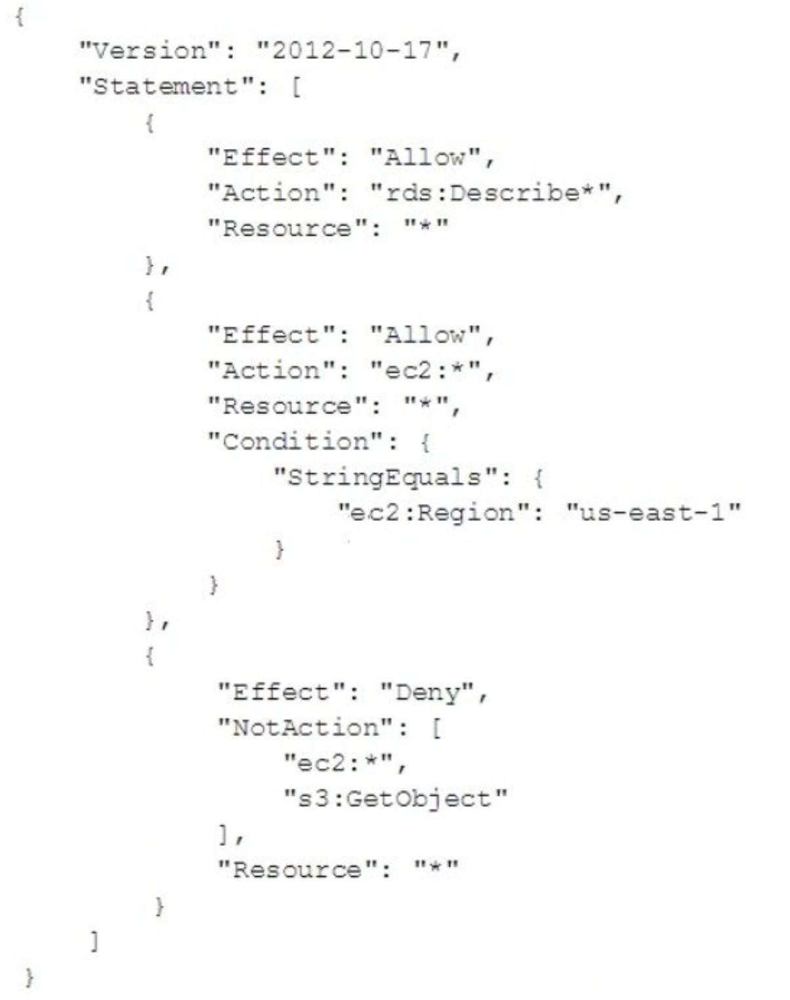
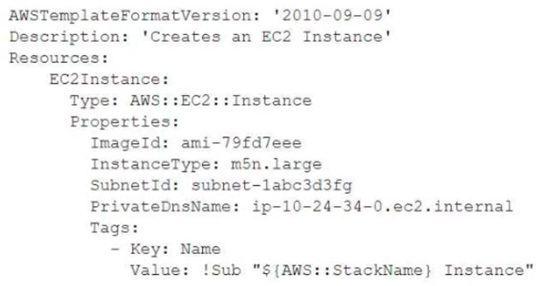
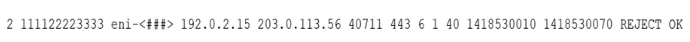

### An Amazon EC2 instance needs to be reachable from the internet. The EC2 instance is in a subnet with the following route table. Which entry must a SysOps administrator add to the route table to meet this requirement?

- [ ] A route for `0.0.0.0/0` that points to a NAT gateway.
- [ ] A route for `0.0.0.0/0` that points to an egress-only internet gateway.
- [x] A route for `0.0.0.0/0` that points to an internet gateway.
- [ ] A route for `0.0.0.0/0` that points to an elastic network interface.

### A SysOps administrator launches an Amazon EC2 instance in a private subnet of a VPC. When the SysOps administrator attempts a curl command from the command line of the EC2 instance, the SysOps administrator cannot connect to https:www.example.com. What should the SysOps administrator do to resolve this issue?

- [x] Ensure that there is an outbound security group for port `443` to `0.0.0.0/0`.
- [ ] Ensure that there is an inbound security group for port `443` from `0.0.0.0/0`.
- [ ] Ensure that there is an outbound network ACL for ephemeral ports `1024-66535` to `0.0.0.0/0`.
- [ ] Ensure that there is an outbound network ACL for port `80` to `0.0.0.0/0`.

### A company's public website is hosted in an Amazon S3 bucket in the `us-east-1` Region behind an Amazon CloudFront distribution. The company wants to ensure that the website is protected from DDoS attacks. A SysOps administrator needs to deploy a solution that gives the company the ability to maintain control over the rate limit at which DDoS protections are applied. Which solution will meet these requirements?

- [x] Deploy a global-scoped AWS WAF web ACL with an allow default action. Configure an AWS WAF rate-based rule to block matching traffic. Associate the web ACL with the CloudFront distribution.
- [ ] Deploy an AWS WAF web ACL with an allow default action in `us-east-1`. Configure an AWS WAF rate-based rule to block matching traffic. Associate the web ACL with the S3 bucket.
- [ ] Deploy a global-scoped AWS WAF web ACL with a block default action. Configure an AWS WAF rate-based rule to allow matching traffic. Associate the web ACL with the CloudFront distribution.
- [ ] Deploy an AWS WAF web ACL with a block default action in `us-east-1`. Configure an AWS WAF rate-based rule to allow matching traffic. Associate the web ACL with the S3 bucket.

### A company hosts an online shopping portal in the AWS Cloud. The portal provides HTTPS security by using a TLS certificate on an Elastic Load Balancer (ELB). Recently, the portal suffered an outage because the TLS certificate expired. A SysOps administrator must create a solution to automatically renew certificates to avoid this issue in the future. What is the MOST operationally efficient solution that meets these requirements?

- [ ] Request a public certificate by using AWS Certificate Manager (ACM). Associate the certificate from ACM with the ELB. Write a scheduled AWS Lambda function to renew the certificate every 18 months.
- [x] Request a public certificate by using AWS Certificate Manager (ACM). Associate the certificate from ACM with the ELB. ACM will automatically manage the renewal of the certificate.
- [ ] Register a certificate with a third-party certificate authority (CA). Import this certificate into AWS Certificate Manager (ACM). Associate the certificate from ACM with the ELB. ACM will automatically manage the renewal of the certificate.
- [ ] Register a certificate with a third-party certificate authority (CA). Configure the ELB to import the certificate directly from the CA. Set the certificate refresh cycle on the ELB to refresh when the certificate is within 3 months of the expiration date.

### With the threat of ransomware viruses encrypting and holding company data hostage, which action should be taken to protect an Amazon S3 bucket?

- [ ] Deny Post. Put. and Delete on the bucket.
- [x] Enable server-side encryption on the bucket.
- [ ] Enable Amazon S3 versioning on the bucket.
- [ ] Enable snapshots on the bucket.

### A company is partnering with an external vendor to provide data processing services. For this integration, the vendor must host the company's data in an Amazon S3 bucket in the vendor's AWS account. The vendor is allowing the company to provide an AWS Key Management Service (AWS KMS) key to encrypt the company's data. The vendor has provided an IAM role Amazon Resources Name (ARN) to the company for this integration. What should a SysOps administrator do to configure this integration?

- [x] Create a new KMS key. Add the vendor's IAM role ARN to the KMS key policy. Provide the new KMS key ARN to the vendor.
- [ ] Create a new KMS key. Create a new IAM user. Add the vendor's IAM role ARN to an inline policy that is attached to the IAM user. Provide the new IAM user ARN to the vendor.
- [ ] Configure encryption using the KMS managed S3 key. Add the vendor's IAM role ARN to the KMS managed S3 key policy. Provide the KMS managed S3 key ARN to the vendor.
- [ ] Configure encryption using the KMS managed S3 key. Create an S3 bucket. Add the vendor's IAM role ARN to the S3 bucket policy. Provide the S3 bucket ARN to the vendor.

### A database is running on an Amazon RDS Multi-AZ DB instance. A recent security audit found the database to be out of compliance because it was not encrypted. Which approach will resolve the encryption requirement?

- [ ] Log in to the RDS console and select the encryption box to encrypt the database.
- [ ] Create a new encrypted Amazon EBS volume and attach it to the instance.
- [ ] Encrypt the standby replica in the secondary Availability Zone and promote it to the primary instance.
- [x] Take a snapshot of the RDS instance, copy and encrypt the snapshot, and then restore to the new RDS instance.

### A SysOps administrator receives an alert from Amazon GuardDuty about suspicious network activity on an Amazon FC2 instance. The GuardDuty finding lists a new external IP address as a traffic destination. The SysOps administrator does not recognize the external IP address. The SysOps administrator must block traffic to the external IP address that GuardDuty identified Which solution will meet this requirement?

- [ ] Create a new security group to block traffic to the external IP address. Assign the new security group to the EC2 instance.
- [ ] Use VPC flow logs with Amazon Athena to block traffic to the external IP address.
- [x] Create a network ACL Add an outbound deny rule tor traffic to the external IP address.
- [ ] Create a new security group to block traffic to the external IP address Assign the new security group to the entire VPC.

### A web application runs on Amazon EC2 instances behind an Application Load Balancer (ALB). The instances run in an Auto Scaling group across multiple Availability Zones. A SysOps administrator notices that some of these EC2 instances show up as healthy in the Auto Scaling group but show up as unhealthy in the ALB target group. What is a possible reason for this issue?

- [ ] Security groups are not allowing traffic between the ALB and the failing EC2 instances.
- [ ] The Auto Scaling group health check is configured for EC2 status checks.
- [ ] The EC2 instances are failing to launch and failing EC2 status checks.
- [x] The target group health check is configured with an incorrect port or path.

### A SysOps administrator has enabled AWS CloudTrail in an AWS account. If CloudTrail is disabled, it must be re-enabled immediately. What should the SysOps administrator do to meet these requirements WITHOUT writing custom code?

- [ ] Add the AWS account to AWS Organizations. Enable CloudTrail in the management account.
- [x] Create an AWS Config rule that is invoked when CloudTrail configuration changes.
Apply the `AWS-ConfigureCloudTrailLogging` automatic remediation action.
- [ ] Create an AWS Config rule that is invoked when CloudTrail configuration changes.
Configure the rule to invoke an AWS Lambda function to enable CloudTrail.
- [ ] Create an Amazon EventBridge (Amazon CloudWatch Events) hourly rule with a schedule pattern to run an AWS Systems Manager Automation document to enable CloudTrail.

### A SysOps administrator needs to give users the ability to upload objects to an Amazon S3 bucket. The SysOps administrator creates a presigned URL and provides the URL to a user, but the user cannot upload an object to the S3 bucket. The presigned URL has not expired, and no bucket policy is applied to the S3 bucket. Which of the following could be the cause of this problem?

- [ ] The user has not properly configured the AWS CLI with their access key and secret access key.
- [x] The SysOps administrator does not have the necessary permissions to upload the object to the S3 bucket.
- [ ] The SysOps administrator must apply a bucket policy to the S3 bucket to allow the user to upload the object.
- [ ] The object already has been uploaded through the use of the presigned URL, so the presigned URL is no longer valid.

### A company runs a web application on three Amazon EC2 instances behind an Application Load Balancer (ALB). The company notices that random periods of increased traffic cause a degradation in the application's performance. A SysOps administrator must scale the application to meet the increased traffic. Which solution meets these requirements?

- [ ] Create an Amazon CloudWatch alarm to monitor application latency and increase the size of each EC2 instance if the desired threshold is reached.
- [ ] Create an Amazon EventBridge (Amazon CloudWatch Events) rule to monitor application latency and add an EC2 instance to the ALB if the desired threshold is reached.
- [x] Deploy the application to an Auto Scaling group of EC2 instances with a target tracking scaling policy. Attach the ALB to the Auto Scaling group.
- [ ] Deploy the application to an Auto Scaling group of EC2 instances with a scheduled scaling policy. Attach the ALB to the Auto Scaling group.

### A company uses an Amazon Elastic File System (Amazon EFS) file system to share files across many Linux Amazon EC2 instances. A SysOps administrator notices that the file system's `PercentIOLimit` metric is consistently at `100%` for 15 minutes or longer. The SysOps administrator also notices that the application that reads and writes to that file system is performing poorly. They application requires high throughput and IOPS while accessing the file system. What should the SysOps administrator do to remediate the consistently high `PercentIOLimit` metric?

- [ ] Create a new EFS file system that uses Max I/O performance mode. Use AWS DataSync to migrate data to the new EFS file system.
- [ ] Create an EFS lifecycle policy to transition future files to the Infrequent Access (IA) storage class to improve performance. Use AWS DataSync to migrate existing data to IA storage.
- [ ] Modify the existing EFS file system and activate Max I/O performance mode.
- [x] Modify the existing EFS file system and activate Provisioned Throughput mode.

### A company needs to restrict access to an Amazon S3 bucket to Amazon EC2 instances in a VPC only. All traffic must be over the AWS private network. What actions should the SysOps administrator take to meet these requirements?

- [ ] Create a VPC endpoint for the S3 bucket, and create an IAM policy that conditionally limits all S3 actions on the bucket to the VPC endpoint as the source.
- [x] Create a VPC endpoint for the S3 bucket, and create an S3 bucket policy that conditionally limits all S3 actions on the bucket to the VPC endpoint as the source.
- [ ] Create a service-linked role for Amazon EC2 that allows the EC2 instances to interact directly with Amazon S3, and attach an IAM policy to the role that allows the EC2 instances full access to the S3 bucket.
- [ ] Create a NAT gateway in the VPC, and modify the VPC route table to route all traffic destined for Amazon S3 through the NAT gateway.

### A company is managing multiple AWS accounts in AWS Organizations. The company is reviewing internal security of its AWS environment. The company's security administrator has their own AWS account and wants to review the VPC configuration of developer AWS accounts. Which solution will meet these requirements in the MOST secure manner?

- [ ] Create an IAM policy in each developer account that has read-only access related to VPC resources Assign the policy to an IAM user. Share the user credentials with the security administrator.
- [ ] Create an IAM policy in each developer account that has administrator access to all Amazon EC2 actions, including VPC actions. Assign the policy to an IAM user. Share the user credentials with the security administrator.
- [ ] Create an IAM policy in each developer account that has administrator access related to
VPC resources. Assign the policy to a cross-account IAM role. Ask the security administrator to assume the role from their account.
- [x] Create an IAM policy in each developer account that has read-only access related to VPC resources. Assign the policy to a cross-account IAM role. Ask the security administrator to assume the role from their account.

### A company migrated an I/O intensive application to an Amazon EC2 general purpose instance. The EC2 instance has a single General Purpose SSD Amazon Elastic Block Store (Amazon EBS) volume attached. Application users report that certain actions that require intensive reading and writing to the disk are taking much longer than normal or are failing completely. After reviewing the performance metrics of the EBS volume, a SysOps administrator notices that the VolumeQueueLength metric is consistently high during the same times in which the users are reporting issues. The SysOps administrator needs to resolve this problem to restore full performance to the application. Which action will meet these requirements?

- [ ] Modify the instance type to be storage optimized.
- [ ] Modify the volume properties by deselecting Auto-Enable Volume 10.
- [x] Modify the volume properties to increase the IOPS.
- [ ] Modify the instance to enable enhanced networking.

### A company has multiple AWS Site-to-Site VPN connections between a VPC and its branch offices. The company manages an Amazon Elasticsearch Service (Amazon ES) domain that is configured with public access. The Amazon ES domain has an open domain access policy. A SysOps administrator needs to ensure that Amazon ES can be accessed only from the branch offices while preserving existing data. Which solution will meet these requirements?

- [ ] Configure an identity-based access policy on Amazon ES. Add an allow statement to the policy that includes the Amazon Resource Name (ARN) for each branch office VPN connection.
- [x] Configure an IP-based domain access policy on Amazon ES. Add an allow statement to the policy that includes the private IP CIDR blocks from each branch office network.
- [ ] Deploy a new Amazon ES domain in private subnets in a VPC, and import a snapshot from the old domain. Create a security group that allows inbound traffic from the branch office CIDR blocks.
- [ ] Reconfigure the Amazon ES domain in private subnets in a VPC. Create a security group that allows inbound traffic from the branch office CIDR blocks.

### A company is managing many accounts by using a single organization in AWS Organizations. The organization has all features enabled. The company wants to turn on AWS Config in all the accounts of the organization and in all AWS Regions. What should a Sysops administrator do to meet these requirements in the MOST operationally efficient way?

- [x] Use AWS CloudFormation StackSets to deploy stack instances that turn on AWS Config in all accounts and in all Regions.
- [ ] Use AWS CloudFormation StackSets to deploy stack policies that turn on AWS Config in all accounts and in all Regions.
- [ ] Use service control policies (SCPs) to configure AWS Config in all accounts and in all Regions.
- [ ] Create a script that uses the AWS CLI to turn on AWS Config in all accounts in the organization. Run the script from the organization's management account.

### A company's SysOps administrator deploys four new Amazon EC2 instances by using the standard Amazon Linux 2 Amazon Machine Image (AMI). The company needs to be able to use AWS Systems Manager to manage the instances The SysOps administrator notices that the instances do not appear in the Systems Manager console. What must the SysOps administrator do to resolve this issue?

- [ ] Connect to each instance by using SSH. Install Systems Manager Agent on each instance. Configure Systems Manager Agent to start automatically when the instances start up.
- [ ] Use AWS Certificate Manager (ACM) to create a TLS certificate. Import the certificate into each instance. Configure Systems Manager Agent to use the TLS certificate for secure communications.
- [ ] Connect to each instance by using SSH. Create an `ssm-user` account. Add the `ssm-user` account to the `/etcsudoers` directory.
- [x] Attach an IAM instance profile to the instances. Ensure that the instance profile contains the `AmazonSSMManagedinstanceCore` policy.

### A development team recently deployed a new version of a web application to production. After the release, penetration testing revealed a cross-site scripting vulnerability that could expose user data. Which AWS service will mitigate this issue?

- [ ] AWS Shield Standard.
- [x] AWS WAF.
- [ ] Elastic Load Balancing.
- [ ] Amazon Cognito.

### An Amazon EC2 instance is running an application that uses Amazon Simple Queue Service (Amazon SQS) queues A SysOps administrator must ensure that the application can read, write, and delete messages from the SQS queues. Which solution will meet these requirements in the MOST secure manner?

- [ ] Create an IAM user with an IAM policy that allows the `sqs:SendMessage` permission, the `sqs:ReceiveMessage` permission, and the `sqs:DeleteMessage` permission to the appropriate queues Embed the IAM user's credentials in the application's configuration.
- [ ] Create an IAM user with an IAM policy that allows the `sqs:SendMessage` permission, the `sqs:ReceiveMessage` permission, and the `sqs:DeleteMessage` permission to the appropriate queues Export the IAM user's access key and secret access key as environment variables on the EC2 instance.
- [ ] Create and associate an IAM role that allows EC2 instances to call AWS services. Attach an IAM policy to the role that allows `sqs:*` permissions to the appropriate queues.
- [x] Create and associate an IAM role that allows EC2 instances to call AWS services. Attach an IAM policy to the role that allows the `sqs:SendMessage` permission, the `sqs:ReceiveMessage` permission, and the `sqs:DeleteMessage` permission to the appropriate queues.

### A company has a policy that requires all Amazon EC2 instances to have a specific set of tags. If an EC2 instance does not have the required tags, the noncompliant instance should be terminated. What is the MOST operationally efficient solution that meets these requirements?

- [ ] Create an Amazon EventBridge (Amazon CloudWatch Events) rule to send all EC2 instance state changes to an AWS Lambda function to determine if each instance is compliant. Terminate any noncompliant instances.
- [ ] Create an IAM policy that enforces all EC2 instance tag requirements. If the required tags are not in place for an instance, the policy will terminate noncompliant instance.
- [ ] Create an AWS Lambda function to determine if each EC2 instance is compliant and terminate an instance if it is noncompliant. Schedule the Lambda function to invoke every 5 minutes.
- [x] Create an AWS Config rule to check if the required tags are present. If an EC2 instance is noncompliant, invoke an AWS Systems Manager Automation document to terminate the instance.

### A SysOps administrator wants to upload a file that is 1 TB in size from on-premises to an Amazon S3 bucket using multipart uploads. What should the SysOps administrator do to meet this requirement?

- [ ] Upload the file using the S3 console.
- [ ] Use the `s3api copy-object` command.
- [x] Use the `s3api put-object` command.
- [ ] Use the `s3 cp` command.

### A SysOps administrator launches an Amazon EC2 Linux instance in a public subnet. When the instance is running, the SysOps administrator obtains the public IP address and attempts to remotely connect to the instance multiple times. However, the SysOps administrator always receives a timeout error. Which action will allow the SysOps administrator to remotely connect to the instance?

- [ ] Add a route table entry in the public subnet for the SysOps administrator's IP address.
- [ ] Add an outbound network ACL rule to allow TCP port `22` for the SysOps administrator's IP address.
- [x] Modify the instance security group to allow inbound SSH traffic from the SysOps administrator's IP address.
- [ ] Modify the instance security group to allow outbound SSH traffic to the SysOps administrator's IP address.

### A company wants to use only IPv6 for all its Amazon EC2 instances. The EC2 instances must not be accessible from the internet, but the EC2 instances must be able to access the internet. The company creates a dual-stack VPC and IPv6-only subnets. How should a SysOps administrator configure the VPC to meet these requirements?

- [ ] Create and attach a NAT gateway. Create a custom route table that includes an entry to point all IPv6 traffic to the NAT gateway. Attach the custom route table to the IPv6-only subnets.
- [ ] Create and attach an internet gateway. Create a custom route table that includes an entry to point all IPv6 traffic to the internet gateway. Attach the custom route table to the IPv6-only subnets.
- [x] Create and attach an egress-only internet gateway. Create a custom route table that includes an entry to point all IPv6 traffic to the egress-only internet gateway. Attach the custom route table to the IPv6-only subnets.
- [ ] Create and attach an internet gateway and a NAT gateway. Create a custom route table that includes an entry to point all IPv6 traffic to the internet gateway and all IPv4 traffic to the NAT gateway. Attach the custom route table to the IPv6-only subnets.

### A SysOps administrator wants to manage a web server application with AWS Elastic Beanstalk. The Elastic Beanstalk service must maintain full capacity for new deployments at all times. Which deployment policies satisfy this requirement? (Select TWO.)

- [ ] All at once.
- [x] Immutable.
- [ ] Rebuild.
- [ ] Rolling.
- [x] Rolling with additional batch.

### A company asks a SysOps administrator to ensure that AWS CloudTrail files are not tampered with after they are created. Currently, the company uses AWS Identity and Access Management (IAM) to restrict access to specific trails. The company's security team needs the ability to trace the integrity of each file. What is the MOST operationally efficient solution that meets these requirements?

- [ ] Create an Amazon EventBridge (Amazon CloudWatch Events) rule that invokes an AWS Lambda function when a new file is delivered. Configure the Lambda function to compute an MD5 hash check on the file and store the result in an Amazon DynamoDB table. The security team can use the values that are stored in DynamoDB to verify the integrity of the delivered files.
- [ ] Create an AWS Lambda function that is invoked each time a new file is delivered to the CloudTrail bucket. Configure the Lambda function to compute an MD5 hash check on the file and store the result as a tag in an Amazon S3 object. The security team can use the information in the tag to verify the integrity of the delivered files.
- [ ] Enable the CloudTrail file integrity feature on an Amazon S3 bucket. Create an IAM policy that grants the security team access to the file integrity logs that are stored in the S3 bucket.
- [x] Enable the CloudTrail file integrity feature on the trail. The security team can use the digest file that is created by CloudTrail to verify the integrity of the delivered files.

### A company has multiple Amazon EC2 instances that run a resource-intensive application in a development environment. A SysOps administrator is implementing a solution to stop these EC2 instances when they are not in use. Which solution will meet this requirement?

- [ ] Assess AWS CloudTrail logs to verify that there is no EC2 API activity. Invoke an AWS Lambda function to stop the EC2 instances.
- [x] Create an Amazon CloudWatch alarm to stop the EC2 instances when the average CPU utilization is lower than `5%` for a 30-minute period.
- [ ] Create an Amazon CloudWatch metric to stop the EC2 instances when the `VolumeReadBytes` metric is lower than `500` for a 30-minute period.
- [ ] Use AWS Config to invoke an AWS Lambda function to stop the EC2 instances based on resource configuration changes.

### A company creates custom AMI images by launching new Amazon EC2 instances from an AWS CloudFormation template it installs and configure necessary software through AWS OpsWorks and takes images of each EC2 instance. The process of installing and configuring software can take between 2 to 3 hours but at times the process stalls due to installation errors. The SysOps administrator must modify the CloudFormation template so if the process stalls, the entire stack will fail and roll back. Based on these requirements what should be added to the template?

- [ ] `Conditions` with a timeout set to 4 hours.
- [x] `CreationPolicy` with timeout set to 4 hours.
- [ ] `DependsOn` a timeout set to 4 hours.
- [ ] `Metadata` with a timeout set to 4 hours.

### A company plans to run a public web application on Amazon EC2 instances behind an Elastic Load Balancer (ELB). The company's security team wants to protect the website by using AWS Certificate Manager (ACM) certificates. The ELB must automatically redirect any HTTP requests to HTTPS. Which solution will meet these requirements?

- [ ] Create an Application Load Balancer that has one HTTPS listener on port `80`. Attach an SSL/TLS certificate to listener port `80`. Create a rule to redirect requests from HTTP to HTTPS.
- [x] Create an Application Load Balancer that has one HTTP listener on port `80` and one HTTPS protocol listener on port `443`. Attach an SSL/TLS certificate to listener port `443`. Create a rule to redirect requests from port `80` to port `443`.
- [ ] Create an Application Load Balancer that has two TCP listeners on port `80` and port `443`. Attach an SSL/TLS certificate to listener port `443`. Create a rule to redirect requests from port `80` to port `443`.
- [ ] Create a Network Load Balancer that has two TCP listeners on port `80` and port `443`. Attach an SSL/TLS certificate to listener port `443`. Create a rule to redirect requests from port `80` to port `443`.

### A SysOps administrator is responsible for a legacy CPU-heavy application. The application can only be scaled vertically. Currently, the application is deployed on a single t2 large Amazon EC2 instance. The system is showing `90%` CPU usage and significant performance latency after a few minutes. What change should be made to alleviate the performance problem?

- [ ] Change the Amazon EBS volume to Provisioned IOPS.
- [x] Upgrade to a compute-optimized instance.
- [ ] Add additional `t2.large` instances to the application.
- [ ] Purchase Reserved Instances.

### A company recently migrated its application to a VPC on AWS. An AWS Site-to-Site VPN connection connects the company's on-premises network to the VPC. The application retrieves customer data from another system that resides on premises. The application uses an on-premises DNS server to resolve domain records. After the migration, the application is not able to connect to the customer data because of name resolution errors. Which solution will give the application the ability to resolve the internal domain names?

- [ ] Launch EC2 instances in the VPC. On the EC2 instances, deploy a custom DNS forwarder that forwards all DNS requests to the on-premises DNS server. Create an Amazon Route 53 private hosted zone that uses the EC2 instances for name servers.
- [x] Create an Amazon Route 53 Resolver outbound endpoint. Configure the outbound endpoint to forward DNS queries against the on-premises domain to the on-premises DNS server.
- [ ] Set up two AWS Direct Connect connections between the AWS environment and the on-premises network. Set up a link aggregation group (LAG) that includes the two connections. Change the VPC resolver address to point to the on-premises DNS server.
- [ ] Create an Amazon Route 53 public hosted zone for the on-premises domain. Configure the network ACLs to forward DNS requests against the on-premises domain to the Route 53 public hosted zone.

### A SysOps administrator creates a new VPC that includes a public subnet and a private subnet. The SysOps administrator successfully launches 11 Amazon EC2 instances in the private subnet. The SysOps administrator attempts to launch one more EC2 instance in the same subnet. However, the SysOps administrator receives an error message that states that not enough free IP addresses are available. What must the SysOps administrator do to deploy more EC2 instances?

- [ ] Edit the private subnet to change the CIDR block to `/27`.
- [ ] Edit the private subnet to extend across a second Availability Zone.
- [ ] Assign additional Elastic IP addresses to the private subnet.
- [x] Create a new private subnet to hold the required EC2 instances.

### A company has a critical serverless application that uses multiple AWS Lambda functions. Each Lambda function generates 1 GB of log data daily in its own Amazon CloudWatch Logs log group. The company's security team asks for a count of application errors, grouped by type, across all of the log groups. What should a SysOps administrator do to meet this requirement?

- [x] Perform a CloudWatch Logs Insights query that uses the stats command and count function.
- [ ] Perform a CloudWatch Logs search that uses the groupby keyword and count function.
- [ ] Perform an Amazon Athena query that uses the SELECT and GROUP BY keywords.
- [ ] Perform an Amazon RDS query that uses the SELECT and GROUP BY keywords.

### A SysOps administrator applies the following policy to an AWS CloudFormation stack. What is the result of this policy?

- [ ] Users that assume an IAM role with a logical ID that begins with "Production" are prevented from running the update-stack command.
- [x] Users can update all resources in the stack except for resources that have a logical ID that begins with "Production".
- [ ] Users can update all resources in the stack except for resources that have an attribute that begins with "Production".
- [ ] Users in an IAM group with a logical ID that begins with "Production" are prevented from running the update-stack command.

### A SysOps administrator is deploying an application on 10 Amazon EC2 instances. The application must be highly available. The instances must be placed on distinct underlying hardware. What should the SysOps administrator do to meet these requirements?

- [ ] Launch the instances into a cluster placement group in a single AWS Region.
- [ ] Launch the instances into a partition placement group in multiple AWS Regions.
- [ ] Launch the instances into a spread placement group in multiple AWS Regions.
- [x] Launch the instances into a spread placement group in single AWS Region.

### A company is running a website on Amazon EC2 instances that are in an Auto Scaling group. When the website traffic increases, additional instances take several minutes to become available because of a long-running user data script that installs software. A SysOps administrator must decrease the time that is required for new instances to become available. Which action should the SysOps administrator take to meet this requirement?

- [ ] Reduce the scaling thresholds so that instances are added before traffic increases.
- [ ] Purchase Reserved Instances to cover `100%`of the maximum capacity of the Auto Scaling group.
- [ ] Update the Auto Scaling group to launch instances that have a storage optimized instance type.
- [x] Use EC2 Image Builder to prepare an Amazon Machine Image (AMI) that has pre-installed software.

### A SysOps administrator has launched a large general purpose Amazon EC2 instance to regularly process large data files. The instance has an attached 1 TB General Purpose SSD (gp2) Amazon Elastic Block Store (Amazon EBS) volume. The instance also is EBS-optimized. To save costs, the SysOps administrator stops the instance each evening and restarts the instance each morning. When data processing is active, Amazon CloudWatch metrics on the instance show a consistent 3.000 VolumeReadOps. The SysOps administrator must improve the I/O performance while ensuring data integrity. Which action will meet these requirements?

- [ ] Change the instance type to a large, burstable, general purpose instance.
- [ ] Change the instance type to an extra large general purpose instance.
- [ ] Increase the EBS volume to a 2 TB General Purpose SSD (gp2) volume.
- [x] Move the data that resides on the EBS volume to the instance store.

### A company runs workloads on 90 Amazon EC2 instances in the `eu-west-1` Region in an AWS account. In 2 months, the company will migrate the workloads from `eu-west-1` to the `eu-west-3` Region. The company needs to reduce the cost of the EC2 instances. The company is willing to make a 1-year commitment that will begin next week. The company must choose an EC2 Instance purchasing option that will provide discounts for the 90 EC2 Instances regardless of Region during the 1-year period. Which solution will meet these requirements?

- [ ] Purchase EC2 Standard Reserved Instances.
- [ ] Purchase an EC2 Instance Savings Plan.
- [ ] Purchase EC2 Convertible Reserved Instances.
- [x] Purchase a Compute Savings Plan.

### A company uses Amazon Elasticsearch Service (Amazon ES) to analyze sales and customer usage data. Members of the company's geographically dispersed sales team are traveling. They need to log in to Kibana by using their existing corporate credentials that are stored in Active Directory. The company has deployed Active Directory Federation Services (AD FS) to enable authentication to cloud services. Which solution will meet these requirements?

- [ ] Configure Active Directory as an authentication provider in Amazon ES. Add the Active Directory server's domain name to Amazon ES. Configure Kibana to use Amazon ES authentication.
- [x] Deploy an Amazon Cognito user pool. Configure Active Directory as an external identity provider for the user pool. Enable Amazon Cognito authentication for Kibana on Amazon ES.
- [ ] Enable Active Directory user authentication in Kibana. Create an IP-based custom domain access policy in Amazon ES that includes the Active Directory server's IP address.
- [ ] Establish a trust relationship with Kibana on the Active Directory server. Enable Active Directory user authentication in Kibana. Add the Active Directory server's IP address to Kibana.

### A company uses AWS Organizations. A SysOps administrator wants to use AWS Compute Optimizer and AWS tag policies in the management account to govern all member accounts in the billing family. The SysOps administrator navigates to the AWS Organizations console but cannot activate tag policies through the management account. What could be the reason for this issue?

- [x] All features have not been enabled in the organization.
- [ ] Consolidated billing has not been enabled.
- [ ] The member accounts do not have tags enabled for cost allocation.
- [ ] The member accounts have not manually enabled trusted access for Compute Optimizer.

### A SysOps administrator is attempting to download patches from the internet into an instance in a private subnet. An internet gateway exists for the VPC, and a NAT gateway has been deployed on the public subnet; however, the instance has no internet connectivity. The resources deployed into the private subnet must be inaccessible directly from the public internet. Public Subnet `(10.0.1.0/24)` Route Table: `Destination` - `Target`. `10.0.0.0/16` - `local`. `0.0.0.0/0` - `IGW`. Private Subnet (`10.0.2.0/24`) Route Table: `Destination` `Target`. `10.0.0.0/16` - `local`. What should be added to the private subnet's route table in order to address this issue, given the information provided?

- [ ] `0.0.0.0/0` IGW.
- [x] `0.0.0.0/0` NAT.
- [ ] `10.0.1.0/24` IGW.
- [ ] `10.0.1.0/24` NAT.

### A company has a stateless application that is hosted on a fleet of 10 Amazon EC2 On-Demand Instances in an Auto Scaling group. A minimum of 6 instances are needed to meet service requirements. Which action will maintain uptime for the application MOST cost-effectively?

- [x] Use a Spot Fleet with an On-Demand capacity of 6 instances.
- [ ] Update the Auto Scaling group with a minimum of 6 On-Demand Instances and a maximum of 10 On-Demand Instances.
- [ ] Update the Auto Scaling group with a minimum of 1 On-Demand Instance and a maximum of 6 On-Demand Instances.
- [ ] Use a Spot Fleet with a target capacity of 6 instances.

### A large company is using AWS Organizations to manage its multi-account AWS environment. According to company policy, all users should have read-level access to a particular Amazon S3 bucket in a central account. The S3 bucket data should not be available outside the organization. A SysOps administrator must set up the permissions and add a bucket policy to the S3 bucket. Which parameters should be specified to accomplish this in the MOST efficient manner?

- [x] Specify `"'` as the principal and `PrincipalOrgld` as a condition.
- [ ] Specify all account numbers as the principal.
- [ ] Specify `PrincipalOrgld` as the principal.
- [ ] Specify the organization's management account as the principal.

### SysOps administrator needs to create alerts that are based on the read and write metrics of Amazon Elastic Block Store (Amazon EBS) volumes that are attached to an Amazon EC2 instance. The SysOps administrator creates and enables Amazon CloudWatch alarms for the DiskReadBytes metric and the DiskWriteBytes metric. A custom monitoring tool that is installed on the EC2 instance with the same alarm configuration indicates that the volume metrics have exceeded the threshold. However, the CloudWatch alarms were not in ALARM state. Which action will ensure that the CloudWatch alarms function correctly?

- [ ] Install and configure the CloudWatch agent on the EC2 instance to capture the desired metrics.
- [ ] Install and configure AWS Systems Manager Agent on the EC2 instance to capture the desired metrics.
- [x] Reconfigure the CloudWatch alarms to use the `VolumeReadBytes` metric and the `VolumeWriteBytes` metric for the EBS volumes.
- [ ] Reconfigure the CloudWatch alarms to use the `VolumeReadBytes` metric and the `VolumeWriteBytes` metric for the EC2 instance.

### A company updates its security policy to prohibit the public exposure of any data in Amazon S3 buckets in the company's account. What should a SysOps administrator do to meet this requirement?

- [x] Turn on S3 Block Public Access from the account level.
- [ ] Create an Amazon Event Bridge (Amazon CloudWatch Events) rule to enforce that all S3 objects are private.
- [ ] Use Amazon Inspector to search for S3 buckets and to automatically reset S3 ACLs if any public S3 buckets are found.
- [ ] Use S3 Object Lambda to examine S3 ACLs and to change any public S3 ACLs to private.

### An Amazon S3 Inventory report reveals that more than 1 million objects in an S3 bucket are not encrypted These objects must be encrypted, and all future objects must be encrypted at the time they are written. Which combination of actions should a SysOps administrator take to meet these requirements? (Select TWO)

- [ ] Create an AWS Config rule that runs evaluations against configuration changes to the S3 bucket. When an unencrypted object is found run an AWS Systems Manager Automation document to encrypt the object in place.
- [x] Edit the properties of the S3 bucket to enable default server-side encryption.
- [x] Filter the S3 Inventory report by using S3 Select to find all objects that are not encrypted. Create an S3 Batch Operations job to copy each object in place with en cryption enabled.
- [ ] Filter the S3 Inventory report by using S3 Select to find all objects that are not encrypted. Send each object name as a message to an Amazon Simple Queue Service (Amazon SQS) queue. Use the SQS queue to invoke an AWS Lambda function to tag each object with a key of "Encryption" and a value of "SSE-KMS"
- [ ] Use S3 Event Notifications to invoke an AWS Lambda function on all new object-created events for the S3 bucket. Configure the Lambda function to check whether the object is encrypted and to run an AWS Systems Manager Automation document to encrypt the object in place when an unencrypted object is found.

### A web application runs on Amazon EC2 instances behind an Elastic Load Balancing Application Load Balancer (ALB). The instances run in an Auto Scaling group across multiple Availability Zones. A SysOps Administrator has notice that some EC2 instances show up healthy in the Auto Scaling console but show up as unhealthy in the ALB target console. What could be the issue?

- [ ] The health check grace period for the Auto Scaling group is set too low; increase it.
- [ ] The target group health check is incorrectly configured and needs to be adjusted.
- [ ] The user data or AMI used for the Auto Scaling group launch configuration is incorrect.
- [x] The Auto Scaling group health check type is based on EC2 instance health instead of Elastic Load Balancing health checks.

### An application accesses data through a file system interface. The application runs on Amazon EC2 instances in multiple Availability Zones, all of which must share the same data. While the amount of data is currently small, the company anticipates that it will grow to tens of terabytes over the lifetime of the application. What is the MOST scalable storage solution to fulfill this requirement?

- [ ] Connect a large Amazon EBS volume to multiple instances and schedule snapshots.
- [x] Deploy Amazon EFS in the VPC and create mount targets in multiple subnets.
- [ ] Launch an EC2 instance and share data using SMB/CIFS or NFS.
- [ ] Deploy an AWS Storage Gateway cached volume on Amazon EC2.

### A company is expanding its use of AWS services across its portfolios. The company wants to provision AWS accounts for each team to ensure a separation of business processes for security compliance and billing. Account creation and bootstrapping should be completed in a scalable and efficient way so new accounts are created with a defined baseline and governance guardrails in place. A SysOps administrator needs to design a provisioning process that saves time and resources. Which action should be taken to meet these requirements?

- [ ] Automate using AWS Elastic Beanstalk to provision the AWS accounts set up infrastructure and integrate with AWS Organizations.
- [ ] Create bootstrapping scripts in AWS OpsWorks and combine them with AWS CloudFormation templates to provision accounts and infrastructure.
- [ ] Use AWS Config to provision accounts and deploy instances using AWS Service Catalog.
- [x] Use AWS Control Tower to create a template in Account Factory and use the template to provision new accounts.

### A company hosts a web portal on Amazon EC2 instances. The web portal uses an Elastic Load Balancer (ELB) and Amazon Route 53 for its public DNS service. The ELB and the EC2 instances are deployed by way of a single AWS CloudFormation stack in the `us-east-1` Region. The web portal must be highly available across multiple Regions. Which configuration will meet these requirements?

- [ ] Deploy a copy of the stack in the `us-west-2` Region. Create a single start of authority (SOA) record in Route 53 that includes the IP address from each ELB. Configure the `SOA` record with health checks. Use the ELB in `us-east-1` as the primary record and the ELB in `us-west-2` as the secondary record.
- [x] Deploy a copy of the stack in the `us-west-2` Region. Create an additional `A` record in Route 53 that includes the ELB in `us-west-2` as an alias target. Configure the A records with a failover routing policy and health checks. Use the ELB in `us-east-1` as the primary record and the ELB in `us-west-2` as the secondary record.
- [ ] Deploy a new group of EC2 instances in the `us-west-2` Region. Associate the new EC2 instances with the existing ELB, and configure load balancer health checks on all EC2 instances. Configure the ELB to update Route 53 when EC2 instances in `us-west-2` fail health checks.
- [ ] Deploy a new group of EC2 instances in the `us-west-2` Region. Configure EC2 health checks on all EC2 instances in each Region. Configure a peering connection between the VPCs. Use the VPC in `us-east-1` as the primary record and the VPC in `us-west-2` as the secondary record.

### A company needs to view a list of security groups that are open to the internet on port `3389`. What should a SysOps administrator do to meet this requirement?

- [ ] Configure Amazon GuardDuty to scan security groups and report unrestricted access on port `3389`.
- [ ] Configure a service control policy (SCP) to identify security groups that allow unrestricted access on port `3389`.
- [ ] Use AWS Identity and Access Management Access Analyzer to find any instances that have unrestricted access on port `3389`.
- [x] Use AWS Trusted Advisor to find security groups that allow unrestricted access on port `3389`.

### A company has an AWS Site-to-Site VPN connection between on-premises resources and resources that are hosted in a VPC. A SysOps administrator launches an Amazon EC2 instance that has only a private IP address into a private subnet in the VPC. The EC2 instance runs Microsoft Windows Server. A security group for the EC2 instance has rules that allow inbound traffic from the on-premises network over the VPN connection. The on-premises environment contains a third-party network firewall. Rules in the third-party network firewall allow Remote Desktop Protocol (RDP) traffic to flow between the on-premises users over the VPN connection. The on-premises users are unable to connect to the EC2 instance and receive a timeout error. What should the SysOps administrator do to troubleshoot this issue?

- [ ] Create Amazon CloudWatch logs for the EC2 instance to check for blocked traffic.
- [ ] Create Amazon CloudWatch logs for the Site-to-Site VPN connection to check for blocked traffic.
- [x] Create VPC flow logs for the EC2 instance's elastic network interface to check for rejected traffic.
- [ ] Instruct users to use EC2 Instance Connect as a connection method.

### A recent organizational audit uncovered an existing Amazon RDS database that is not currently configured for high availability. Given the critical nature of this database, it must be configured for high availability as soon as possible. How can this requirement be met?

- [ ] Switch to an active/passive database pair using the `create-db-instance-read-replica` with the `–availability-zone` flag.
- [ ] Specify high availability when creating a new RDS instance, and `live-migrate` the data.
- [x] Modify the RDS instance using the console to include the Multi-AZ option.
- [ ] Use the `modify-db-instance` command with the `–na` flag.

### A SysOps administrator is deploying a test site running on Amazon EC2 instances. The application requires both incoming and outgoing connectivity to the internet. Which combination of steps are required to provide internet connectivity to the EC2 instances? (Choose two.)

- [ ] Add a NAT gateway to a public subnet.
- [ ] Attach a private address to the elastic network interface on the EC2 instance.
- [ ] Attach an Elastic IP address to the internet gateway.
- [x] Add an entry to the route table for the subnet that points to an internet gateway.
- [x] Create an internet gateway and attach it to a VPC.

### A company is testing Amazon Elasticsearch Service (Amazon ES) as a solution for analyzing system logs from a fleet of Amazon EC2 instances. During the test phase, the domain operates on a single-node cluster. A SysOps administrator needs to transition the test domain into a highly available production-grade deployment. Which Amazon ES configuration should the SysOps administrator use to meet this requirement?

- [ ] Use a cluster of four data nodes across two AWS Regions. Deploy four dedicated master nodes in each Region.
- [x] Use a cluster of six data nodes across three Availability Zones. Use three dedicated master nodes.
- [ ] Use a cluster of six data nodes across three Availability Zones. Use six dedicated master nodes.
- [ ] Use a cluster of eight data nodes across two Availability Zones. Deploy four master nodes in a failover AWS Region.

### A SysOps administrator is investigating why a user has been unable to use RDP to connect over the internet from their home computer to a bastion server running on an Amazon EC2 Windows instance. Which of the following are possible causes of this issue? (Choose two.)

- [x] A network ACL associated with the bastion's subnet is blocking the network traffic.
- [ ] The instance does not have a private IP address.
- [x] The route table associated with the bastion's subnet does not have a route to the internet gateway.
- [ ] The security group for the instance does not have an inbound rule on port `22`.
- [ ] The security group for the instance does not have an outbound rule on port `3389`.

### While securing the connection between a company's VPC and its on-premises data center, a security engineer sent a ping command from an on-premises host (IP address `203.0.113.12`) to an Amazon EC2 instance (IP address `172.31.16.139`). The ping command did not return a response. The flow log in the VPC showed the following. What action should be performed to allow the ping to work?

- [ ] In the security group of the EC2 instance, allow inbound ICMP traffic.
- [ ] In the security group of the EC2 instance, allow outbound ICMP traffic.
- [ ] In the VPC's NACL, allow inbound ICMP traffic.
- [x] In the VPC's NACL, allow outbound ICMP traffic.

### A global company handles a large amount of personally identifiable information (Pll) through an internal web portal. The company's application runs in a corporate data center that is connected to AWS through an AWS Direct Connect connection. The application stores the Pll in Amazon S3. According to a compliance requirement, traffic from the web portal to Amazon S3 must not travel across the internet. What should a SysOps administrator do to meet the compliance requirement?

- [x] Provision an interface VPC endpoint for Amazon S3. Modify the application to use the interface endpoint.
- [ ] Configure AWS Network Firewall to redirect traffic to the internal S3 address.
- [ ] Modify the application to use the S3 path-style endpoint.
- [ ] Set up a range of VPC network ACLs to redirect traffic to the Internal S3 address.

### An application runs on multiple Amazon EC2 instances in an Auto Scaling group The Auto Scaling group is configured to use the latest version of a launch template A SysOps administrator must devise a solution that centrally manages the application logs and retains the logs for no more than 90 days. Which solution will meet these requirements?

- [ ] Launch an Amazon Machine Image (AMI) that is preconfigured with the Amazon CloudWatch Logs agent to send logs to an Amazon S3 bucket. Apply a 90-day S3 Lifecycle policy on the S3 bucket to expire the application logs.
- [ ] Launch an Amazon Machine Image (AMI) that is preconfigured with the Amazon CloudWatch Logs agent to send logs to a log group. Create an Amazon EventBridge (Amazon CloudWatch Events) scheduled rule to perform an instance refresh every 90 days.
- [x] Update the launch template user data to install and configure the Amazon CloudWatch Logs agent to send logs to a log group. Configure the retention period on the log group to be 90 days.
- [ ] Update the launch template user data to install and configure the Amazon CloudWatch Logs agent to send logs to a log group. Set the log rotation configuration of the EC2 instances to 90 days.

### A company is running a flash sale on its website. The website is hosted on burstable performance Amazon EC2 instances in an Auto Scaling group. The Auto Scaling group is configured to launch instances when the CPU utilization is above `70%`. A couple of hours into the sale, users report slow load times and error messages for refused connections. A SysOps administrator reviews Amazon CloudWatch metrics and notices that the CPU utilization is at `20%` across the entire fleet of instances. The SysOps administrator must restore the website's functionality without making changes to the network infrastructure. Which solution will meet these requirements?

- [x] Activate unlimited mode for the instances in the Auto Scaling group.
- [ ] Implement an Amazon CloudFront distribution to offload the traffic from the Auto Scaling group.
- [ ] Move the website to a different AWS Region that is closer to the users.
- [ ] Reduce the desired size of the Auto Scaling group to artificially increase CPU average utilization.

### A company has attached the following policy to an IAM user. Which of the following actions are allowed for the IAM user?

- [ ] Amazon RDS `DescribeDBInstances` action in the `us-east-1` Region.
- [ ] Amazon S3 `Putobject` operation in a bucket named testbucket.
- [x] Amazon EC2 `DescribeInstances` action in the `us-east-1` Region.
- [ ] Amazon EC2 `AttachNetworkinterface` action in the `eu-west-1` Region.

### A company has launched a social media website that gives users the ability to upload images directly to a centralized Amazon S3 bucket. The website is popular in areas that are geographically distant from the AWS Region where the S3 bucket is located. Users are reporting that uploads are slow. A SysOps administrator must improve the upload speed. What should the SysOps administrator do to meet these requirements?

- [ ] Create S3 access points in Regions that are closer to the users.
- [ ] Create an accelerator in AWS Global Accelerator for the S3 bucket.
- [x] Enable S3 Transfer Acceleration on the S3 bucket.
- [ ] Enable cross-origin resource sharing (CORS) on the S3 bucket.

### A SysOps administrator is using AWS Systems Manager Patch Manager to patch a fleet of Amazon EC2 instances. The SysOps administrator has configured a patch baseline and a maintenance window. The SysOps administrator also has used an instance tag to identify which instances to patch. The SysOps administrator must give Systems Manager the ability to access the EC2 instances. Which additional action must the SysOps administrator perform to meet this requirement?

- [ ] Add an inbound rule to the instances' security group.
- [x] Attach an IAM instance profile with access to Systems Manager to the instances.
- [ ] Create a Systems Manager activation Then activate the fleet of instances.
- [ ] Manually specify the instances to patch Instead of using tag-based selection.

### A company is using Amazon Elastic Container Sen/ice (Amazon ECS) to run a containerized application on Amazon EC2 instances. A SysOps administrator needs to monitor only traffic flows between the ECS tasks. Which combination of steps should the SysOps administrator take to meet this requirement? (Select TWO.)

- [ ] Configure Amazon CloudWatch Logs on the elastic network interface of each task.
- [x] Configure VPC Flow Logs on the elastic network interface of each task.
- [x] Specify the `awsvpc` network mode in the task definition.
- [ ] Specify the `bridge` network mode in the task definition.
- [ ] Specify the `host` network mode in the task definition.

### A company has a mobile app that uses Amazon S3 to store images The images are popular for a week, and then the number of access requests decreases over time The images must be highly available and must be immediately accessible upon request A SysOps administrator must reduce S3 storage costs for the company. Which solution will meet these requirements MOST cost-effectively?

- [ ] Create an S3 Lifecycle policy to transition the images to S3 Glacier after 7 days.
- [ ] Create an S3 Lifecycle policy to transition the images to S3 One Zone-Infrequent Access (S3 One Zone-IA) after 7 days.
- [ ] Create an S3 Lifecycle policy to transition the images to S3 Standard after 7 days.
- [x] Create an S3 Lifecycle policy to transition the images to S3 Standard-Infrequent Access (S3 Standard-IA) after 7 days.

### A SysOps administrator is unable to authenticate an AWS CLI call to an AWS service. Which of the following is the cause of this issue?

- [ ] The IAM password is incorrect.
- [ ] The server certificate is missing.
- [ ] The SSH key pair is incorrect.
- [x] There is no access key.

### A SysOps administrator is setting up a fleet of Amazon EC2 instances in an Auto Scaling group for an application. The fleet should have `50%` CPU available at that times to accommodate bursts of traffic. The load will increase significantly between the hours of 09:00 and 17:00,7 days a week. How should the SysOps adminiAstrator configure the scaling of the EC2 instances to meet these requirements?

- [ ] Create a target tracking scaling policy that runs when the CPU utilization is higher than `90%`.
- [x] Create a target tracking scaling policy that runs when the CPU utilization is higher than `50%`. Create a scheduled scaling policy that ensures that the fleet is available at 09:00 Create a second scheduled scaling policy that scales in the fleet at 17:00.
- [ ] Set the Auto Scaling group to start with 2 instances by setting the desired instances maximum instances, and minimum instances to 2 Create a scheduled scaling policy that ensures that the fleet is available at 09:00.
- [ ] Create a scheduled scaling policy that ensures that the fleet is available at 09.00. Create a second scheduled scaling policy that scales in the fleet at 17:00.

### A SysOps administrator has created an AWS Service Catalog portfolio and has shared the portfolio with a second AWS account in the company. The second account is controlled by a different administrator. Which action will the administrator of the second account be able to perform?

- [x] Add a product from the imported portfolio to a local portfolio.
- [ ] Add new products to the imported portfolio.
- [ ] Change the launch role for the products contained in the imported portfolio.
- [ ] Customize the products in the imported portfolio.

### A company uses AWS Organizations to manage multiple AWS accounts with consolidated billing enabled. Organization member account owners want the benefits of Reserved Instances (RIs) but do not want to share RIs with other accounts. Which solution will meet these requirements?

- [x] Purchase RIs in individual member accounts. Disable RI discount sharing in the management account.
- [ ] Purchase RIs in individual member accounts. Disable RI discount sharing in the member accounts.
- [ ] Purchase RIs in the management account. Disable RI discount sharing in the management account.
- [ ] Purchase RIs in the management account. Disable RI discount sharing in the member accounts.

### A gaming application is deployed on four Amazon EC2 instances in a default VPC. The SysOps administrator has noticed consistently high latency in responses as data is transferred among the four instances. There is no way for the administrator to alter the application code. The MOST effective way to reduce latency is to relaunch the EC2 instances in:

- [ ] Dedicated VPC.
- [ ] Single subnet inside the VPC.
- [x] Placement group.
- [ ] Single Availability Zone.

### A company has a stateful web application that is hosted on Amazon EC2 instances in an Auto Scaling group. The instances run behind an Application Load Balancer (ALB) that has a single target group. The ALB is configured as the origin in an Amazon CloudFront distribution. Users are reporting random logouts from the web application. Which combination of actions should a SysOps administrator take to resolve this problem? (Select TWO.)

- [ ] Change to the least outstanding requests algorithm on the ALB target group.
- [x] Configure cookie forwarding in the CloudFront distribution cache behavior.
- [ ] Configure header forwarding in the CloudFront distribution cache behavior.
- [ ] Enable group-level stickiness on the ALB listener rule.
- [x] Enable sticky sessions on the ALB target group.

### A SysOps administrator is investigating a company's web application for performance problems. The application runs on Amazon EC2 instances that are in an Auto Scaling group. The application receives large traffic increases at random times throughout the day. During periods of rapid traffic increases, the Auto Scaling group is not adding capacity fast enough. As a result, users are experiencing poor performance. The company wants to minimize costs without adversely affecting the user experience when web traffic surges quickly. The company needs a solution that adds more capacity to the Auto Scaling group for larger traffic increases than for smaller traffic increases. How should the SysOps administrator configure the Auto Scaling group to meet these requirements?

- [ ] Create a simple scaling policy with settings to make larger adjustments in capacity when the system is under heavy load.
- [x] Create a step scaling policy with settings to make larger adjustments in capacity when the system is under heavy load.
- [ ] Create a target tracking scaling policy with settings to make larger adjustments in capacity when the system is under heavy load.
- [ ] Use Amazon EC2 Auto Scaling lifecycle hooks. Adjust the Auto Scaling group's maximum number of instances after every scaling event.

### A VPC is connected to a company data center by a VPN. An Amazon EC2 instance with the IP address `172.31.16.139` is within a private subnet of the VPC. A SysOps Administrator issued a ping command to the EC2 instance from an on-premises computer with the IP address `203.0.113.12` and did not receive an acknowledgment. VPC Flow Logs were enabled and showed the following. What action will resolve the issue?

- [ ] Modify the EC2 security group rules to allow inbound traffic from the on-premises computer.
- [ ] Modify the EC2 security group rules to allow outbound traffic to the on-premises computer.
- [ ] Modify the VPC network ACL rules to allow inbound traffic from the on-premises computer.
- [x] Modify the VPC network ACL rules to allow outbound traffic to the on-premises computer.

### A company's financial department needs to view the cost details of each project in an AWS account A SysOps administrator must perform the initial configuration that is required to view cost for each project in Cost Explorer. Which solution will meet this requirement?

- [x] Activate cost allocation tags Add a project tag to the appropriate resources.
- [ ] Configure consolidated billing Create AWS Cost and Usage Reports.
- [ ] Use AWS Budgets Create AWS Budgets reports.
- [ ] Use cost categories to define custom groups that are based on AWS cost and usage dimensions.

### SysOps administrator needs to secure the credentials for an Amazon RDS database that is created by an AWS CloudFormation template. The solution must encrypt the credentials and must support automatic rotation. Which solution will meet these requirements?

- [x] Create an `AWS::SecretsManager::Secret` resource in the CloudFormation template. Reference the credentials in the `AWS::RDS::DBInstance` resource by using the `resolve:secretsmanager` dynamic reference.
- [ ] Create an `AWS::SecretsManager::Secret` resource in the CloudFormation template. Reference the credentials in the `AWS::RDS::DBInstance` resource by using the `resolve:ssm-secure` dynamic reference.
- [ ] Create an `AWS::SSM::Parameter` resource in the CloudFormation template. Reference the credentials in the `AWS::RDS::DBInstance` resource by using the `resolve:ssm` dynamic reference.
- [ ] Create parameters for the database credentials in the CloudFormation template. Use the Ref intrinsic function to provide the credentials to the `AWS::RDS::DBInstance` resource.

### A company is expanding its fleet of Amazon EC2 instances before an expected increase of traffic. When a SysOps administrator attempts to add more instances, an `InstanceLimitExceeded` error is returned. What should the SysOps administrator do to resolve this error?

- [ ] Add an additional CIDR block to the VPC.
- [ ] Launch the EC2 instances in a different Availability Zone.
- [ ] Launch new EC2 instances in another VPC.
- [x] Use Service Quotas to request an EC2 quota increase.

### A SysOps Administrator maintains several Amazon EC2 instances that do not have access to the public internet. To patch operating systems, the instances require outbound internet connectivity. For security reasons, the instances should not be reachable from the public Internet. The Administrator deploys a NAT instance, updates the security groups, and configures the appropriate routes within the route table. However, the instances are still unable to reach the Internet. What should be done to resolve the issue?

- [ ] Assign Elastic IP addresses to the instances and create a route from the private subnets to the internet gateway.
- [ ] Delete the NAT instance and replace it with AWS WAF.
- [x] Disable source/destination checks on the NAT instance.
- [ ] Start/stop the NAT instance so it is launched on a different host.

### A SysOps administrator must configure a resilient tier of Amazon EC2 instances for a high performance computing (HPC) application. The HPC application requires minimum latency between nodes. Which actions should the SysOps administrator take to meet these requirements? (Choose two.)

- [ ] Create an Amazon Elastic File System (Amazon EFS) file system. Mount the file system to the EC2 instances by using user data.
- [ ] Create a Multi-AZ Network Load Balancer in front of the EC2 instances.
- [x] Place the EC2 instances in an Auto Scaling group within a single subnet.
- [x] Launch the EC2 instances into a cluster placement group.
- [ ] Launch the EC2 instances into a partition placement group.

### A company uses an Amazon Simple Queue Service (Amazon SQS) standard queue with its application. The application sends messages to the queue with unique message bodies. The company decides to switch to an SQS FIFO queue. What must the company do to migrate to an SQS FIFO queue?

- [x] Create a new SQS FIFO gueue. Turn on content based deduplication on the new FIFO queue. Update the application to include a message group ID in the messages.
- [ ] Create a new SQS FIFO queue. Update the application to include the `DelaySeconds` parameter in the messages.
- [ ] Modify the queue type from SQS standard to SQS FIFO. Turn off content-based deduplication on the queue. Update the application to include a message group ID in the messages.
- [ ] Modify the queue type from SQS standard to SQS FIFO. Update the application to send messages with identical message bodies and to include the `DelaySeconds` parameter in the messages.

### A SysOps administrator created an AWS CloudFormation template that provisions Amazon EC2 instances, an Elastic Load Balancer (ELB), and an Amazon RDS DB instance. During stack creation, the creation of the EC2 instances and the creation of the ELB are successful. However, the creation of the DB instance fails. What is the default behavior of CloudFormation in this scenario?

- [ ] CloudFormation will roll back the stack and delete the stack.
- [x] CloudFormation will roll back the stack but will not delete the stack.
- [ ] CloudFormation will prompt the user to roll back the stack or continue.
- [ ] CloudFormation will successfully complete the stack but will report a failed status for the DB instance.

### A SysOps administrator manages a company's Amazon S3 buckets. The SysOps administrator has identified 5 GB of incomplete multipart uploads in an S3 bucket in the company's AWS account. The SysOps administrator needs to reduce the number of incomplete multipart upload objects in the S3 bucket. Which solution will meet this requirement?

- [x] Create an S3 Lifecycle rule on the S3 bucket to delete expired markers or incomplete multipart uploads.
- [ ] Require users that perform uploads of files into Amazon S3 to use the S3 TransferUtility.
- [ ] Enable S3 Versioning on the S3 bucket that contains the incomplete multipart uploads.
- [ ] Create an S3 Object Lambda Access Point to delete incomplete multipart uploads.

### A company is using Amazon Elastic File System (Amazon EFS) to share a file system among several Amazon EC2 instances. As usage increases, users report that file retrieval from the EFS file system is slower than normal. Which action should a SysOps administrator take to improve the performance of the file system?

- [x] Configure the file system for Provisioned Throughput.
- [ ] Enable encryption in transit on the file system.
- [ ] Identify any unused files in the file system, and remove the unused files.
- [ ] Resize the Amazon Elastic Block Store (Amazon EBS) volume of each of the EC2 instances.

### A company hosts several write-intensive applications. These applications use a MySQL database that runs on a single Amazon EC2 instance. The company asks a SysOps administrator to implement a highly available database solution that is ideal for multi-tenant workloads. Which solution should the SysOps administrator implement to meet these requirements?

- [ ] Create a second EC2 instance for MySQL. Configure the second instance to be a read replica.
- [ ] Migrate the database to an Amazon Aurora DB cluster. Add an Aurora Replica.
- [x] Migrate the database to an Amazon Aurora multi-master DB cluster.
- [ ] Migrate the database to an Amazon RDS for MySQL DB instance.

### A SysOps administrator is evaluating Amazon Route 53 DNS options to address concerns about high availability for an on-premises website. The website consists of two servers: a primary active server and a secondary passive server. Route 53 should route traffic to the primary server if the associated health check returns 2xx or 3xx HTTP codes. All other traffic should be directed to the secondary passive server. The failover record type, set ID. and routing policy have been set appropriately for both primary and secondary servers. Which next step should be taken to configure Route 53?

- [x] Create an `A` record for each server. Associate the records with the Route 53 HTTP health check.
- [ ] Create an `A` record for each server. Associate the records with the Route 53 TCP health check.
- [ ] Create an alias record for each server with evaluate target health set to yes. Associate the records with the Route 53 HTTP health check.
- [ ] Create an alias record for each server with evaluate target health set to yes. Associate the records with the Route 53 TCP health check.

### A company must ensure that any objects uploaded to an S3 bucket are encrypted. Which of the following actions will meet this requirement? (Choose two.)

- [ ] Implement AWS Shield to protect against unencrypted objects stored in S3 buckets.
- [ ] Implement Object access control list (ACL) to deny unencrypted objects from being uploaded to the S3 bucket.
- [x] Implement Amazon S3 default encryption to make sure that any object being uploaded is encrypted before it is stored.
- [ ] Implement Amazon Inspector to inspect objects uploaded to the S3 bucket to make sure that they are encrypted.
- [x] Implement S3 bucket policies to deny unencrypted objects from being uploaded to the buckets.

### A SysOps administrator is reviewing VPC Flow Logs to troubleshoot connectivity issues in a VPC. While reviewing the togs the SysOps administrator notices that rejected traffic is not listed. What should the SysOps administrator do to ensure that all traffic is logged?

- [ ] Create a new flow tog that has a titter setting to capture all traffic.
- [ ] Create a new flow log set the tog record format to a custom format. Select the proper fields to include in the tog.
- [x] Edit the existing flow log. Change the fitter setting to capture all traffic.
- [ ] Edit the existing flow log. Set the log record format to a custom format. Select the proper fields to include in the tog.

### A company wants to collect data from an application to use for analytics. For the first 90 days, the data will be infrequently accessed but must remain highly available. During this time, the company's analytics team requires access to the data in milliseconds. However, after 90 days, the company must retain the data for the long term at a lower cost. The retrieval time after 90 days must be less than 5 hours. Which solution will meet these requirements MOST cost-effectively?

- [x] Store the data in S3 Standard-Infrequent Access (S3 Standard-IA) for the first 90 days. Set up an S3 Lifecycle rule to move the data to S3 Glacier Flexible Retrieval after 90 days.
- [ ] Store the data in S3 One Zone-Infrequent Access (S3 One Zone-IA) for the first 90 days. Set up an S3 Lifecycle rule to move the data to S3 Glacier Deep Archive after 90 days.
- [ ] Store the data in S3 Standard for the first 90 days. Set up an S3 Lifecycle rule to move the data to S3 Glacier Flexible Retrieval after 90 days.
- [ ] Store the data in S3 Standard for the first 90 days. Set up an S3 Lifecycle rule to move the data to S3 Glacier Deep Archive after 90 days.

### A manufacturing company uses an Amazon RDS DB instance to store inventory of all stock items. The company maintains several AWS Lambda functions that interact with the database to add, update, and delete items. The Lambda functions use hardcoded credentials to connect to the database. A SysOps administrator must ensure that the database credentials are never stored in plaintext and that the password is rotated every 30 days. Which solution will meet these requirements in the MOST operationally efficient manner?

- [ ] Store the database password as an environment variable for each Lambda function. Create a new Lambda function that is named `PasswordRotate`. Use Amazon EventBridge (Amazon CloudWatch Events) to schedule the `PasswordRotate` function every 30 days to change the database password and update the environment variable for each Lambda function.
- [ ] Use AWS Key Management Service (AWS KMS) to encrypt the database password and to store the encrypted password as an environment variable for each Lambda function. Grant each Lambda function access to the KMS key so that the database password can be decrypted when required. Create a new Lambda function that is named `PasswordRotate` to change the password every 30 days.
- [x] Use AWS Secrets Manager to store credentials for the database. Create a Secrets Manager secret, and select the database so that Secrets Manager will use a Lambda function to update the database password automatically. Specify an automatic rotation schedule of 30 days. Update each Lambda function to access the database password from SecretsManager.
- [ ] Use AWS Systems Manager Parameter Store to create a secure string to store credentials for the database. Create a new Lambda function called `PasswordRotate`. Use Amazon EventBridge (Amazon CloudWatch Events) to schedule the `PasswordRotate` function every 30 days to change the database password and to update the secret within Parameter Store. Update each Lambda function to access the database password from Parameter Store.

### A Sysops administrator creates an Amazon Elastic Kubernetes Service (Amazon EKS) cluster that uses AWS Fargate. The cluster is deployed successfully. The Sysops administrator needs to manage the cluster by using the `kubectl` command line tool. Which of the following must be configured on the Sysops administrator's machine so that `kubectl` can communicate with the cluster API server?

- [x] The `kubeconfig` file.
- [ ] The `kube-proxy` Amazon EKS add-on.
- [ ] The Fargate profile.
- [ ] The `eks-connector.yaml` file.

### A Sysops administrator needs to configure automatic rotation for Amazon RDS database credentials. The credentials must rotate every 30 days. The solution must integrate with Amazon RDS. Which solution will meet these requirements with the LEAST operational overhead?

- [ ] Store the credentials in AWS Systems Manager Parameter Store as a secure string. Configure automatic rotation with a rotation interval of 30 days.
- [x] Store the credentials in AWS Secrets Manager. Configure automatic rotation with a rotation interval of 30 days.
- [ ] Store the credentials in a file in an Amazon S3 bucket. Deploy an AWS Lambda function to automatically rotate the credentials every 30 days.
- [ ] Store the credentials in AWS Secrets Manager. Deploy an AWS Lambda function to automatically rotate the credentials every 30 days.

### A company has an application that runs only on Amazon EC2 Spot Instances. The instances run in an Amazon EC2 Auto Scaling group with scheduled scaling actions. However, the capacity does not always increase at the scheduled times, and instances terminate many times a day. A Sysops administrator must ensure that the instances launch on time and have fewer interruptions. Which action will meet these requirements?

- [x] Specify the capacity-optimized allocation strategy for Spot Instances. Add more instance types to the Auto Scaling group.
- [ ] Specify the capacity-optimized allocation strategy for Spot Instances. Increase the size of the instances in the Auto Scaling group.
- [ ] Specify the lowest-price allocation strategy for Spot Instances. Add more instance types to the Auto Scaling group.
- [ ] Specify the lowest-price allocation strategy for Spot Instances. Increase the size of the instances in the Auto Scaling group.

### A company stores its data in an Amazon S3 bucket. The company is required to classify the data and find any sensitive personal information in its S3 files. Which solution will meet these requirements?

- [ ] Create an AWS Config rule to discover sensitive personal information in the S3 files and mark them as noncompliant.
- [ ] Create an S3 event-driven artificial intelligence/machine learning (AI/ML) pipeline to classify sensitive personal information by using Amazon Recognition.
- [ ] Enable Amazon GuardDuty. Configure S3 protection to monitor all data inside Amazon S3.
- [x] Enable Amazon Macie. Create a discovery job that uses the managed data identifier.

### A company has an application that customers use to search for records on a website. The application's data is stored in an Amazon Aurora DB cluster. The application's usage varies by season and by day of the week. The website's popularity is increasing, and the website is experiencing slower performance because of increased load on the DB cluster during periods of peak activity. The application logs show that the performance issues occur when users are searching for information. The same search is rarely performed multiple times. A SysOps administrator must improve the performance of the platform by using a solution that maximizes resource efficiency. Which solution will meet these requirements?

- [ ] Deploy an Amazon ElastiCache for Redis cluster in front of the DB cluster. Modify the application to check the cache before the application issues new queries to the database. Add the results of any queries to the cache.
- [x] Deploy an Aurora Replica for the DB cluster. Modify the application to use the reader endpoint for search operations. Use Aurora Auto Scaling to scale the number of replicas based on load.
- [ ] Use Provisioned IOPS on the storage volumes that support the DB cluster to improve performance sufficiently to support the peak load on the application.
- [ ] Increase the instance size in the DB cluster to a size that is sufficient to support the peak load on the application. Use Aurora Auto Scaling to scale the instance size based on load.

### The security team is concerned because the number of AWS Identity and Access Management (IAM) policies being used in the environment is increasing. The team tasked a SysOps administrator to report on the current number of IAM policies in use and the total available IAM policies. Which AWS service should the administrator use to check how current IAM policy usage compares to current service limits?

- [x] AWS Trusted Advisor.
- [ ] Amazon Inspector.
- [ ] AWS Config.
- [ ] AWS Organizations.

### A SysOps administrator noticed that a large number of Elastic IP addresses are being created on the company's AWS account, but they are not being associated with Amazon EC2 instances, and are incurring Elastic IP address charges in the monthly bill. How can the administrator identify who is creating the Elastic IP addresses?

- [ ] Attach a `cost-allocation` tag to each requested Elastic IP address with the IAM user name of the developer who creates it.
- [x] Query AWS CloudTrail logs by using Amazon Athena to search for Elastic IP address events.
- [ ] Create a CloudWatch alarm on the ElPCreated metric and send an Amazon SNS notification when the alarm triggers.
- [ ] Use Amazon Inspector to get a report of all Elastic IP addresses created in the last 30 days.

### A company has an Amazon CloudFront distribution that uses an Amazon S3 bucket as its origin. During a review of the access logs, the company determines that some requests are going directly to the S3 bucket by using the website hosting endpoint. A SysOps administrator must secure the S3 bucket to allow requests only from CloudFront. What should the SysOps administrator do to meet this requirement?

- [x] Create an origin access identity (OAI) in CloudFront. Associate the OAI with the distribution. Remove access to and from other principals in the S3 bucket policy. Update the S3 bucket policy to allow access only from the OAI.
- [ ] Create an origin access identity (OAI) in CloudFront. Associate the OAI with the distribution. Update the S3 bucket policy to allow access only from the OAI. Create a new origin, and specify the S3 bucket as the new origin. Update the distribution behavior to use the new origin. Remove the existing origin.
- [ ] Create an origin access identity (OAI) in CloudFront. Associate the OAI with the distribution. Update the S3 bucket policy to allow access only from the OAI. Disable website hosting. Create a new origin, and specify the S3 bucket as the new origin. Update the distribution behavior to use the new origin. Remove the existing origin.
- [ ] Update the S3 bucket policy to allow access only from the CloudFront distribution. Remove access to and from other principals in the S3 bucket policy. Disable website hosting. Create a new origin, and specify the S3 bucket as the new origin. Update the distribution behavior to use the new origin. Remove the existing origin.

### A SysOps administrator must create an IAM policy for a developer who needs access to specific AWS services. Based on the requirements, the SysOps administrator creates the following policy: Which actions does this policy allow? (Select TWO.)

- [ ] Create an AWS Storage Gateway.
- [ ] Create an IAM role for an AWS Lambda function.
- [ ] Delete an Amazon Simple Queue Service (Amazon SQS) queue.
- [ ] Describe AWS load balancers.
- [x] Invoke an AWS Lambda function.

### A company is trying to connect two applications. One application runs in an on-premises data center that has a hostname of hostl .onprem.private. The other application runs on an Amazon EC2 instance that has a hostname of hostl.awscloud.private. An AWS Site-to-Site VPN connection is in place between the on-premises network and AWS. The application that runs in the data center tries to connect to the application that runs on the EC2 instance, but DNS resolution fails. A SysOps administrator must implement DNS resolution between on-premises and AWS resources. Which solution allows the on-premises application to resolve the EC2 instance hostname?

- [ ] Set up an Amazon Route 53 inbound resolver endpoint with a forwarding rule for the onprem.private hosted zone. Associate the resolver with the VPC of the EC2 instance. Configure the on-premises DNS resolver to forward onprem.private DNS queries to the inbound resolver endpoint.
- [x] Set up an Amazon Route 53 inbound resolver endpoint. Associate the resolver with the VPC of the EC2 instance. Configure the on-premises DNS resolver to forward awscloud.private DNS queries to the inbound resolver endpoint.
- [ ] Set up an Amazon Route 53 outbound resolver endpoint with a forwarding rule for the onprem.private hosted zone. Associate the resolver with the AWS Region of the EC2 instance. Configure the on-premises DNS resolver to forward onprem.private DNS queries to the outbound resolver endpoint.
- [ ] Set up an Amazon Route 53 outbound resolver endpoint. Associate the resolver with the AWS Region of the EC2 instance. Configure the on-premises DNS resolver to forward awscloud.private DNS queries to the outbound resolver endpoint.

### While setting up an AWS managed VPN connection, a SysOps administrator creates a customer gateway resource in AWS. The customer gateway device resides in a data center with a NAT gateway in front of it. What address should be used to create the customer gateway resource?

- [ ] The private IP address of the customer gateway device.
- [ ] The MAC address of the NAT device in front of the customer gateway device.
- [ ] The public IP address of the customer gateway device.
- [x] The public IP address of the NAT device in front of the customer gateway device.

### A SysOps administrator applies the following policy to an AWS CloudFormation stack: What is the result of this policy?

- [ ] Users that assume an IAM role with a logical ID that begins with "Production" are prevented from running the update-stack command.
- [x] Users can update all resources in the stack except for resources that have a logical ID that begins with "Production".
- [ ] Users can update all resources in the stack except for resources that have an attribute that begins with "Production".
- [ ] Users in an IAM group with a logical ID that begins with "Production" are prevented from running the update-stack command.

### A company's IT department noticed an increase in the spend of their developer AWS account. There are over 50 developers using the account, and the finance team wants to determine the service costs incurred by each developer. What should a SysOps administrator do to collect this information? (Select TWO.)

- [x] Activate the `createdBy` tag in the account.
- [ ] Analyze the usage with Amazon CloudWatch dashboards.
- [x] Analyze the usage with Cost Explorer.
- [ ] Configure AWS Trusted Advisor to track resource usage.
- [ ] Create a billing alarm in AWS Budgets.

### A company website contains a web tier and a database tier on AWS. The web tier consists of Amazon EC2 instances that run in an Auto Scaling group across two Availability Zones. The database tier runs on an Amazon ROS for MySQL Multi-AZ DB instance. The database subnet network ACLs are restricted to only the web subnets that need access to the database. The web subnets use the default network ACL with the default rules. The company's operations team has added a third subnet to the Auto Scaling group configuration. After an Auto Scaling event occurs, some users report that they intermittently receive an error message. The error message states that the server cannot connect to the database. The operations team has confirmed that the route tables are correct and that the required ports are open on all security groups. Which combination of actions should a SysOps administrator take so that the web servers can communicate with the DB instance? (Select TWO.)

- [ ] On the default ACL. create inbound Allow rules of type TCP with the ephemeral port range and the source as the database subnets.
- [ ] On the default ACL, create outbound Allow rules of type MySQL/Aurora (3306). Specify the destinations as the database subnets.
- [x] On the network ACLs for the database subnets, create an inbound Allow rule of type MySQL/Aurora (3306). Specify the source as the third web subnet.
- [x] On the network ACLs for the database subnets, create an outbound Allow rule of type TCP with the ephemeral port range and the destination as the third web subnet.
- [ ] On the network ACLs for the database subnets, create an outbound Allow rule of type MySQL/Aurora (3306). Specify the destination as the third web subnet.

### A company is running an application on a fleet of Amazon EC2 instances behind an Application Load Balancer (ALB). The EC2 instances are launched by an Auto Scaling group and are automatically registered in a target group. A SysOps administrator must set up a notification to alert application owners when targets fail health checks. What should the SysOps administrator do to meet these requirements?

- [x] Create an Amazon CloudWatch alarm on the UnHealthyHostCount metric. Configure an action to send an Amazon Simple Notification Service (Amazon SNS) notification when the metric is greater than 0.
- [ ] Configure an Amazon EC2 Auto Scaling custom lifecycle action to send an Amazon Simple Notification Service (Amazon SNS) notification when an instance is in the Pending:Wait state.
- [ ] Update the Auto Scaling group. Configure an activity notification to send an Amazon Simple Notification Service (Amazon SNS) notification for the Unhealthy event type.
- [ ] Update the ALB health check to send an Amazon Simple Notification Service (Amazon SNS) notification when an instance is unhealthy.

### A company wants to build a solution for its business-critical Amazon RDS for MySQL database. The database requires high availability across different geographic locations. A SysOps administrator must build a solution to handle a disaster recovery (DR) scenario with the lowest recovery time objective (RTO) and recovery point objective (RPO). Which solution meets these requirements?

- [ ] Create automated snapshots of the database on a schedule. Copy the snapshots to the DR Region.
- [x] Create a cross-Region read replica for the database.
- [ ] Create a Multi-AZ read replica for the database.
- [ ] Schedule AWS Lambda functions to create snapshots of the source database and to copy the snapshots to a DR Region.

### A SysOps administrator is using Amazon EC2 instances to host an application. The SysOps administrator needs to grant permissions for the application to access an Amazon DynamoDB table. Which solution will meet this requirement?

- [ ] Create access keys to access the DynamoDB table. Assign the access keys to the EC2 instance profile.
- [ ] Create an EC2 key pair to access the DynamoDB table. Assign the key pair to the EC2 instance profile.
- [ ] Create an IAM user to access the DynamoDB table. Assign the IAM user to the EC2 instance profile.
- [x] Create an IAM role to access the DynamoDB table. Assign the IAM role to the EC2 instance profile.

### A company has a web application with a database tier that consists of an Amazon EC2 instance that runs MySQL. A SysOps administrator needs to minimize potential data loss and the time that is required to recover in the event of a database failure. What is the MOST operationally efficient solution that meets these requirements?

- [ ] Create an Amazon CloudWatch alarm for the StatusCheckFailed_System metric to invoke an AWS Lambda function that stops and starts the EC2 instance.
- [x] Create an Amazon RDS for MySQL Multi-AZ DB instance. Use a MySQL native backup that is stored in Amazon S3 to restore the data to the new database. Update the connection string in the web application.
- [ ] Create an Amazon RDS for MySQL Single-AZ DB instance with a read replica. Use a MySQL native backup that is stored in Amazon S3 to restore the data to the new database. Update the connection string in the web application.
- [ ] Use Amazon Data Lifecycle Manager (Amazon DLM) to take a snapshot of the Amazon Elastic Block Store (Amazon EBS) volume every hour. In the event of an EC2 instance failure, restore the EBS volume from a snapshot.

### A company has an application that runs on a fleet of Amazon EC2 instances behind an Elastic Load Balancer. The instances run in an Auto Scaling group. The application's performance remains consistent throughout most of each day. However, an increase in user traffic slows the performance during the same 4-hour period of time each day. What is the MOST operationally efficient solution that will resolve this issue?

- [ ] Configure a second Elastic Load Balancer in front of the Auto Scaling group with a weighted routing policy.
- [ ] Configure the fleet of EC2 instances to run on larger instance types to support the increase in user traffic.
- [x] Create a scheduled scaling action to scale out the number of EC2 instances shortly before the increase in user traffic occurs.
- [ ] Manually add a few more EC2 instances to the Auto Scaling group to support the increase in user traffic.

### An Amazon EC2 instance needs to be reachable from the internet. The EC2 instance is in a subnet with the following route table: Which entry must a SysOps administrator add to the route table to meet this requirement?

- [ ] A route for `0.0.0.0/0` that points to a NAT gateway.
- [ ] A route for `0.0.0.0/0` that points to an egress-only internet gateway.
- [x] A route for `0.0.0.0/0` that points to an internet gateway.
- [ ] A route for `0.0.0.0/0` that points to an elastic network interface.

### An Amazon S3 bucket in a SysOps Administrator's account can be accesses by users in other AWS accounts. How can the Administrator ensure that the bucket is only accessible to members of the Administrator's AWS account?

- [ ] Move the S3 bucket from a public subnet to a private subnet in the Amazon VPC.
- [x] Change the bucket access control list (ACL) to restrict access to the bucket owner.
- [ ] Enable server-side encryption for all objects in the bucket.
- [ ] Use only Amazon S3 presigned URLs for accessing objects in the bucket.

### A company has a stateless application that runs on four Amazon EC2 instances. The application requires tour instances at all times to support all traffic. A SysOps administrator must design a highly available, fault-tolerant architecture that continually supports all traffic if one Availability Zone becomes unavailable. Which configuration meets these requirements?

- [ ] Deploy two Auto Scaling groups in two Availability Zones with a minimum capacity of two instances in each group.
- [ ] Deploy an Auto Scaling group across two Availability Zones with a minimum capacity of four instances.
- [x] Deploy an Auto Scaling group across three Availability Zones with a minimum capacity of four instances.
- [ ] Deploy an Auto Scaling group across three Availability Zones with a minimum capacity of six instances.

### A company's backend infrastructure contains an Amazon EC2 instance in a private subnet. The private subnet has a route to the internet through a NAT gateway in a public subnet. The instance must allow connectivity to a secure web server on the internet to retrieve data at regular intervals. The client software times out with an error message that indicates that the client software could not establish the TCP connection. What should a SysOps administrator do to resolve this error?

- [ ] Add an inbound rule to the security group for the EC2 instance with the following parameters: Type – HTTP, Source – `0.0.0.0/0`.
- [ ] Add an inbound rule to the security group for the EC2 instance with the following parameters: Type – HTTPS, Source – `0.0.0.0/0`.
- [ ] Add an outbound rule to the security group for the EC2 instance with the following parameters: Type – HTTP, Destination – `0.0.0.0/0`.
- [x] Add an outbound rule to the security group for the EC2 instance with the following parameters: Type – HTTPS. Destination – `0.0.0.0/0`.

### A software development company has multiple developers who work on the same product. Each developer must have their own development environment, and these development environments must be identical. Each development environment consists of Amazon EC2 instances and an Amazon RDS DB instance. The development environments should be created only when necessary, and they must be terminated each night to minimize costs. What is the MOST operationally efficient solution that meets these requirements?

- [ ] Provide developers with access to the same AWS CloudFormation template so that they can provision their development environment when necessary. Schedule a nightly cron job on each development instance to stop all running processes to reduce CPU utilization to nearly zero.
- [x] Provide developers with access to the same AWS CloudFormation template so that they can provision their development environment when necessary. Schedule a nightly Amazon EventBridge (Amazon CloudWatch Events) rule to invoke an AWS Lambda function to delete the AWS CloudFormation stacks.
- [ ] Provide developers with CLI commands so that they can provision their own development environment when necessary. Schedule a nightly Amazon EventBridge (Amazon CloudWatch Events) rule to invoke an AWS Lambda function to terminate all EC2 instances and the DB instance.
- [ ] Provide developers with CLI commands so that they can provision their own development environment when necessary. Schedule a nightly Amazon EventBridge (Amazon CloudWatch Events) rule to cause AWS CloudFormation to delete all of the development environment resources.

### A company runs a stateless application that is hosted on an Amazon EC2 instance. Users are reporting performance issues. A SysOps administrator reviews the Amazon CloudWatch metrics for the application and notices that the instance's CPU utilization frequently reaches `90%` during business hours. What is the MOST operationally efficient solution that will improve the application's responsiveness?

- [ ] Configure CloudWatch logging on the EC2 instance. Configure a CloudWatch alarm for CPU utilization to alert the SysOps administrator when CPU utilization goes above `90%`.
- [ ] Configure an AWS Client VPN connection to allow the application users to connect directly to the EC2 instance private IP address to reduce latency.
- [x] Create an Auto Scaling group, and assign it to an Application Load Balancer. Configure a target tracking scaling policy that is based on the average CPU utilization of the Auto Scaling group.
- [ ] Create a CloudWatch alarm that activates when the EC2 instance's CPU utilization goes above `80%`. Configure the alarm to invoke an AWS Lambda function that vertically scales the instance.

### A company recently acquired another corporation and all of that corporation's AWS accounts. A financial analyst needs the cost data from these accounts. A SysOps administrator uses Cost Explorer to generate cost and usage reports. The SysOps administrator notices that `No Tagkey` represents `20%` of the monthly cost. What should the SysOps administrator do to tag the `No Tagkey` resources?

- [ ] Add the accounts to AWS Organizations. Use a service control policy (SCP) to tag all the untagged resources.
- [ ] Use an AWS Config rule to find the untagged resources. Set the remediation action to terminate the resources.
- [ ] Use Cost Explorer to find and tag all the untagged resources.
- [x] Use Tag Editor to find and tag all the untagged resources.

### A SysOps administrator is helping a development team deploy an application to AWS Trie AWS CloudFormat on temp ate includes an Amazon Linux EC2 Instance an Amazon Aurora DB cluster and a hard coded database password that must be rotated every 90 days. What is the MOST secure way to manage the database password?

- [x] Use the AWS SecretsManager Secret resource with the GenerateSecretString property to automatically generate a password Use the AWS SecretsManager RotationSchedule resource lo define a rotation schedule lor the password Configure the application to retrieve the secret from AWS Secrets Manager access the database.
- [ ] Use me AWS SecretsManager Secret resource with the SecretStrmg property Accept a password as a CloudFormation parameter Use the AllowedPatteen property of the CloudFormaton parameter to require a minimum length, uppercase and lowercase letters and special characters Configure me application to retrieve the secret from AWS Secrets Manager to access the database.
- [ ] Use the AWS SSM Parameter resource Accept input as a Qoudformatton parameter to store the parameter as a secure sting Configure the application to retrieve the parameter from AWS Systems Manager Parameter Store to access the database.
- [ ] Use the AWS SSM Parameter resource Accept input as a Cloudf ormetton parameter to store the parameter as a string Configure the application to retrieve the parameter from AWS Systems Manager Parameter Store to access the database.

### An application team uses an Amazon Aurora MySQL DB cluster with one Aurora Replica. The application team notices that the application read performance degrades when user connections exceed 200. The number of user connections is typically consistent around 180. with occasional sudden increases above 200 connections. The application team wants the application to automatically scale as user demand increases or decreases. Which solution will meet these requirements?

- [ ] Migrate to a new Aurora multi-master DB cluster. Modify the application database connection string.
- [ ] Modify the DB cluster by changing to serverless mode whenever user connections exceed 200.
- [x] Create an auto scaling policy with a target metric of 195 DatabaseConnections.
- [ ] Modify the DB cluster by increasing the Aurora Replica instance size.

### A company's SysOps administrator has created an Amazon EC2 instance with custom software that will be used as a template for all new EC2 instances across multiple AWS accounts. The Amazon Elastic Block Store (Amazon EBS) volumes that are attached to the EC2 instance are encrypted with AWS managed keys. The SysOps administrator creates an Amazon Machine Image (AMI) of the custom EC2 instance and plans to share the AMI with the company's other AWS accounts. The company requires that all AMIs are encrypted with AWS Key Management Service (AWS KMS) keys and that only authorized AWS accounts can access the shared AMIs. Which solution will securely share the AMI with the other AWS accounts?

- [ ] In the account where the AMI was created, create a customer master key (CMK). Modify the key policy to provide kms:DescribeKey, kms ReEncrypf, kms:CreateGrant, and kms:Decrypt permissions to the AWS accounts that the AMI will be shared with. Modify the AMI permissions to specify the AWS account numbers that the AMI will be shared with.
- [x] In the account where the AMI was created, create a customer master key (CMK). Modify the key policy to provide kms:DescribeKey, kms:ReEncrypt*. kms:CreateGrant, and kms;Decrypt permissions to the AWS accounts that the AMI will be shared with. Create a copy of the AMI. and specify the CMK. Modify the permissions on the copied AMI to specify the AWS account numbers that the AMI will be shared with.
- [ ] In the account where the AMI was created, create a customer master key (CMK). Modify the key
policy to provide kms:DescrlbeKey, kms:ReEncrypt kms:CreateGrant, and kms:Decrypt permissions to the AWS accounts that the AMI will be shared with. Create a copy of the AMI. and specify the CMK. Modify the permissions on the copied AMI to make it public.
- [ ] In the account where the AMI was created, modify the key policy of the AWS managed key to provide kms:DescnbeKey. kms:ReEncrypt kms:CreateGrant, and kms:Decrypt permissions to the AWS accounts that the AMI will be shared with. Modify the AMI permissions to specify the AWS account numbers that the AMI will be shared with.

### A company has an application that uses an Amazon Elastic File System (Amazon EFS) file system. A recent incident that involved an application logic error corrupted several files. The company wants to improve its ability to back up and recover the EFS file system. The company must be able to recover individual files rapidly. Which solution meets these requirements MOST cost-effectively?

- [ ] Configure Amazon Data Lifecycle Manager (Amazon DLM) to archive a copy of the data to an Amazon S3 Glacier vault. Use S3 Glacier retrieval requests to retrieve individual files.
- [ ] Create a second EFS file system in another AWS Region. Configure AWS DataSync to copy the data to the backup file system. Recover files by copying them from the backup EFS file system.
- [ ] Enable AWS Backup in Amazon EFS to back up the file system to an Amazon S3 Glacier vault. Use S3 Glacier retrieval requests to retrieve individual files.
- [x] Enable AWS Backup in Amazon EFS to back up the file system to a backup vault. Use a partial restore job to retrieve individual files.

### A SysOps administrator is troubleshooting an AWS CloudFormation template whereby multiple Amazon EC2 instances are being created. The template is working In `us-east-1`, but it is failing. In `us-west-2` with the error code: `AMI [ami-12345678] does not exist`. How should the administrator ensure that the AWS CloudFormation template is working in every region?

- [ ] Copy the source region's Amazon Machine Image (AMI) to the destination region and assign it the same ID.
- [ ] Edit the AWS CloudFormatton template to specify the region code as part of the fully qualified AMI ID.
- [ ] Edit the AWS CloudFormatton template to offer a drop-down list of all AMIs to the user by using the `AWS::EC2::AMI::ImageID` control.
- [x] Modify the AWS CloudFormation template by including the AMI IDs in the 'Mappings' section. Refer to the proper mapping within the template for the proper AMI ID.

### A company runs us Infrastructure on Amazon EC2 Instances that run In an Auto Scaling group. Recently, the company promoted faulty code to the entire EC2 fleet. This faulty code caused the Auto Scaling group to scale the instances before any of the application logs could be retrieved. What should a SysOps administrator do to retain the application logs after instances are terminated?

- [ ] Configure an Auto Scaling lifecycle hook to create a snapshot of the ephemeral storage upon termination of the instances.
- [x] Create a new Amazon Machine Image (AMI) that has the Amazon CloudWatch agent installed and configured to send logs to Amazon CloudWatch Logs. Update the launch template to use the new AMI.
- [ ] Create a new Amazon Machine Image (AMI) that has a custom script configured to send logs to AWS CloudTrail. Update the launch template to use the new AMI.
- [ ] Install the Amazon CloudWatch agent on the Amazon Machine Image (AMI) that is defined in the launch template. Configure the CloudWatch agent to back up the logs to ephemeral storage.

### A company monitors its account activity using AWS CloudTrail. and is concerned that some log files are being tampered with after the logs have been delivered to the account's Amazon S3 bucket. Moving forward, how can the SysOps administrator confirm that the log files have not been modified after being delivered to the S3 bucket?

- [ ] Stream the CloudTrail logs to Amazon CloudWatch Logs to store logs at a secondary location.
- [x] Enable log file integrity validation and use digest files to verify the hash value of the log file.
- [ ] Enable log file integrity validation and use digest files to verify the hash value of the log file.
- [ ] Enable S3 server access logging to track requests made to the log bucket for security audits.

### A team of On-call engineers frequently needs to connect to Amazon EC2 Instances In a private subnet to troubleshoot and run commands. The Instances use either the latest AWS-provided Windows Amazon Machine Images (AMIs) or Amazon Linux AMIs. The team has an existing IAM role for authorization. A SysOps administrator must provide the team with access to the Instances by granting IAM permissions to this

- [x] Add a statement to the IAM role policy to allow the `ssm:StartSession` action on the instances. Instruct the team to use AWS Systems Manager Session Manager to connect to the Instances by using the assumed IAM role.
- [ ] Associate an Elastic IP address and a security group with each instance. Add the engineers' IP addresses to the security group inbound rules. Add a statement to the IAM role policy to allow the `ec2:AuthoflzeSecurityGroupIngress` action so that the team can connect to the Instances.
- [ ] Create a bastion host with an EC2 Instance, and associate the bastion host with the VPC. Add a statement to the IAM role policy to allow the e`c2:CreateVpnConnection` action on the bastion host. Instruct the team to use the bastion host endpoint to connect to the instances.
- [ ] Create an internet-facing Network Load Balancer. Use two listeners. Forward port `22` to a target group of Linux instances. Forward port `3389` to a target group of Windows Instances. Add a statement to the IAM role policy to allow the `ec2:CreateRoute` action so that the team can connect to the Instances.

### A company has an AWS CloudFormation template that creates an Amazon S3 bucket. A user authenticates to the corporate AWS account with their Active Directory credentials and attempts to deploy the CloudFormation template. However, the stack creation fails. Which factors could cause this failure? (Select TWO.)

- [x] The user's IAM policy does not allow the `cloudformation:CreateStack` action.
- [ ] The user's IAM policy does not allow the `cloudformation:CreateStackSet` action.
- [x] The user's IAM policy does not allow the `s3:CreateBucket` action.
- [ ] The user's IAM policy explicitly denies the `s3:ListBucket` action.
- [ ] The user's IAM policy explicitly denies the `s3:PutObject` action.

### A company has a new requirement stating that all resources In AWS must be tagged according to a set policy. Which AWS service should be used to enforce and continually Identify all resources that are not in compliance with the policy?

- [ ] AWS CloudTrail.
- [ ] Amazon Inspector.
- [x] AWS Config.
- [ ] AWS Systems Manager.

### A SysOps administrator is setting up an automated process to recover an Amazon EC2 instance In the event of an underlying hardware failure. The recovered instance must have the same private IP address and the same Elastic IP address that the original instance had. The SysOps team must receive an email notification when the recovery process is initiated. Which solution will meet these requirements?

- [ ] Create an Amazon CloudWatch alarm for the EC2 instance, and specify the SiatusCheckFailedjnstance metric. Add an EC2 action to the alarm to recover the instance. Add an alarm notification to publish a message to an Amazon Simple Notification Service (Amazon SNS> topic. Subscribe the SysOps team email address to the SNS topic.
- [x] Create an Amazon CloudWatch alarm for the EC2 Instance, and specify the StatusCheckFailed_System metric. Add an EC2 action to the alarm to recover the instance. Add an alarm notification to publish a message to an Amazon Simple Notification Service (Amazon SNS) topic. Subscribe the SysOps team email address to the SNS topic.
- [ ] Create an Auto Scaling group across three different subnets in the same Availability Zone with a minimum, maximum, and desired size of 1. Configure the Auto Seating group to use a launch template that specifies the private IP address and the Elastic IP address. Add an activity notification for the Auto Scaling group to send an email message to the SysOps team through Amazon Simple Email Service (Amazon SES)
- [ ] Create an Auto Scaling group across three Availability Zones with a minimum, maximum, and desired size of 1. Configure the Auto Scaling group to use a launch template that specifies the private IP address and the Elastic IP address. Add an activity notification for the Auto Scaling group to publish a message to an Amazon Simple Notification Service (Amazon SNS) topic. Subscribe the SysOps team email address to the SNS topic.

### A SysOps administrator must create a solution that immediately notifies software developers if an AWS Lambda function experiences an error. Which solution will meet this requirement?

- [x] Create an Amazon Simple Notification Service (Amazon SNS) topic with an email subscription for each developer. Create an Amazon CloudWatch alarm by using the Errors metric and the Lambda function name as a dimension. Configure the alarm to send a notification to the SNS topic when the alarm state reaches ALARM.
- [ ] Create an Amazon Simple Notification Service (Amazon SNS) topic with a mobile subscription for each developer. Create an Amazon EventBridge (Amazon CloudWatch Events) alarm by using LambdaError as the event pattern and the SNS topic name as a resource. Configure the alarm to send a notification to the SNS topic when the alarm state reaches ALARM.
- [ ] Verify each developer email address in Amazon Simple Email Service (Amazon SES). Create an Amazon CloudWatch rule by using the LambdaError metric and developer email addresses as dimensions. Configure the rule to send an email through Amazon SES when the rule state reaches ALARM.
- [ ] Verify each developer mobile phone in Amazon Simple Email Service {Amazon SES). Create an Amazon EventBridge (Amazon CloudWatch Events) rule by using Errors as the event pattern and the Lambda function name as a resource. Configure the rule to send a push notification through Amazon SES when the rule state reaches ALARM.

### A SysOps administrator developed a Python script that uses the AWS SDK to conduct several maintenance tasks. The script needs to run automatically every night. What is the MOST operationally efficient solution that meets this requirement?

- [x] Convert the Python script to an AWS Lambda (unction. Use an Amazon EventBridge (Amazon CloudWatch Events) rule to invoke the function every night.
- [ ] Convert the Python script to an AWS Lambda function. Use AWS CloudTrail to invoke the function every night.
- [ ] Deploy the Python script to an Amazon EC2 Instance. Use Amazon EventBridge (Amazon CloudWatch Events) to schedule the instance to start and stop every night.
- [ ] Deploy the Python script to an Amazon EC2 instance. Use AWS Systems Manager to schedule the instance to start and stop every night.

### A SysOps administrator must create a solution that automatically shuts down any Amazon EC2 instances that have less than `10%` average CPU utilization for 60 minutes or more. Which solution will meet this requirement In the MOST operationally efficient manner?

- [ ] Implement a cron job on each EC2 instance to run once every 60 minutes and calculate the current CPU utilization. Initiate an instance shutdown If CPU utilization is less than `10%`.
- [x] Implement an Amazon CloudWatch alarm for each EC2 instance to monitor average CPU utilization. Set the period at 1 hour, and set the threshold at `10%`. Configure an EC2 action on the alarm to stop the instance.
- [ ] Install the unified Amazon CloudWatch agent on each EC2 instance, and enable the Basic level predefined metric set. Log CPU utilization every 60 minutes, and initiate an instance shutdown if CPU utilization is less than `10%`.
- [ ] Use AWS Systems Manager Run Command to get CPU utilization from each EC2 instance every 60 minutes. Initiate an instance shutdown if CPU utilization is less than `10%`.

### A company uses AWS CloudFormation templates to deploy cloud infrastructure. An analysis of all the company's templates shows that the company has declared the same components in multiple templates. A SysOps administrator needs to create dedicated templates that have their own parameters and conditions for these common components. Which solution will meet this requirement?

- [ ] Develop a CloudFormaiion change set.
- [ ] Develop CloudFormation macros.
- [x] Develop CloudFormation nested stacks.
- [ ] Develop CloudFormation stack sets.

### A company has deployed AWS Security Hub and AWS Config in a newly implemented organization in AWS Organizations. A SysOps administrator must implement a solution to restrict all member accounts in the organization from deploying Amazon EC2 resources in the ap-southeast-2 Region. The solution must be implemented from a single point and must govern an current and future accounts. The use of root credentials also must be restricted in member accounts. Which AWS feature should the SysOps administrator use to meet these requirements?

- [ ] AWS Config aggregator.
- [ ] IAM user permissions boundaries.
- [x] AWS Organizations service control policies (SCPs).
- [ ] AWS Security Hub conformance packs.

### A company runs a worker process on three Amazon EC2 instances. The instances are in an Auto Scaling group that is configured to use a simple scaling policy. The instances process messages from an Amazon Simple Queue Service (Amazon SQS) queue. Random periods of increased messages are causing a decrease in the performance of the worker process. A SysOps administrator must scale the instances to accommodate the increased number of messages. Which solution will meet these requirements?

- [ ] Use CloudWatch to create a metric math expression to calculate the approximate age of the oldest message in the SQS queue. Create a target tracking scaling policy for the metric math expression to modify the Auto Scaling group.
- [x] Use CloudWatch to create a metric math expression to calculate the approximate number of messages visible in the SQS queue for each instance. Create a target tracking scaling policy for the metric math expression to modify the Auto Scaling group.
- [ ] Create an Application Load Balancer (ALB). Attach the ALB to the Auto Scaling group. Create a target tracking scaling policy for the ALBRequestCountPerTarget metric to modify the Auto Scaling group.
- [ ] Create an Application Load Balancer (ALB). Attach the ALB to the Auto Scaling group. Create a scheduled scaling policy for the Auto Scaling group.

### A SysOps administrator is notified that an Amazon EC2 instance has stopped responding The AWS Management Console indicates that the system status checks are failing. What should the administrator do first to resolve this issue?

- [ ] Reboot the EC2 instance so it can be launched on a new host.
- [x] Stop and then start the EC2 instance so that it can be launched on a new host.
- [ ] Terminate the EC2 instance and relaunch it.
- [ ] View the AWS CloudTrail log to investigate what changed on the EC2 instance.

### A recent audit found that most resources belonging to the development team were in violation of patch compliance standards The resources were properly tagged. Which service should be used to quickly remediate the issue and bring the resources back into compliance?

- [ ] AWS Config.
- [ ] Amazon Inspector.
- [ ] AWS Trusted Advisor.
- [x] AWS Systems Manager.

### A SysOps administrator has many Windows Amazon EC2 instances that need to share a file system between nodes. The SysOps administrator creates an Amazon Elastic File System (Amazon EFS) file share. After creation of the file share, the SysOps administrator is having trouble mounting the file share to the EC2 instances. Which action should the SysOps administrator take so that the EC2 instances can share the files?

- [x] Delete the EFS file share. Create an Amazon FSx for Windows File Server file share for the EC2 instances.
- [ ] Use the correct IAM credentials to mount the EFS file share.
- [ ] Configure NFSv4 support on the Windows operating system that is running on the EC2 instances.
- [ ] Allow the correct port for NFS through the security group and network ACL.

### An existing, deployed solution uses Amazon EC2 instances with Amazon EBS General Purpose SSD volumes, am Amazon RDS PostgreSQL database, an Amazon EFS file system, and static objects stored in an Amazon S3 bucket. The Security team now mandates that at-rest encryption be turned on immediately for all aspects of the application, without creating new resources and without any downtime. To satisfy the requirements, which one of these services can the SysOps Administrator enable at-rest encryption on?

- [ ] EBS General Purpose SSD volumes.
- [ ] RDS PostgreSQL database.
- [ ] Amazon EFS file systems.
- [x] S3 objects within a bucket.

### A company uses an AWS CloudFormation template to provision an Amazon EC2 instance and an Amazon RDS DB instance A SysOps administrator must update the template to ensure that the DB instance is created before the EC2 instance is launched. What should the SysOps administrator do to meet this requirement?

- [ ] Add a wait condition to the template. Update the EC2 instance user data script to send a signal after the EC2 instance is started.
- [x] Add the DependsOn attribute to the EC2 instance resource, and provide the logical name of the RDS resource.
- [ ] Change the order of the resources in the template so that the RDS resource is listed before the EC2 instance resource.
- [ ] Create multiple templates Use AWS CloudFormation StackSets to wait for one stack to complete before the second stack is created.

### A company has an existing web application that runs on two Amazon EC2 instances behind an Application Load Balancer (ALB) across two Availability Zones The application uses an Amazon RDS Multi-AZ DB Instance Amazon Route 53 record sets route requests tor dynamic content to the load balancer and requests for static content to an Amazon S3 bucket Site visitors are reporting extremely long loading times. Which actions should be taken to improve the performance of the website? (Select TWO)

- [x] Add Amazon CloudFront caching for static content.
- [ ] Change the load balancer listener from HTTPS to TCP.
- [ ] Enable Amazon Route 53 latency-based routing.
- [x] Implement Amazon EC2 Auto Scaling for the web servers.
- [ ] Move the static content from Amazon S3 to the web servers.

### A company is running an application on premises and wants to use AWS for data backup All of the data must be available locally. The backup application can write only to block-based storage that is compatible with the Portable Operating System Interface (POSIX). Which backup solution will meet these requirements?

- [ ] Configure the backup software to use Amazon S3 as the target for the data backups.
- [ ] Configure the backup software to use Amazon S3 Glacier as the target for the data backups.
- [ ] Use AWS Storage Gateway, and configure it to use gateway-cached volumes.
- [x] Use AWS Storage Gateway, and configure it to use gateway-stored volumes.

### An organization created an Amazon Elastic File System (Amazon EFS) volume with a file system ID of fs-85ba4Kc. and it is actively used by 10 Amazon EC2 hosts. The organization has become concerned that the file system is not encrypted.How can this be resolved?

- [ ] Enable encryption on each host's connection to the Amazon EFS volume Each connection must be recreated for encryption to take effect.
- [ ] Enable encryption on the existing EFS volume by using the AWS Command Line Interface.
- [ ] Enable encryption on each host's local drive Restart each host to encrypt the drive.
- [x] Enable encryption on a newly created volume and copy all data from the original volume Reconnect each host to the new volume.

### While setting up an AWS managed VPN connection, a SysOps administrator creates a customer gateway resource in AWS The customer gateway device resides in a data center with a NAT gateway in front of it. What address should be used to create the customer gateway resource?

- [ ] The private IP address of the customer gateway device.
- [ ] The MAC address of the NAT device in front of the customer gateway device.
- [ ] The public IP address of the customer gateway device.
- [x] The public IP address of the NAT device in front of the customer gateway device.

### An errant process is known to use an entire processor and run at `100%`A SysOps administrator wants to automate restarting the instance once the problem occurs for more than 2 minutes. How can this be accomplished?

- [ ] Create an Amazon CloudWatch alarm for the Amazon EC2 instance with basic monitoring Enable an action to restart the instance.
- [x] Create a CloudWatch alarm for the EC2 instance with detailed monitoring Enable an action to restart the instance.
- [ ] Create an AWS Lambda function to restart the EC2 instance triggered on a scheduled basis every 2 minutes.
- [ ] Create a Lambda function to restart the EC2 instance, triggered by EC2 health checks.

### A SysOps administrator notices a scale-up event for an Amazon EC2 Auto Scaling group Amazon CloudWatch shows a spike in the RequestCount metric for the associated Application Load Balancer The administrator would like to know the IP addresses for the source of the requests. Where can the administrator find this information?

- [ ] Auto Scaling logs.
- [ ] AWS CloudTrail logs.
- [ ] EC2 instance logs.
- [x] Elastic Load Balancer access logs.

### An organization with a large IT department has decided to migrate to AWS With different job functions in the IT department it is not desirable to give all users access to all AWS resources Currently the organization handles access via LDAP group membership. What is the BEST method to allow access using current LDAP credentials?

- [ ] Create an AWS Directory Service Simple AD Replicate the on-premises LDAP directory to Simple AD.
- [ ] Create a Lambda function to read LDAP groups and automate the creation of IAM users.
- [ ] Use AWS CloudFormation to create IAM roles Deploy Direct Connect to allow access to the on-premises LDAP server.
- [x] Federate the LDAP directory with IAM using SAML Create different IAM roles to correspond to different LDAP groups to limit permissions.

### A company is using an AWS KMS customer master key (CMK) with imported key material The company references the CMK by its alias in the Java application to encrypt data The CMK must be rotated every 6 months. What is the process to rotate the key?

- [ ] Enable automatic key rotation for the CMK and specify a period of 6 months.
- [X] Create a new CMK with new imported material, and update the key alias to point to the new CMK.
- [ ] Delete the current key material, and import new material into the existing CMK.
- [ ] Import a copy of the existing key material into a new CMK as a backup, and set the rotation schedule for 6 months.

### A company is running a serverless application on AWS Lambda The application stores data in an Amazon RDS for MySQL DB instance Usage has steadily increased and recently there have been numerous "too many connections" errors when the Lambda function attempts to connect to the database The company already has configured the database to use the maximum max_connections value that is possible. What should a SysOps administrator do to resolve these errors?

- [ ] Create a read replica of the database Use Amazon Route 53 to create a weighted DNS record that contains both databases.
- [x] Use Amazon RDS Proxy to create a proxy Update the connection string in the Lambda function.
- [ ] Increase the value in the max_connect_errors parameter in the parameter group that the database uses.
- [ ] Update the Lambda function's reserved concurrency to a higher value.

### A company stores files on 50 Amazon S3 buckets in the same AWS Region The company wants to connect to the S3 buckets securely over a private connection from its Amazon EC2 instances. The company needs a solution that produces no additional cost. Which solution will meet these requirements?

- [ ] Create a gateway VPC endpoint for each S3 bucket. Attach the gateway VPC endpoints to each subnet inside the VPC.
- [ ] Create an interface VPC endpoint for each S3 bucket. Attach the interface VPC endpoints to each subnet inside the VPC.
- [x] Create one gateway VPC endpoint for all the S3 buckets. Add the gateway VPC endpoint to the VPC route table.
- [ ] Create one interface VPC endpoint for all the S3 buckets. Add the interface VPC endpoint to the VPC route table.

### A company uses AWS CloudFormation to deploy its application infrastructure Recently, a user accidentally changed a property of a database in a CloudFormation template and performed a stack update that caused an interruption to the application A SysOps administrator must determine how to modify the deployment process to allow the DevOps team to continue to deploy the infrastructure, but prevent against accidental modifications to specific resources. Which solution will meet these requirements?

- [ ] Set up an AWS Config rule to alert based on changes to any CloudFormation stack An AWS Lambda function can then describe the stack to determine if any protected resources were modified and cancel the operation.
- [ ] Set up an Amazon CloudWatch Events event with a rule to trigger based on any CloudFormation API call An AWS Lambda function can then describe the stack to determine if any protected resources were modified and cancel the operation.
- [x] Launch the CloudFormation templates using a stack policy with an explicit allow for all resources and an explicit deny of the protected resources with an action of Update.
- [ ] Attach an IAM policy to the DevOps team role that prevents a CloudFormation stack from updating, with a condition based on the specific Amazon Resource Names (ARNs) of the protected resources

### A SysOps administrator receives notification that an application that is running on Amazon EC2 instances has failed to authenticate to an Amazon RDS database. To troubleshoot, the SysOps administrator needs to investigate AWS Secrets Manager password rotation. Which Amazon CloudWatch log will provide insight into the password rotation?

- [ ] AWS CloudTrail logs.
- [x] EC2 instance application logs.
- [ ] AWS Lambda function logs.
- [ ] RDS database logs.

### An AWS Lambda function is intermittently failing several times a day. A SysOps administrator must find out how often this error has occurred in the last 7 days. Which action will meet this requirement in the MOST operationally efficient manner?

- [ ] Use Amazon Athena to query the Amazon CloudWatch logs that are associated with the Lambda function.
- [ ] Use Amazon Athena to query the AWS CloudTrail logs that are associated with the Lambda function.
- [x] Use Amazon CloudWatch Logs Insights to query the associated Lambda function logs.
- [ ] Use Amazon Elasticsearch Service (Amazon ES) to stream the Amazon CloudWatch logs for the Lambda function.

### A SysOps administrator is building a process for sharing Amazon RDS database snapshots between different accounts associated with different business units within the same company. All data must be encrypted at rest. How should the administrator implement this process?

- [ ] Write a script to download the encrypted snapshot, decrypt it using the AWS KMS encryption key used to encrypt the snapshot, then create a new volume in each account.
- [x] Update the key policy to grant permission to the AWS KMS encryption key used to encrypt the snapshot with all relevant accounts, then share the snapshot with those accounts.
- [ ] Create an Amazon EC2 instance based on the snapshot, then save the instance's Amazon EBS volume as a snapshot and share it with the other accounts. Require each account owner to create a new volume from that snapshot and encrypt it.
- [ ] Create a new unencrypted RDS instance from the encrypted snapshot, connect to the instance using SSH/RDP. export the database contents into a file, then share this file with the other accounts.

### A SysOps administrator has an AWS CloudFormation template of the company's existing infrastructure in `us-west-2`. The administrator attempts to use the template to launch a new stack in `eu-west-1`, but the stack only partially deploys, receives an error message, and then rolls back. Why would this template fail to deploy? (Select TWO.)

- [ ] The template referenced an IAM user that is not available in `eu-west-1`.
- [x] The template referenced an Amazon Machine Image (AMI) that is not available in `eu-west-1`.
- [ ] The template did not have the proper level of permissions to deploy the resources.
- [x] The template requested services that do not exist in `eu-west-1`.
- [ ] CloudFormation templates can be used only to update existing services.

### A company is using an Amazon DynamoDB table for data. A SysOps administrator must configure replication of the table to another AWS Region for disaster recovery. What should the SysOps administrator do to meet this requirement?

- [ ] Enable DynamoDB Accelerator (DAX).
- [ ] Enable DynamoDB Streams, and add a global secondary index (GSI).
- [x] Enable DynamoDB Streams, and-add a global table Region.
- [ ] Enable point-in-time recovery.

### A SysOps administrator must set up notifications for whenever combined billing exceeds a certain threshold for all AWS accounts within a company. The administrator has set up AWS Organizations and enabled Consolidated Billing. Which additional steps must the administrator perform to set up the billing alerts?

- [ ] In the payer account: Enable billing alerts in the Billing and Cost Management console; publish an Amazon SNS message when the billing alert triggers.
- [ ] In each account: Enable billing alerts in the Billing and Cost Management console; set up a billing alarm in Amazon CloudWatch; publish an SNS message when the alarm triggers.
- [ ] In the payer account: Enable billing alerts in the Billing and Cost Management console; set up a billing alarm in the Billing and Cost Management console to publish an SNS message when the alarm triggers.
- [x] In the payer account: Enable billing alerts in the Billing and Cost Management console; set up a billing alarm in Amazon CloudWatch; publish an SNS message when the alarm triggers.

### A SysOps administrator is troubleshooting connection timeouts to an Amazon EC2 instance that has a public IP address. The instance has a private IP address of `172.31.16.139`. When the SysOps administrator tries to ping the instance's public IP address from the remote IP address `203.0.113.12`, the response is `request timed out.` The flow logs contain the following information: What is one cause of the problem?

- [ ] Inbound security group deny rule.
- [ ] Outbound security group deny rule.
- [ ] Network ACL inbound rules.
- [x] Network ACL outbound rules.

### A SysOps administrator needs to configure a solution that will deliver digital content to a set of authorized users through Amazon CloudFront. Unauthorized users must be restricted from access. Which solution will meet these requirements?

- [ ] Store the digital content in an Amazon S3 bucket that does not have public access blocked. Use signed URLs to access the S3 bucket through CloudFront.
- [x] Store the digital content in an Amazon S3 bucket that has public access blocked. Use an origin access identity (OAI) to deliver the content through CloudFront. Restrict S3 bucket access with signed URLs in CloudFront.
- [ ] Store the digital content in an Amazon S3 bucket that has public access blocked. Use an origin access identity (OAI) to deliver the content through CloudFront. Enable field-level encryption.
- [ ] Store the digital content in an Amazon S3 bucket that does not have public access blocked. Use signed cookies for restricted delivery of the content through CloudFront.

### A company has a high-performance Windows workload. The workload requires a storage volume that provides consistent performance of 10,000 IOPS. The company does not want to pay for additional unneeded capacity to achieve this performance. Which solution will meet these requirements with the LEAST cost?

- [ ] Use a Provisioned IOPS SSD (io1) Amazon Elastic Block Store (Amazon EBS) volume that is configured with 10,000 provisioned IOPS.
- [x] Use a General Purpose SSD (gp3) Amazon Elastic Block Store (Amazon EBS) volume that is configured with 10,000 provisioned IOPS.
- [ ] Use an Amazon Elastic File System (Amazon EFS) file system in Max I/O mode.
- [ ] Use an Amazon FSx for Windows File Server file system that is configured with 10,000 IOPS.

### A company hosts an internal application on Amazon EC2 instances. All application data and requests route through an AWS Site-to-Site VPN connection between the on-premises network and AWS. The company must monitor the application for changes that allow network access outside of the corporate network. Any change that exposes the application externally must be restricted automatically. Which solution meets these requirements in the MOST operationally efficient manner?

- [ ] Create an AWS Lambda function that updates security groups that are associated with the elastic network interface to remove inbound rules with noncorporate CIDR ranges. Turn on VPC Flow Logs, and send the logs to Amazon CloudWatch Logs. Create an Amazon CloudWatch alarm that matches traffic from noncorporate CIDR ranges, and publish a message to an Amazon Simple Notification Service (Amazon SNS) topic with the Lambda function as a target.
- [ ] Create a scheduled Amazon EventBridge (Amazon CloudWatch Events) rule that targets an AWS Systems Manager Automation document to check for public IP addresses on the EC2 instances. If public IP addresses are found on the EC2 instances, initiate another Systems Manager Automation document to terminate the instances.
- [x] Configure AWS Config and a custom rule to monitor whether a security group allows inbound
requests from noncorporate CIDR ranges. Create an AWS Systems Manager Automation document to remove any noncorporate CIDR ranges from the application security groups.
- [ ] Configure AWS Config and the managed rule for monitoring public IP associations with the EC2 instances by tag. Tag the EC2 instances with an identifier. Create an AWS Systems Manager Automation document to remove the public IP association from the EC2 instances.

### A company has deployed an application on Amazon EC2 instances in a single VPC. The company has placed the EC2 instances in a private subnet in the VPC. The EC2 instances need access to Amazon S3 buckets that are in the same AWS Region as the EC2 instances. A SysOps administrator must provide the EC2 instances with access to the S3 buckets without requiring any changes to the EC2 instances or the application. The EC2 instances must not have access to the internet. Which solution will meet these requirements?

- [x] Create an S3 gateway endpoint that uses the default gateway endpoint policy. Associate the private subnet with the gateway endpoint.
- [ ] Create an S3 interface endpoint. Associate the EC2 instances with the interface endpoint.
- [ ] Configure a NAT gateway. Associate the private subnet with the NAT gateway.
- [ ] Configure a proxy EC2 instance. Update the private subnet route tables to route traffic through the proxy EC2 instance. Configure the proxy to route all S3 requests to the target S3 bucket.

### A company runs thousands of Amazon EC2 instances that are based on the Amazon Linux 2 Amazon Machine Image (AMI). A SysOps administrator must implement a solution to record commands and output from any user that needs an interactive session on one of the EC2 instances. The solution must log the data to a durable storage location. The solution also must provide automated notifications and alarms that are based on the log data. Which solution will meet these requirements with the MOST operational efficiency?

- [ ] Configure command session logging on each EC2 instance. Configure the unified Amazon CloudWatch agent to send session logs to Amazon CloudWatch Logs. Set up query filters and alerts by using Amazon Athena.
- [ ] Require all users to use a central bastion host when they need command line access to an EC2 instance. Configure the unified Amazon CloudWatch agent on the bastion host to send session logs to Amazon CloudWatch Logs. Set up a metric filter and a metric alarm for relevant security findings in CloudWatch Logs.
- [x] Require all users to use AWS Systems Manager Session Manager when they need command line access to an EC2 instance. Configure Session Manager to stream session logs to Amazon CloudWatch Logs. Set up a metric filter and a metric alarm for relevant security findings in CloudWatch Logs.
- [ ] Configure command session logging on each EC2 instance. Require all users to use AWS Systems Manager Run Command documents when they need command line access to an EC2 instance. Configure the unified Amazon CloudWatch agent to send session logs to Amazon CloudWatch Logs. Set up CloudWatch alarms that are based on Amazon Athena query results.

### A company's AWS account users are launching Amazon EC2 instances without required cost allocation tags. A SysOps administrator needs to prevent users within an organization in AWS Organizations from launching new EC2 instances that do not have the required tags. The solution must require the least possible operational overhead. Which solution meets these requirements?

- [ ] Set up an AWS Lambda function that will initiate a run instance event and check for the required tags. Configure the function to prevent the launch of EC2 instances if the tags are missing.
- [ ] Set up an AWS Config rule to monitor for EC2 instances that lack the required tags.
- [x] Set up a service control policy (SCP) that prevents the launch of EC2 instances that lack the required tags. Attach the SCP to the organization root.
- [ ] Set up an Amazon CloudWatch alarm to stop any EC2 instances that lack the required tags.

### A company has scientists who upload large data objects to an Amazon S3 bucket. The scientists upload the objects as multipart uploads. The multipart uploads often fail because of poor end-client connectivity. The company wants to optimize storage costs that are associated with the data. A SysOps administrator must implement a solution that presents metrics for incomplete uploads. The solution also must automatically delete any incomplete uploads after 7 days. Which solution will meet these requirements?

- [x] Review the Incomplete Multipart Upload Bytes metric in the S3 Storage Lens dashboard. Create an S3 Lifecycle policy to automatically delete any incomplete multipart uploads after 7 days.
- [ ] Implement S3 Intelligent-Tiering to move data into lower-cost storage classes after 7 days. Create an S3 Storage Lens policy to automatically delete any incomplete multipart uploads after 7 days.
- [ ] Access the S3 console. Review the Metrics tab to check the storage that incomplete multipart uploads are consuming. Create an AWS Lambda function to delete any incomplete multipart uploads after 7 days.
- [ ] Use the S3 analytics storage class analysis tool to identify and measure incomplete multipart uploads. Configure an S3 bucket policy to enforce restrictions on multipart uploads to delete incomplete multipart uploads after 7 days.

### A company is uploading important files as objects to Amazon S3. The company needs to be informed if an object is corrupted during the upload. What should a SysOps administrator do to meet this requirement?

- [ ] Pass the Content-Disposition value as a request body during the object upload.
- [x] Pass the Content-MD5 value as a request header during the object upload.
- [ ] Pass `x-amz-object-lock-mode` as a request header during the object upload.
- [ ] Pass `x-amz-server-side-encryption-customer-algorithm` as a request body during the object upload.

### A company currently runs its infrastructure within a VPC in a single Availability Zone. The VPC is connected to the company's on-premises data center through an AWS Site-to-Site VPN connection attached to a virtual private gateway. The on-premises route tables route all VPC networks to the VPN connection. Communication between the two environments is working correctly. A SysOps administrator created new VPC subnets within a new Availability Zone, and deployed new resources within the subnets. However, communication cannot be established between the new resources and the on-premises environment. Which steps should the SysOps administrator take to resolve the issue?

- [x] Add a route to the route tables of the new subnets that send on-premises traffic to the virtual private gateway.
- [ ] Create a ticket with AWS Support to request adding Availability Zones to the Site-to-Site VPN route configuration.
- [ ] Establish a new Site-to-Site VPN connection between a virtual private gateway attached to the new Availability Zone and the on-premises data center.
- [ ] Replace the Site-to-Site VPN connection with an AWS Direct Connect connection.

### A company has an internal web application that runs on Amazon EC2 instances behind an Application Load Balancer. The instances run in an Amazon EC2 Auto. Scaling group in a single Availability Zone. A SysOps administrator must make the application highly available. Which action should the SysOps administrator take to meet this requirement?

- [ ] Increase the maximum number of instances in the Auto Scaling group to meet the capacity that is required at peak usage.
- [ ] Increase the minimum number of instances in the Auto Scaling group to meet the capacity that is required at peak usage.
- [x] Update the Auto Scaling group to launch new instances in a second Availability Zone in the same AWS Region.
- [ ] Update the Auto Scaling group to launch new instances in an Availability Zone in a second AWS Region.

### A company hosts a website on multiple Amazon EC2 instances that run in an Auto Scaling group. Users are reporting slow responses during peak times between. 6 PM and 11 PM every weekend. A SysOps administrator must implement a solution to improve performance during these peak times. What is the MOST operationally efficient solution that meets these requirements?

- [ ] Create a scheduled Amazon EventBridge (Amazon CloudWatch Events) rule to invoke an AWS Lambda function to increase the desired capacity before peak times.
- [x] Configure a scheduled scaling action with a recurrence option to change the desired capacity before and after peak times.
- [ ] Create a target tracking scaling policy to add more instances when memory utilization is above `70%`.
- [ ] Configure the cooldown period for the Auto Scaling group to modify desired capacity before and after peak times.

### A company is running a website on Amazon EC2 instances behind an Application Load Balancer (ALB). The company configured an Amazon CloudFront distribution and set the ALB as the origin. The company created an Amazon Route 53 `CNAME` record to send all traffic through the CloudFront distribution. As an unintended side effect, mobile users are now being served the desktop version of the website. Which action should a SysOps administrator take to resolve this issue?

- [x] Configure the CloudFront distribution behavior to forward the User-Agent header.
- [ ] Configure the CloudFront distribution origin settings. Add a User-Agent header to the list of origin custom headers.
- [ ] Enable IPv6 on the ALB. Update the CloudFront distribution origin settings to use the dualstack endpoint.
- [ ] Enable IPv6 on the CloudFront distribution. Update the Route 53 record to use the dualstack endpoint.

### A company hosts its website on Amazon EC2 instances behind an Application Load Balancer. The company manages its DNS with Amazon Route 53, and wants to point its domain's zone apex to the website. Which type of record should be used to meet these requirements?

- [ ] An `AAAA` record for the domain's zone apex.
- [ ] An `A` record for the domain's zone apex.
- [ ] A `CNAME` record for the domain's zone apex.
- [x] An alias record for the domain's zone apex.

### A SysOps administrator has created a VPC that contains a public subnet and a private subnet. Amazon EC2 instances that were launched in the private subnet cannot access the internet. The default network ACL is active on all subnets in the VPC, and all security groups allow all outbound traffic. Which solution will provide the EC2 instances in the private subnet with access to the internet?

- [x] Create a NAT gateway in the public subnet. Create a route from the private subnet to the NAT gateway.
- [ ] Create a NAT gateway in the public subnet. Create a route from the public subnet to the NAT gateway.
- [ ] Create a NAT gateway in the private subnet. Create a route from the public subnet to the NAT gateway.
- [ ] Create a NAT gateway in the private subnet. Create a route from the private subnet to the NAT gateway.

### A company is running a serverless application on AWS Lambda. The application stores data in an Amazon RDS for MySQL DB instance. Usage has steadily increased, and recently there have been numerous "too many connections" errors when the Lambda function attempts to connect to the database. The company already has configured the database to use the maximum max_connections value that is possible. What should a SysOps administrator do to resolve these errors?

- [ ] Create a read replica of the database. Use Amazon Route 53 to create a weighted DNS record that contains both databases.
- [x] Use Amazon RDS Proxy to create a proxy. Update the connection string in the Lambda function.
- [ ] Increase the value in the max_connect_errors parameter in the parameter group that the database uses.
- [ ] Update the Lambda function's reserved concurrency to a higher value.

### A SysOps administrator creates an AWS CloudFormation template to define an application stack that can be deployed in multiple AWS Regions. The SysOps administrator also creates an Amazon CloudWatch dashboard by using the AWS Management Console. Each deployment of the application requires its own CloudWatch dashboard. How can the SysOps administrator automate the creation of the CloudWatch dashboard each time the application is deployed?

- [ ] Create a script by using the AWS CLI to run the aws cloudformation put-dashboard command with the name of the dashboard. Run the command each time a new CloudFormation stack is created.
- [x] Export the existing CloudWatch dashboard as JSON. Update the CloudFormation template to define an `AWS::CloudWatch::Dashboard` resource. Include the exported JSON in the resource's DashboardBody property.
- [ ] Update the CloudFormation template to define an `AWS::CloudWatch::Dashboard` resource. Use the Intrinsic Ref function to reference the ID of the existing CloudWatch dashboard.
- [ ] Update the CloudFormation template to define an `AWS::CloudWatch::Dashboard` resource. Specify the name of the existing dashboard in the DashboardName property.

### A SysOps administrator is provisioning an Amazon Elastic File System (Amazon EFS) file system to provide shared storage across multiple Amazon EC2 instances. The instances all exist in the same VPC across multiple Availability Zones. There are two instances in each Availability Zone. The SysOps administrator must make the file system accessible to each instance with the lowest possible latency. Which solution will meet these requirements?

- [ ] Create a mount target for the EFS file system in the VPC. Use the mount target to mount the file system on each of the instances.
- [ ] Create a mount target for the EFS file system in one Availability Zone of the VPC. Use the mount target to mount the file system on the instances in that Availability Zone. Share the directory with the other instances.
- [ ] Create a mount target for each instance. Use each mount target to mount the EFS file system on each respective instance.
- [x] Create a mount target in each Availability Zone of the VPC. Use the mount target to mount the EFS file system on the instances in the respective Availability Zone.

### A SysOps administrator has successfully deployed a VPC with an AWS CloudFormation template. The SysOps administrator wants to deploy the same template across multiple accounts that are managed through AWS Organizations. Which solution will meet this requirement with the LEAST operational overhead?

- [ ] Assume the OrganizationAccountAccessRole IAM role from the management account. Deploy the template in each of the accounts.
- [ ] Create an AWS Lambda function to assume a role in each account. Deploy the template by using the AWS CloudFormation CreateStack API call.
- [ ] Create an AWS Lambda function to query for a list of accounts. Deploy the template by using the AWS CloudFormation CreateStack API call.
- [x] Use AWS CloudFormation StackSets from the management account to deploy the template in each of the accounts.

### A company is running distributed computing software to manage a fleet of 20 Amazon EC2 instances for calculations. The fleet includes 2 control nodes and 18 task nodes to run the calculations. Control nodes can automatically start the task nodes. Currently, all the nodes run on demand. The control nodes must be available 24 hours a day, 7 days a week. The task nodes run for 4 hours each day. A SysOps administrator needs to optimize the cost of this solution. Which combination of actions will meet these requirements? (Choose two.)

- [x] Purchase EC2 Instance Savings Plans for the control nodes.
- [ ] Use Dedicated Hosts for the control nodes.
- [ ] Use Reserved Instances for the task nodes.
- [ ] Use Spot Instances for the control nodes. Use On-Demand Instances if there is no Spot availability.
- [x] Use Spot Instances for the task nodes. Use On-Demand Instances if there is no Spot availability.

### A company is supposed to receive a data file every hour in an Amazon S3 bucket. An S3 event notification invokes an AWS Lambda function each time a file arrives. The function processes the data for use by an application. The application team notices that sometimes the file does not arrive. The application team wants to receive a notification whenever the file does not arrive. What is the MOST operationally efficient solution that meets these requirements?

- [ ] Add an S3 Lifecycle rule on the S3 bucket with a scope that is limited to objects that were created in the last hour. Configure another S3 event notification to be invoked by the lifecycle transition when the number of objects transitioned is zero. Publish a message to an Amazon Simple Notification Service (Amazon SNS) topic to notify the application team.
- [ ] Configure another S3 event notification to invoke a Lambda function that posts a message to an Amazon Simple Queue Service (Amazon SQS) queue. Create an Amazon CloudWatch alarm to publish a message to an Amazon Simple Notification Service (Amazon SNS) topic to notify the application team when the ApproximateAgeOfOldestMessage metric of the queue is greater than 1 hour.
- [x] Create an Amazon CloudWatch alarm to publish a message to an Amazon Simple Notification Service (Amazon SNS) topic to alert the application team when the Invocations metric of the Lambda function is zero for an hour. Configure the alarm to treat missing data as breaching.
- [ ] Create a new Lambda function to get the timestamp of the newest file in the S3 bucket. If the timestamp is more than 1 hour ago, publish a message to an Amazon Simple Notification Service (Amazon SNS) topic to notify the application team. Create an Amazon EventBridge (Amazon CloudWatch Events) rule to invoke the new function hourly.

### A company has a web application that is experiencing performance problems many times each night. A root cause analysis reveals sudden increases in CPU utilization that last 5 minutes on an Amazon EC2 Linux instance. A SysOps administrator must find the process ID (PID) of the service or process that is consuming more CPU. What should the SysOps administrator do to collect the process utilization information with the LEAST amount of effort?

- [x] Configure the procstat plugin to collect and send CPU metrics for the running processes.
- [ ] Configure an AWS Lambda function to run every minute to capture the PID and send a notification.
- [ ] Log in to the EC2 instance by using a .pem key each night. Then run the top command.
- [ ] Use the default Amazon CloudWatch CPU utilization metric to capture the PID in CloudWatch.

### A SysOps administrator configured AWS Backup to capture snapshots from a single Amazon EC2 instance that has one Amazon Elastic Block Store (Amazon. EBS) volume attached. On the first snapshot, the EBS volume has 10 GiB of data. On the second snapshot, the EBS volume still contains 10 GiB of data, but 4. GiB have changed. On the third snapshot, 2 GiB of data have been added to the volume, for a total of 12 GiB. How much total storage is required to store these snapshots?

- [ ] 12 GiB.
- [x] 16 GiB.
- [ ] 26 GiB.
- [ ] 32 GiB.

### A team is managing an AWS account that is a member of an organization in AWS Organizations. The organization has consolidated billing features enabled. The account hosts several applications. A SysOps administrator has applied tags to resources within the account to reflect the environment. The team needs a report of the breakdown of charges by environment. What should the SysOps administrator do to meet this requirement?

- [ ] Filter, map, and categorize resource groups in Tag Editor.
- [ ] Ensure that the organization's service control policies (SCPs) allow access to cost allocation tags.
- [ ] Ensure that the IAM credentials that are used to access Cost Explorer have permissions to group cost by tags.
- [x] Activate the tag keys for cost allocation on the organization's management account.

### A company uses an AWS CloudFormation template to provision an Amazon EC2 instance and an Amazon RDS DB instance. A SysOps administrator must update the template to ensure that the DB instance is created before the EC2 instance is launched. What should the SysOps administrator do to meet this requirement?

- [ ] Add a wait condition to the template. Update the EC2 instance user data script to send a signal after the EC2 instance is started.
- [x] Add the DependsOn attribute to the EC2 instance resource, and provide the logical name of the RDS resource.
- [ ] Change the order of the resources in the template so that the RDS resource is listed before the EC2 instance resource.
- [ ] Create multiple templates. Use AWS CloudFormation StackSets to wait for one stack to complete before the second stack is created.

### A company hosts a static website on Amazon S3. The website is served by an Amazon CloudFront distribution with a default TTL of 86,400 seconds. The company recently uploaded an updated version of the website to Amazon S3. However, users still see the old content when they refresh the site. A SysOps administrator must make the new version of the website visible to users as soon as possible. Which solution meets these requirements?

- [ ] Adjust the TTL value for the DNS `CNAME` record that is pointing to the CloudFront distribution.
- [x] Create an invalidation on the CloudFront distribution for the old S3 objects.
- [ ] Create a new CloudFront distribution. Update the DNS records to point to the new CloudFront distribution.
- [ ] Update the DNS record for the website to point to the S3 bucket.

### A SysOps administrator is responsible for managing a company's cloud infrastructure with AWS CloudFormation. The SysOps administrator needs to create a single resource that consists of multiple AWS services. The resource must support creation and deletion through the CloudFormation console. Which CloudFormation resource type should the SysOps administrator create to meet these requirements?

- [ ] `AWS::EC2::Instance` with a cfn-init helper script.
- [ ] `AWS::OpsWorks::Instance`.
- [ ] `AWS::SSM::Document`.
- [x] `Custom::MyCustomType`.

### A new website will run on Amazon EC2 instances behind an Application Load Balancer. Amazon Route 53 will be used to manage DNS records. What type of record should be set in Route 53 to point the website's apex domain name (for example, `company.com`) to the Application Load Balancer?

- [ ] CNAME.
- [ ] SOA.
- [ ] TXT.
- [x] ALIAS.

### A company is implementing security and compliance by using AWS Trusted Advisor. The company's SysOps team is validating the list of Trusted Advisor checks that it can access. Which factor will affect the quantity of available Trusted Advisor checks?

- [ ] Whether at least one Amazon EC2 instance is in the running state.
- [x] The AWS Support plan.
- [ ] An AWS Organizations service control policy (SCP).
- [ ] Whether the AWS account root user has multi-factor authentication (MFA) enabled.

### A SysOps administrator is investigating issues on an Amazon RDS for MariaDB DB instance. The SysOps administrator wants to display the database load categorized by detailed wait events. How can the SysOps administrator accomplish this goal?

- [ ] Create an Amazon CloudWatch dashboard.
- [x] Enable Amazon RDS Performance Insights.
- [ ] Enable and configure Enhanced Monitoring.
- [ ] Review the database logs in Amazon CloudWatch Logs.

### A company is planning to host an application on a set of Amazon EC2 instances that are distributed across multiple Availability Zones. The application must be able to scale to millions of requests each second. A SysOps administrator must design a solution to distribute the traffic to the EC2 instances. The solution must be optimized to handle sudden and volatile traffic patterns while using a single static IP address for each Availability Zone. Which solution will meet these requirements?

- [ ] Amazon Simple Queue Service (Amazon SQS) queue.
- [ ] Application Load Balancer.
- [ ] AWS Global Accelerator.
- [x] Network Load Balancer.

### A SysOps administrator is using AWS CloudFormation StackSets to create AWS resources in two AWS Regions in the same AWS account. A stack operation fails in one Region and returns the stack instance status of OUTDATED. What is the cause of this failure?

- [ ] The CloudFormation template changed on the local disk and has not been submitted to CloudFormation.
- [x] The CloudFormation template is trying to create a global resource that is not unique.
- [ ] The stack has not yet been deployed to the Region.
- [ ] The SysOps administrator is using an old version of the CloudFormation API.

### A SysOps administrator must configure Amazon S3 to host a simple nonproduction webpage. The SysOps administrator has created an empty S3 bucket from the. AWS Management Console. The S3 bucket has the default configuration in place. Which combination of actions should the SysOps administrator take to complete this process? (Choose two.)

- [ ] Configure the S3 bucket by using the "Redirect requests for an object" functionality to point to the bucket root URL.
- [ ] Turn off the "Block all public access" setting. Allow public access by using a bucket ACL that contains <Permission>WEBSITE</Permission>.
- [ ] Turn off the "Block all public access" setting. Allow public access by using a bucket ACL that allows access to the AuthenticatedUsers grantee.
- [x] Turn off the "Block all public access" setting. Set a bucket policy that allows "Principal": the s3:GetObject action.
- [x] Create an index.html document. Configure static website hosting, and upload the index document to the S3 bucket.

### A company is using an Amazon Aurora MySQL DB cluster that has point-in-time recovery, backtracking, and automatic backup enabled. A SysOps administrator needs to be able to roll back the DB cluster to a specific recovery point within the previous 72 hours. Restores must be completed in the same production DB cluster. Which solution will meet these requirements?

- [ ] Create an Aurora Replica. Promote the replica to replace the primary DB instance.
- [ ] Create an AWS Lambda function to restore an automatic backup to the existing DB cluster.
- [x] Use backtracking to rewind the existing DB cluster to the desired recovery point.
- [ ] Use point-in-time recovery to restore the existing DB cluster to the desired recovery point.

### A user working in the Amazon EC2 console increased the size of an Amazon Elastic Block Store (Amazon EBS) volume attached to an Amazon EC2 Windows instance. The change is not reflected in the file system. What should a SysOps administrator do to resolve this issue?

- [x] Extend the file system with operating system-level tools to use the new storage capacity.
- [ ] Reattach the EBS volume to the EC2 instance.
- [ ] Reboot the EC2 instance that is attached to the EBS volume.
- [ ] Take a snapshot of the EBS volume. Replace the original volume with a volume that is created from the snapshot.

### A SysOps administrator wants to protect objects in an Amazon S3 bucket from accidental overwrite and deletion. Noncurrent objects must be kept for 90 days and then must be permanently deleted. Objects must reside within the same AWS Region as the original S3 bucket. Which solution meets these requirements?

- [ ] Create an Amazon Data Lifecycle Manager (Amazon DLM) lifecycle policy for the S3 bucket. Add a rule to the lifecycle policy to delete noncurrent objects after 90 days.
- [ ] Create an AWS Backup policy for the S3 bucket. Create a backup rule that includes a lifecycle to expire noncurrent objects after 90 days.
- [ ] Create an AWS Backup policy for the S3 bucket. Create a backup rule that includes a lifecycle to expire noncurrent objects after 90 days.
- [x] Enable S3 Versioning on the S3 bucket. Create an S3 Lifecycle policy for the bucket to expire noncurrent objects after 90 days.

### A company uses AWS Organizations to manage multiple AWS accounts. Corporate policy mandates that only specific AWS Regions can be used to store and process customer data. A SysOps administrator must prevent the provisioning of Amazon EC2 instances in unauthorized Regions by anyone in the company. What is the MOST operationally efficient solution that meets these requirements?

- [ ] Configure AWS CloudTrail in all Regions to record all API activity. Create an Amazon EventBridge (Amazon CloudWatch Events) rule in all unauthorized Regions for `ec2:RunInstances` events. Use AWS Lambda to terminate the launched EC2 instances.
- [ ] In each AWS account, create a managed IAM policy that uses a Region condition to deny the `ec2:RunInstances` action in all unauthorized Regions. Attach this policy to all IAM groups in each AWS account.
- [ ] In each AWS account, create an IAM permissions boundary policy that uses a Region condition to deny the `ec2:RunInstances` action in all unauthorized Regions. Attach the permissions boundary policy to all IAM users in each AWS account.
- [x] Create a service control policy (SCP) in AWS Organizations to deny the `ec2:RunInstances` action in all unauthorized Regions. Attach this policy to the root level of the organization.

### A company has a private Amazon S3 bucket that contains sensitive information. A SysOps administrator needs to keep logs of the IP addresses from authentication failures that result from attempts to access objects in the bucket. The logs must be stored so that they cannot be overwritten or deleted for 90 days. Which solution will meet these requirements?

- [ ] Create an AWS CloudTrail trail. Configure the log files to be saved to Amazon CloudWatch Logs. Configure the log group with a retention period of 90 days.
- [ ] Create an AWS CloudTrail trail. Configure the log files to be saved to a different S3 bucket. Turn on CloudTrail log file integrity validation for 90 days.
- [ ] Turn on access logging for the S3 bucket. Configure the access logs to be saved to Amazon CloudWatch Logs. Configure the log group with a retention period of 90 days.
- [x] Turn on access logging for the S3 bucket. Configure the access logs to be saved in a second S3 bucket. Turn on S3 Object Lock on the second S3 bucket, and configure a default retention period of 90 days.

### A SysOps administrator migrates NAT instances to NAT gateways. After the migration, an application that is hosted on Amazon EC2 instances in a private subnet cannot access the internet. Which of the following are possible reasons for this problem? (Choose two.)

- [x] The application is using a protocol that the NAT gateway does not support.
- [ ] The NAT gateway is not in a security group.
- [ ] The NAT gateway is in an unsupported Availability Zone.
- [x] The NAT gateway is not in the Available state.
- [ ] The port forwarding settings do not allow access to internal services from the internet.

### A company runs an application on an Amazon EC2 instance. A SysOps administrator creates an Auto Scaling group and an Application Load Balancer (ALB) to handle an increase in demand. However, the EC2 instances are failing the health check. What should the SysOps administrator do to troubleshoot this issue?

- [ ] Verify that the Auto Scaling group is configured to use all AWS Regions.
- [x] Verify that the application is running on the protocol and the port that the listener is expecting.
- [ ] Verify the listener priority in the ALB. Change the priority if necessary.
- [ ] Verify the maximum number of instances in the Auto Scaling group. Change the number if necessary.

### A company has migrated its application to AWS. The company will host the application on Amazon EC2 instances of multiple instance families. During initial testing, a SysOps administrator identifies performance issues on selected EC2 instances. The company has a strict budget allocation policy, so the SysOps administrator must use the right resource types with the performance characteristics to match the workload. What should the SysOps administrator do to meet this requirement?

- [ ] Purchase regional Reserved Instances (RIs) for immediate cost savings. Review and take action on the EC2 rightsizing recommendations in Cost Explorer. Exchange the RIs for the optimal instance family after rightsizing.
- [ ] Purchase zonal Reserved Instances (RIs) for the existing instances. Monitor the RI utilization in the AWS Billing and Cost Management console. Make adjustments to instance sizes to optimize utilization.
- [x] Review and take action on AWS Compute Optimizer recommendations. Purchase Compute Savings Plans to reduce the cost that is required to run the compute resources.
- [ ] Review resource utilization metrics in the AWS Cost and Usage Report. Rightsize the EC2 instances. Create On-Demand Capacity Reservations for the rightsized resources.

### A SysOps administrator is tasked with deploying a company's infrastructure as code. The SysOps administrator want to write a single template that can be reused for multiple environments. How should the SysOps administrator use AWS CloudFormation to create a solution?

- [ ] Use Amazon EC2 user data in a CloudFormation template.
- [ ] Use nested stacks to provision resources.
- [x] Use parameters in a CloudFormation template.
- [ ] Use stack policies to provision resources.

### A SysOps administrator is responsible for a large fleet of Amazon EC2 instances and must know whether any instances will be affected by upcoming hardware maintenance. Which option would provide this information with the LEAST administrative overhead?

- [ ] Deploy a third-party monitoring solution to provide real-time EC2 instance monitoring.
- [ ] List any instances with failed system status checks using the AWS Management Console.
- [ ] Monitor AWS CloudTrail for StopInstances API calls.
- [x] Review the AWS Personal Health Dashboard.

### A SysOps administrator is attempting to deploy resources by using an AWS CloudFormation template. An Amazon EC2 instance that is defined in the template fails to launch and produces an InsufficientInstanceCapacity error. Which actions should the SysOps administrator take to resolve this error? (Choose two.)

- [ ] Create a separate AWS CloudFormation template for the EC2 instance.
- [x] Modify the AWS CloudFormation template to not specify an Availability Zone for the EC2 instance.
- [x] Modify the AWS CloudFormation template to use a different EC2 instance type.
- [ ] Use a different Amazon Machine Image (AMI) for the EC2 instance.
- [ ] Use the AWS CLI's validate-template command before creating a stack from the template.

### A company hosts a web application on Amazon EC2 instances behind an Application Load Balancer (ALB). The company uses Amazon Route 53 to route traffic. The company also has a static website that is configured in an Amazon S3 bucket. A SysOps administrator must use the static website as a backup to the web application. The failover to the static website must be fully automated. Which combination of actions will meet these requirements? (Choose two.)

- [ ] Create a primary failover routing policy record. Configure the value to be the ALB.
- [ ] Create an AWS Lambda function to switch from the primary website to the secondary website when the health check fails.
- [x] Create a primary failover routing policy record. Configure the value to be the ALB. Associate the record with a Route 53 health check.
- [ ] Create a secondary failover routing policy record. Configure the value to be the static website. Associate the record with a Route 53 health check.
- [x] Create a secondary failover routing policy record. Configure the value to be the static website.

### A data analytics application is running on an Amazon EC2 instance. A SysOps administrator must add custom dimensions to the metrics collected by the Amazon. CloudWatch agent. How can the SysOps administrator meet this requirement?

- [ ] Create a custom shell script to extract the dimensions and collect the metrics using the Amazon CloudWatch agent.
- [ ] Create an Amazon EventBridge (Amazon CloudWatch Events) rule to evaluate the required custom dimensions and send the metrics to Amazon Simple Notification Service (Amazon SNS).
- [ ] Create an AWS Lambda function to collect the metrics from AWS CloudTrail and send the metrics to an Amazon CloudWatch Logs group.
- [x] Create an append_dimensions field in the Amazon CloudWatch agent configuration file to collect the metrics.

### A SysOps administrator is examining the following AWS CloudFormation template: Why will the stack creation fail?

- [ ] The Outputs section of the CloudFormation template was omitted.
- [ ] The Parameters section of the CloudFormation template was omitted.
- [x] The PrivateDnsName cannot be set from a CloudFormation template.
- [ ] The VPC was not specified in the CloudFormation template.

### A new application runs on Amazon EC2 instances and accesses data in an Amazon RDS database instance. When fully deployed in production, the application fails. The database can be queried from a console on a bastion host. When looking at the web server logs, the following error is repeated multiple times: *** Error Establishing a Database Connection Which of the following may be causes of the connectivity problems? (Choose two.)

- [x] The security group for the database does not have the appropriate egress rule from the database to the web server.
- [ ] The certificate used by the web server is not trusted by the RDS instance.
- [x] The security group for the database does not have the appropriate ingress rule from the web server to the database.
- [ ] The database is still being created and is not available for connectivity.

### A compliance team requires all administrator passwords for Amazon RDS DB instances to be changed at least annually. Which solution meets this requirement in the MOST operationally efficient manner?

- [x] Store the database credentials in AWS Secrets Manager. Configure automatic rotation for the secret every 365 days.
- [ ] Store the database credentials as a parameter in the RDS parameter group. Create a database trigger to rotate the password every 365 days.
- [ ] Store the database credentials in a private Amazon S3 bucket. Schedule an AWS Lambda function to generate a new set of credentials every 365 days.
- [ ] Store the database credentials in AWS Systems Manager Parameter Store as a secure string parameter. Configure automatic rotation for the parameter every 365 days.

### A SysOps administrator is responsible for managing a fleet of Amazon EC2 instances. These EC2 instances upload build artifacts to a third-party service. The third-party service recently implemented a strict IP allow list that requires all build uploads to come from a single IP address. What change should the systems administrator make to the existing build fleet to comply with this new requirement?

- [x] Move all of the EC2 instances behind a NAT gateway and provide the gateway IP address to the service.
- [ ] Move all of the EC2 instances behind an internet gateway and provide the gateway IP address to the service.
- [ ] Move all of the EC2 instances into a single Availability Zone and provide the Availability Zone IP address to the service.
- [ ] Move all of the EC2 instances to a peered VPC and provide the VPC IP address to the service.

### A company uses an Amazon CloudFront distribution to deliver its website. Traffic logs for the website must be centrally stored, and all data must be encrypted at rest. Which solution will meet these requirements?

- [ ] Create an Amazon OpenSearch Service (Amazon Elasticsearch Service) domain with internet access and server-side encryption that uses the default AWS managed customer master key (CMK). Configure CloudFront to use the Amazon OpenSearch Service (Amazon Elasticsearch Service) domain as a log destination.
- [ ] Create an Amazon OpenSearch Service (Amazon Elasticsearch Service) domain with VPC access and server-side encryption that uses AES-256. Configure CloudFront to use the Amazon OpenSearch Service (Amazon Elasticsearch Service) domain as a log destination.
- [x] Create an Amazon S3 bucket that is configured with default server-side encryption that uses AES-256. Configure CloudFront to use the S3 bucket as a log destination.
- [ ] Create an Amazon S3 bucket that is configured with no default encryption. Enable encryption in the CloudFront distribution, and use the S3 bucket as a log destination.

### An organization created an Amazon Elastic File System (Amazon EFS) volume with a file system ID of fs-85ba41fc, and it is actively used by 10 Amazon EC2 hosts. The organization has become concerned that the file system is not encrypted. How can this be resolved?

- [ ] Enable encryption on each host's connection to the Amazon EFS volume. Each connection must be recreated for encryption to take effect.
- [ ] Enable encryption on the existing EFS volume by using the AWS Command Line Interface.
- [ ] Enable encryption on each host's local drive. Restart each host to encrypt the drive.
- [x] Enable encryption on a newly created volume and copy all data from the original volume. Reconnect each host to the new volume.

### A company uses an AWS Service Catalog portfolio to create and manage resources. A SysOps administrator must create a replica of the company's existing AWS infrastructure in a new AWS account. What is the MOST operationally efficient way to meet this requirement?

- [ ] Create an AWS CloudFormation template to use the AWS Service Catalog portfolio in the new AWS account.
- [ ] In the new AWS account, manually create an AWS Service Catalog portfolio that duplicates the original portfolio.
- [ ] Run an AWS Lambda function to create a new AWS Service Catalog portfolio based on the output of the DescribePortfolio API operation.
- [x] Share the AWS Service Catalog portfolio with the new AWS account. Import the portfolio into the new AWS account.

### A SysOps administrator must manage the security of an AWS account. Recently, an IAM user's access key was mistakenly uploaded to a public code repository. The SysOps administrator must identify anything that was changed by using this access key. How should the SysOps administrator meet these requirements?

- [ ] Create an Amazon EventBridge (Amazon CloudWatch Events) rule to send all IAM events to an AWS Lambda function for analysis.
- [ ] Query Amazon EC2 logs by using Amazon CloudWatch Logs Insights for all events initiated with the compromised access key within the suspected timeframe.
- [x] Search AWS CloudTrail event history for all events initiated with the compromised access key within the suspected timeframe.
- [ ] Search VPC Flow Logs for all events initiated with the compromised access key within the suspected timeframe.

### A company runs a retail website on multiple Amazon EC2 instances behind an Application Load Balancer (ALB). The company must secure traffic to the website over an HTTPS connection. Which combination of actions should a SysOps administrator take to meet these requirements? (Choose two.)

- [ ] Attach the certificate to each EC2 instance.
- [x] Attach the certificate to the ALB.
- [ ] Create a private certificate in AWS Certificate Manager (ACM).
- [x] Create a public certificate in AWS Certificate Manager (ACM).
- [ ] Export the certificate, and attach it to the website.

### SIMULATION - Instructions - If the copy-paste functionality is not working in your environment, refer to the instructions file on the VM desktop and use Ctrl+C, Ctrl+V or Command-C, Command-V. Configure Amazon EventBridge to meet the following requirements. 1. Use the us-east-2 Region for all resources. 2. Unless specified below, use the default configuration settings. 3. Use your own resource naming unless a resource name is specified below. 4. Ensure all Amazon EC2 events in the default event bus are replayable for the past 45 days. 5. Create a rule named RunFunction to send the exact message {"name":"example") every 15 minutes to an existing AWS Lambda function named LogEventFunction 6. Create a rule named SpotWarning to send a notification to a new standard Amazon SNS topic named TopicEvents whenever an Amazon EC2 Spot Instance is interrupted. Do NOT create any topic subscriptions. The notification must match the following structure: Input path: {`instance`:`detail.instance-id} Input template:`The EC2 Spot Instance <instance> has been interrupted.` Important: Click the Next button to complete this lab and continue to the next lab. Once you click the Next button, you will NOT be able to return to this lab.

"NO_ANSWER"

### A company has a stateful, long-running workload on a single xlarge general purpose Amazon EC2 On-Demand Instance Metrics show that the service is always using `80%` of its available memory and `40%` of its available CPU. A SysOps administrator must reduce the cost of the service without negatively affecting performance. Which change in instance type will meet these requirements?

- [ ] Change to one large compute optimized On-Demand Instance.
- [x] Change to one large memory optimized On-Demand Instance.
- [ ] Change to one xlarge general purpose Spot Instance.
- [ ] Change to two large general purpose On-Demand Instances.

### A company runs an application on Amazon EC2 instances that are in an Amazon EC2 Auto Scaling group. Scale-out actions take a long time to become complete because of long-running boot scripts. A SysOps administrator must implement a solution to reduce the required time for scale-out actions without overprovisioning the Auto Scaling group. Which solution will meet these requirements?

- [ ] Change the launch configuration to use a larger instance size.
- [ ] Increase the minimum number of instances in the Auto Scaling group.
- [ ] Add a predictive scaling policy to the Auto Scaling group.
- [x] Add a warm pool to the Auto Scaling group.

### When the AWS Cloud infrastructure experiences an event that may impact an organization, which AWS service can be used to see which of the organization's resources are affected?

- [ ] AWS Service Health Dashboard.
- [ ] AWS Trusted Advisor.
- [x] AWS Personal Health Dashboard.
- [ ] AWS Systems Manager.

### A company is using an AWS KMS customer master key (CMK) with imported key material. The company references the CMK by its alias in the Java application to encrypt data. The CMK must be rotated every 6 months. What is the process to rotate the key?

- [ ] Enable automatic key rotation for the CMK, and specify a period of 6 months.
- [x] Create a new CMK with new imported material, and update the key alias to point to the new CMK.
- [ ] Delete the current key material, and import new material into the existing CMK.
- [ ] Import a copy of the existing key material into a new CMK as a backup, and set the rotation schedule for 6 months.

### A SysOps administrator is trying to set up an Amazon Route 53 domain name to route traffic to a website hosted on Amazon S3. The domain name of the website is www.example.com and the S3 bucket name `DOC-EXAMPLE-BUCKET`. After the record set is set up in Route 53, the domain name www.anycompany.com does not seem to work, and the static website is not displayed in the browser. Which of the following is a cause of this?

- [ ] The S3 bucket must be configured with Amazon CloudFront first.
- [ ] The Route 53 record set must have an IAM role that allows access to the S3 bucket.
- [ ] The Route 53 record set must be in the same region as the S3 bucket.
- [x] The S3 bucket name must match the record set name in Route 53.

### A SysOps administrator has used AWS CloudFormation to deploy a serverless application into a production VPC. The application consists of an AWS Lambda function, an Amazon DynamoDB table, and an Amazon API Gateway API. The SysOps administrator must delete the AWS CloudFormation stack without deleting the DynamoDB table. Which action should the SysOps administrator take before deleting the AWS CloudFormation stack?

- [x] Add a Retain deletion policy to the DynamoDB resource in the AWS CloudFormation stack.
- [ ] Add a Snapshot deletion policy to the DynamoDB resource in the AWS CloudFormation stack.
- [ ] Enable termination protection on the AWS CloudFormation stack.
- [ ] Update the application's IAM policy with a Deny statement for the `dynamodb:DeleteTable` action.

### A SysOps administrator is notified that an Amazon EC2 instance has stopped responding. The AWS Management Console indicates that the system checks are failing. What should the administrator do first to resolve this issue?

- [ ] Reboot the EC2 instance so it can be launched on a new host.
- [x] Stop and then start the EC2 instance so that it can be launched on a new host.
- [ ] Terminate the EC2 instance and relaunch it.
- [ ] View the AWS CloudTrail log to investigate what changed on the EC2 instance.

### A software development company has multiple developers who work on the same product. Each developer must have their own development environments, and these development environments must be identical. Each development environment consists of Amazon EC2 instances and an Amazon RDS DB instance. The development environments should be created only when necessary, and they must be terminated each night to minimize costs. What is the MOST operationally efficient solution that meets these requirements?

- [ ] Provide developers with access to the same AWS CloudFormation template so that they can provision their development environment when necessary. Schedule a nightly cron job on each development instance to stop all running processes to reduce CPU utilization to nearly zero.
- [x] Provide developers with access to the same AWS CloudFormation template so that they can provision their development environment when necessary. Schedule a nightly Amazon EventBridge (Amazon CloudWatch Events) rule to invoke an AWS Lambda function to delete the AWS CloudFormation stacks.
- [ ] Provide developers with CLI commands so that they can provision their own development environment when necessary. Schedule a nightly Amazon EventBridge (Amazon CloudWatch Events) rule to invoke an AWS Lambda function to terminate all EC2 instances and the DB instance.
- [ ] Provide developers with CLI commands so that they can provision their own development environment when necessary. Schedule a nightly Amazon EventBridge (Amazon CloudWatch Events) rule to cause AWS CloudFormation to delete all of the development environment resources.

### A SysOps administrator manages policies for many AWS member accounts in an AWS Organizations structure. Administrators on other teams have access to the account root user credentials of the member accounts. The SysOps administrator must prevent all teams, including their administrators, from using Amazon DynamoDB. The solution must not affect the ability of the teams to access other AWS services. Which solution will meet these requirements?

- [ ] In all member accounts, configure IAM policies that deny access to all DynamoDB resources for all users, including the root user.
- [x] Create a service control policy (SCP) in the management account to deny all DynamoDB actions. Apply the SCP to the root of the organization.
- [ ] In all member accounts, configure IAM policies that deny AmazonDynamoDBFullAccess to all users, including the root user.
- [ ] Remove the default service control policy (SCP) in the management account. Create a replacement SCP that includes a single statement that denies all DynamoDB actions.

### A company runs hundreds of Amazon EC2 instances in a single AWS Region. Each EC2 instance has two attached 1 GiB General Purpose SSD (gp2) Amazon Elastic Block Store (Amazon EBS) volumes. A critical workload is using all the available IOPS capacity on the EBS volumes. According to company policy, the company cannot change instance types or EBS volume types without completing lengthy acceptance tests to validate that the company's applications will function properly. A SysOps administrator needs to increase the I/O performance of the EBS volumes as quickly as possible. Which action should the SysOps administrator take to meet these requirements?

- [x] Increase the size of the 1 GiB EBS volumes.
- [ ] Add two additional elastic network interfaces on each EC2 instance.
- [ ] Turn on Transfer Acceleration on the EBS volumes in the Region.
- [ ] Add all the EC2 instances to a cluster placement group.

### A company hosts its website on Amazon EC2 instances in the `us-east-1` Region. The company is preparing to extend its website into the eu-central-1 Region, but the database must remain only in us-east-1. After deployment, the EC2 instances in eu-central-1 are unable to connect to the database in us-east-1. What is the MOST operationally efficient solution that will resolve this connectivity issue?

- [x] Create a VPC peering connection between the two Regions. Add the private IP address range of the instances to the inbound rule of the database security group.
- [ ] Create a VPC peering connection between the two Regions. Add the security group of the instances in eu-central-1 to the outbound rule of the database security group.
- [ ] Create a VPN connection between the two Regions. Add the private IP address range of the instances to the outbound rule of the database security group.
- [ ] Create a VPN connection between the two Regions. Add the security group of the instances in eu-central-1 to the inbound rule of the database security group.

### A company wants to create an automated solution for all accounts managed by AWS Organizations to detect any security groups that use `0.0.0.0/0` as the source address for inbound traffic. The company also wants to automatically remediate any noncompliant security groups by restricting access to a specific CIDR block that corresponds with the company's intranet. Which set of actions should the SysOps administrator take to create a solution?

- [x] Create an AWS Config rule to detect noncompliant security groups. Set up automatic remediation to change the `0.0.0.0/0` source address to the approved CIDR block.
- [ ] Create an IAM policy to deny the creation of security groups that have `0.0.0.0/0` as the source address. Attach this IAM policy to every user in the company.
- [ ] Create an AWS Lambda function to inspect new and existing security groups. Check for a noncompliant `0.0.0.0/0` source address and change the source address to the approved CIDR block.
- [ ] Create a service control policy (SCP) for the organizational unit (OU) to deny the creation of security groups that have the `0.0.0.0/0` source address. Set up automatic remediation to change the `0.0.0.0/0` source address to the approved CIDR block.

### A company requires that all activity in its AWS account be logged using AWS CloudTrail. Additionally, a SysOps administrator must know when CloudTrail log files are modified or deleted. How should the SysOps administrator meet these requirements?

- [x] Enable log file integrity validation. Use the AWS CLI to validate the log files.
- [ ] Enable log file integrity validation. Use the AWS CloudTrail Processing Library to validate the log files.
- [ ] Use CloudTrail Insights to monitor the log files for modifications.
- [ ] Use Amazon CloudWatch Logs to monitor the log files for modifications.

### A company is planning to host its stateful web-based applications on AWS. A SysOps administrator is using an Auto Scaling group of Amazon EC2 instances. The web applications will run 24 hours a day, 7 days a week throughout the year. The company must be able to change the instance type within the same instance family later in the year based on the traffic and usage patterns. Which EC2 instance purchasing option will meet these requirements MOST cost-effectively?

- [x] Convertible Reserved Instances.
- [ ] On-Demand Instances.
- [ ] Spot Instances.
- [ ] Standard Reserved Instances.

### An application runs on Amazon EC2 instances in an Auto Scaling group. Following the deployment of a new feature on the EC2 instances, some instances were marked as unhealthy and then replaced by the Auto Scaling group. The EC2 instances terminated before a SysOps administrator could determine the cause of the health status changes. To troubleshoot this issue, the SysOps administrator wants to ensure that an AWS Lambda function is invoked in this situation. How should the SysOps administrator meet these requirements?

- [ ] Activate the instance scale-in protection setting for the Auto Scaling group. Invoke the Lambda function through Amazon EventBridge (Amazon CloudWatch Events).
- [ ] Activate the instance scale-in protection setting for the Auto Scaling group. Invoke the Lambda function through Amazon Route 53.
- [x] Add a lifecycle hook to the Auto Scaling group to invoke the Lambda function through Amazon EventBridge (Amazon CloudWatch Events).
- [ ] Add a lifecycle hook to the Auto Scaling group to invoke the Lambda function through Amazon Route 53.

### A company runs an application that hosts critical data for several clients. The company uses AWS CloudTrail to track user activities on various AWS resources. To meet new security requirements, the company needs to protect the CloudTrail log files from being modified, deleted, or forged. Which solution will meet these requirement?

- [x] Enable CloudTrail log file integrity validation.
- [ ] Use Amazon S3 MFA Delete on the S3 bucket where the CloudTrail log files are stored.
- [ ] Use Amazon S3 Versioning to keep all versions of the CloudTrail log files.
- [ ] Use AWS Key Management Service (AWS KMS) security keys to secure the CloudTrail log files.

### A global company operates out of five AWS Regions. A SysOps administrator wants to identify all the company's tagged and untagged Amazon EC2 instances. The company requires the output to display the instance ID and tags. What is the MOST operationally efficient way for the SysOps administrator to meet these requirements?

- [ ] Create a tag-based resource group in AWS Resource Groups.
- [ ] Use AWS Trusted Advisor. Export the EC2 On-Demand Instances check results from Trusted Advisor.
- [ ] Use Cost Explorer. Choose a service type of EC2-Instances, and group by Resource.
- [x] Use Tag Editor in AWS Resource Groups. Select all Regions, and choose a resource type of `AWS::EC2::Instance`.

### A company needs to upload gigabytes of files every day. The company need to achieve higher throughput and upload speeds to Amazon S3. Which action should a SysOps administrator take to meet this requirement?

- [ ] Create an Amazon CloudFront distribution with the GET HTTP method allowed and the S3 bucket as an origin.
- [ ] Create an Amazon ElastiCache cluster and enable caching for the S3 bucket.
- [ ] Set up AWS Global Accelerator and configure it with the S3 bucket.
- [x] Enable S3 Transfer Acceleration and use the acceleration endpoint when uploading files.

### A SysOps administrator maintains the security and compliance of a company's AWS account. To ensure the company's Amazon EC2 instances are following company policy, a SysOps administrator wants to terminate any EC2 instance that do not contain a department tag. Noncompliant resources must be terminated in near-real time. Which solution will meet these requirements?

- [x] Create an AWS Config rule with the required-tags managed rule to identify noncompliant resources. Configure automatic remediation to run the AWS- TerminateEC2Instance automation document to terminate noncompliant resources.
- [ ] Create a new Amazon EventBridge (Amazon CloudWatch Events) rule to monitor when new EC2 instances are created. Send the event to a Simple Notification Service (Amazon SNS) topic for automatic remediation.
- [ ] Ensure all users who can create EC2 instances also have the permissions to use the `ec2:CreateTags` and `ec2:DescribeTags` actions. Change the instance's shutdown behavior to terminate.
- [ ] Ensure AWS Systems Manager Compliance is configured to manage the EC2 instances. Call the AWS-StopEC2Instances automation document to stop noncompliant resources.

### A company uploaded its website files to an Amazon S3 bucket that has S3 Versioning enabled. The company uses an Amazon CloudFront distribution with the S3 bucket as the origin. The company recently modified the files, but the object names remained the same. Users report that old content is still appearing on the website. How should a SysOps administrator remediate this issue?

- [x] Create a CloudFront invalidation, and add the path of the updated files.
- [ ] Create a CloudFront signed URL to update each object immediately.
- [ ] Configure an S3 origin access identity (OAI) to display only the updated files to users.
- [ ] Disable S3 Versioning on the S3 bucket so that the updated files can replace the old files.

### A company has two VPC networks named VPC A and VPC B. The VPC A CIDR block is `10.0.0.0/16` and the VPC B CIDR block is `172.31.0.0/16`. The company wants to establish a VPC peering connection named `pcx-12345` between both VPCs. Which rules should appear in the route table of VPC A after configuration? (Choose two.)

- [x] Destination: `10.0.0.0/16`, Target: `Local`.
- [ ] Destination: `172.31.0.0/16`, Target: `Local`.
- [ ] Destination: `10.0.0.0/16`, Target: `pcx-12345`.
- [x] Destination: `172.31.0.0/16`, Target: `pcx-12345`.
- [ ] Destination: `10.0.0.0/16`, Target: `172.31.0.0/16`.

### A company analyzes sales data for its customers. Customers upload files to one of the company's Amazon S3 buckets, and a message is posted to an Amazon. Simple Queue Service (Amazon SQS) queue that contains the object Amazon Resource Name (ARN). An application that runs on an Amazon EC2 instance polls the queue and processes the messages. The processing time depends on the size of the file. Customers are reporting delays in the processing of their files. A SysOps administrator decides to configure Amazon EC2 Auto Scaling as the first step. The SysOps administrator creates an Amazon Machine Image (AMI) that is based on the existing EC2 instance. The SysOps administrator also creates a launch template that references the AMI. How should the SysOps administrator configure the Auto Scaling policy to improve the response time?

- [ ]Add several different instance sizes in the launch template. Create an Auto Scaling policy based on the ApproximateNumberOfMessagesVisible metric to select the size of the instance based on the number of messages in the queue.
- [ ] Create an Auto Scaling policy based on the ApproximateNumberOfMessagesDelayed metric to scale the number of instances based on the number of messages in the queue that have been delayed.
- [ ] Create a custom metric based on the ASGAverageCPUUtilization metric and the GroupPendingInstances metric from the Auto Scaling group. Modify the application to calculate the metric and post the metric to Amazon CloudWatch once each minute. Create an Auto Scaling policy based on this metric to scale the number of instances.
- [x] Create a custom metric based on the ApproximateNumberOfMessagesVisible metric and the number of instances in the InService state in the Auto Scaling group. Modify the application to calculate the metric and post the metric to Amazon CloudWatch once each minute. Create an Auto Scaling policy based on this metric to scale the number of instances.

### A company runs a multi-tier web application with two Amazon EC2 instances in one Availability Zone in the `us-east-1` Region. A SysOps administrator must migrate one of the EC2 instances to a new Availability Zone. Which solution will accomplish this?

- [ ] Copy the EC2 instance to a different Availability Zone. Terminate the original instance.
- [x] Create an Amazon Machine Image (AMI) from the EC2 instance and launch it in a different Availability Zone. Terminate the original instance.
- [ ] Move the EC2 instance to a different Availability Zone using the AWS CLI.
- [ ] Stop the EC2 instance, modify the Availability Zone, and start the instance.

### A company wants to prohibit its developers from using a particular family of Amazon EC2 instances. The company uses AWS Organizations and wants to apply the restriction across multiple accounts. What is the MOST operationally efficient way for the company to apply service control policies (SCPs) to meet these requirements?

- [x] Add the accounts to an organizational unit (OU). Apply the SCPs to the OU.
- [ ] Add the accounts to resource groups in AWS Resource Groups. Apply the SCPs to the resource groups.
- [ ] Apply the SCPs to each developer account.
- [ ] Enroll the accounts with AWS Control Tower. Apply the SCPs to the AWS Control Tower management account.

### An application is running on an Amazon EC2 instance in a VPC with the default DHCP option set. The application connects to an on-premises Microsoft SQL. Server database with the DNS name mssql.example.com. The application is unable to resolve the database DNS name. Which solution will fix this problem?

- [ ] Create an Amazon Route 53 Resolver inbound endpoint. Add a forwarding rule for the domain example.com. Associate the forwarding rule with the VPC
- [ ] Create an Amazon Route 53 Resolver inbound endpoint. Add a system rule for the domain example.com. Associate the system rule with the VPC.
- [x] Create an Amazon Route 53 Resolver outbound endpoint. Add a forwarding rule for the domain example.com. Associate the forwarding rule with the VPC.
- [ ] Create an Amazon Route 53 Resolver outbound endpoint. Add a system rule for the domain example.com. Associate the system rule with the VPC

### A company's application is hosted by an internet provider at app.example.com. The company wants to access the application by using www.company.com, which the company owns and manages with Amazon Route 53. Which Route 53 record should be created to address this?

- [ ] A record.
- [ ] Alias record.
- [x] CNAME record.
- [ ] Pointer (PTR) record.

### A company expanded its web application to serve a worldwide audience. A SysOps administrator has implemented a multi-Region AWS deployment for all production infrastructure. The SysOps administrator must route traffic based on the location of resources. Which Amazon Route 53 routing policy should the SysOps administrator use to meet this requirement?

- [ ] Geolocation routing policy.
- [x] Geoproximity routing policy.
- [ ] Latency-based routing policy.
- [ ] Multivalue answer routing policy.

### An application team is working with a SysOps administrator to define Amazon CloudWatch alarms for an application. The application team does not know the application's expected usage or expected growth. Which solution should the SysOps administrator recommend?

- [x] Create CloudWatch alarms that are based on anomaly detection.
- [ ] Create CloudWatch alarms by using a set of composite alarms.
- [ ] Create CloudWatch alarms by using static thresholds.
- [ ] Create CloudWatch alarms that treat missing data as breaching.

### An ecommerce company uses an Amazon ElastiCache for Memcached cluster for in-memory caching of popular product queries on the shopping site. When viewing recent Amazon CloudWatch metrics data for the ElastiCache cluster, the SysOps administrator notices a large number of evictions. Which of the following actions will reduce these evictions? (Choose two.)

- [x] Add an additional node to the ElastiCache cluster.
- [ ] Increase the ElastiCache time to live (TTL).
- [x] Increase the individual node size inside the ElastiCache cluster.
- [ ] Put an Elastic Load Balancer in front of the ElastiCache cluster.
- [ ] Use Amazon Simple Queue Service (Amazon SQS) to decouple the ElastiCache cluster.

### A SysOps administrator wants to provide access to AWS services by attaching an IAM policy to multiple IAM users. The SysOps administrator also wants to be able to change the policy and create new versions. Which combination of actions will meet these requirements? (Choose two.)

- [ ] Add the users to an IAM service-linked role. Attach the policy to the role.
- [x] Add the users to an IAM user group. Attach the policy to the group.
- [ ] Create an AWS managed policy.
- [x] Create a customer managed policy.
- [ ] Create an inline policy.

### A company stores critical data in Amazon S3 buckets. A SysOps administrator must build a solution to record all S3 API activity. Which action will meet this requirement?

- [ ] Configure S3 bucket metrics to record object access logs.
- [x] Create an AWS CloudTrail trail to log data events for all S3 objects.
- [ ] Enable S3 server access logging for each S3 bucket.
- [ ] Use AWS IAM Access Analyzer for Amazon S3 to store object access logs.

### A company runs an application that uses a MySQL database on an Amazon EC2 instance. The EC2 instance has a General Purpose SSD Amazon Elastic Block. Store (Amazon EBS) volume. The company made changes to the application code and now wants to perform load testing to evaluate the impact of the code changes. A SysOps administrator must create a new MySQL instance from a snapshot of the existing production instance. This new instance needs to perform as similarly as possible to the production instance. Which restore option meets these requirements?

- [x] Use EBS fast snapshot restore to create a new General Purpose SSD EBS volume from the production snapshot.
- [ ] Use EBS fast snapshot restore to create a new Provisioned IOPS SSD EBS volume from the production snapshot.
- [ ] Use EBS snapshot restore to create a new General Purpose SSD EBS volume from the production snapshot.
- [ ] Use EBS snapshot restore to create a new Provisioned IOPS SSD EBS volume from the production snapshot.

### A company uses AWS Organizations to manage its AWS accounts. A SysOps administrator must create a backup strategy for all Amazon EC2 instances across all the company's AWS accounts. Which solution will meet these requirements in the MOST operationally efficient way?

- [ ] Deploy an AWS Lambda function to each account to run EC2 instance snapshots on a scheduled basis.
- [ ] Create an AWS CloudFormation stack set in the management account to add an `AutoBackup=True` tag to every EC2 instance.
- [x] Use AWS Backup in the management account to deploy policies for all accounts and resources.
- [ ] Use a service control policy (SCP) to run EC2 instance snapshots on a scheduled basis in each account.

### A company needs to ensure strict adherence to a budget for 25 applications deployed on AWS. Separate teams are responsible for storage, compute, and database costs. A SysOps administrator must implement an automated solution to alert each team when their projected spend will exceed a quarterly amount that has been set by the finance department. The solution cannot incur additional compute, storage, or database costs. Which solution will meet these requirements?

- [ ] Configure AWS Cost and Usage Reports to send a daily report to an Amazon S3 bucket. Create an AWS Lambda function that will evaluate spend by service and notify each team by using Amazon Simple Notification Service (Amazon SNS) notifications. Invoke the Lambda function when a report is placed in the S3 bucket.
- [ ] Configure AWS Cost and Usage Reports to send a daily report to an Amazon S3 bucket. Create a rule in Amazon EventBridge (Amazon CloudWatch Events) to evaluate the spend by service and notify each team by using Amazon Simple Queue Service (Amazon SQS) when the cost threshold is exceeded.
- [ ] Use AWS Budgets to create one cost budget and select each of the services in use. Specify the budget amount defined by the finance department along with the forecasted cost threshold. Enter the appropriate email recipients for the budget.
- [x] Use AWS Budgets to create a cost budget for each team, filtering by the services they own. Specify the budget amount defined by the finance department along with a forecasted cost threshold. Enter the appropriate email recipients for each budget.

### A company hosts a static website on Amazon S3. An Amazon CloudFront distribution presents this site to global users. The company uses the Managed-CachingDisabled CloudFront cache policy. The company's developers confirm that they frequently update a file in Amazon S3 with new information. Users report that the website presents correct information when the website first loads the file. However, the users' browsers do not retrieve the updated file after a refresh. What should a SysOps administrator recommend to fix this issue?

- [x] Add a Cache-Control header field with max-age=0 to the S3 object.
- [ ] Change the CloudFront cache policy to Managed-CachingOptimized.
- [ ] Disable bucket versioning in the S3 bucket configuration.
- [ ] Enable content compression in the CloudFront configuration.

### A SysOps administrator needs to delete an AWS CloudFormation stack that is no longer in use. The CloudFormation stack is in the DELETE_FAILED state. The SysOps administrator has validated the permissions that are required to delete the CloudFormation stack. Which of the following are possible causes of the DELETE_FAILED state? (Choose two.)

- [ ] The configured timeout to delete the stack was too low for the delete operation to complete.
- [ ] The stack contains nested stacks that must be manually deleted first.
- [ ] The stack was deployed with the `--disable-rollback` option.
- [x] There are additional resources associated with a security group in the stack.
- [x] There are Amazon S3 buckets that still contain objects in the stack.

### A SysOps Administrator is required to monitor free space on Amazon EBS volumes attached to Microsoft Windows-based Amazon EC2 instances within a company's account. The Administrator must be alerted to potential issues. What should the Administrator do to receive email alerts before low storage space affects EC2 instance performance?

- [ ] Use built-in Amazon CloudWatch metrics, and configure CloudWatch alarms and an Amazon SNS topic for email notifications.
- [ ] Use AWS CloudTrail logs and configure the trail to send notifications to an Amazon SNS topic.
- [x] Use the Amazon CloudWatch agent to send disk space metrics, then set up CloudWatch alarms using an Amazon SNS topic.
- [ ] Use AWS Trusted Advisor and enable email notification alerts for EC2 disk space.

### A company has an Auto Scaling group of Amazon EC2 instances that scale based on average CPU utilization. The Auto Scaling group events log indicates an InsufficientInstanceCapacity error. Which actions should a SysOps administrator take to remediate this issue? (Choose two.)

- [x] Change the instance type that the company is using.
- [x] Configure the Auto Scaling group in different Availability Zones.
- [ ] Configure the Auto Scaling group to use different Amazon Elastic Block Store (Amazon EBS) volume sizes.
- [ ] Increase the maximum size of the Auto Scaling group.
- [ ] Request an increase in the instance service quota.

### A SysOps administrator needs to control access to groups of Amazon EC2 instances using AWS Systems Manager Session Manager. Specific tags on the EC2 instances have already been added. Which additional actions should the administrator take to control access? (Choose two.)

- [ ] Attach an IAM policy to the users or groups that require access to the EC2 instances.
- [x] Attach an IAM role to control access to the EC2 instances.
- [ ] Create a placement group for the EC2 instances and add a specific tag.
- [ ] Create a service account and attach it to the EC2 instances that need to be controlled.
- [x] Create an IAM policy that grants access to any EC2 instances with a tag specified in the Condition element.

### A company has an AWS Lambda function in Account A. The Lambda function needs to read the objects in an Amazon S3 bucket in Account B. A SysOps administrator must create corresponding IAM roles in both accounts. Which solution will meet these requirements?

- [x] In Account A, create a Lambda execution role to assume the role in Account B. In Account B. create a role that the function can assume to gain access to the S3 bucket.
- [ ] In Account A, create a Lambda execution role that provides access to the S3 bucket. In Account B, create a role that the function can assume.
- [ ] In Account A, create a role that the function can assume. In Account B, create a Lambda execution role that provides access to the S3 bucket.
- [ ] In Account A. create a role that the function can assume to gain access to the S3 bucket. In Account B, create a Lambda execution role to assume the role in Account A.

### A SysOps administrator wants to monitor the free disk space that is available on a set of Amazon EC2 instances that have Amazon Elastic Block Store (Amazon EBS) volumes attached. The SysOps administrator wants to receive a notification when the used disk space of the EBS volumes exceeds a threshold value, but only when the `DiskReadOps` metric also exceeds a threshold value. The SysOps administrator has set up an Amazon Simple Notification Service (Amazon SNS) topic. How can the SysOps administrator receive notification only when both metrics exceed their threshold values?

- [x] Install the Amazon CloudWatch agent on the EC2 instances. Create a metric alarm for the disk space and a metric alarm for the `DiskReadOps` metric. Create a composite alarm that includes the two metric alarms to publish a notification to the SNS topic.
- [ ] Install the Amazon CloudWatch agent on the EC2 instances. Create a metric alarm for the disk space and a metric alarm for the `DiskReadOps` metric. Configure each alarm to publish a notification to the SNS topic.
- [ ] Create a metric alarm for the `EBSByteBalance%` metric and a metric alarm for the `DiskReadOps` metric. Create a composite alarm that includes the two metric alarms to publish a notification to the SNS topic.
- [ ] Configure detailed monitoring for the EC2 instances. Create a metric alarm for the disk space and a metric alarm for the `DiskReadOps` metric. Create a composite alarm that includes the two metric alarms to publish a notification to the SNS topic.

### A company is using Amazon CloudFront to serve static content for its web application to its users. The CloudFront distribution uses an existing on-premises website as a custom origin. The company requires the use of TLS between CloudFront and the origin server. This configuration has worked as expected for several months. However, users are now experiencing HTTP 502 (Bad Gateway) errors when they view webpages that include content from the CloudFront distribution. What should a SysOps administrator do to resolve this problem?

- [x] Examine the expiration date on the certificate on the origin site. Validate that the certificate has not expired. Replace the certificate if necessary.
- [ ] Examine the hostname on the certificate on the origin site. Validate that the hostname matches one of the hostnames on the CloudFront distribution. Replace the certificate if necessary.
- [ ] Examine the firewall rules that are associated with the origin server. Validate that port `443` is open for inbound traffic from the internet. Create an inbound rule if necessary.
- [ ] Examine the network ACL rules that are associated with the CloudFront distribution. Validate that port `443` is open for outbound traffic to the origin server. Create an outbound rule if necessary.

### An Amazon CloudFront distribution has a single Amazon S3 bucket as its origin. A SysOps administrator must ensure that users can access the S3 bucket only through requests from the CloudFront endpoint. Which solution will meet these requirements?

- [ ] Configure S3 Block Public Access on the S3 bucket. Update the S3 bucket policy to allow the GetObject action from only the CloudFront distribution.
- [ ] Configure Origin Shield in the CloudFront distribution. Update the CloudFront origin to include a custom Origin_Shield header.
- [x] Create an origin access identity (OAI). Assign the OAI to the CloudFront distribution. Update the S3 bucket policy to restrict access to the OAI.
- [ ] Create an origin access identity (OAI). Assign the OAI to the S3 bucket. Update the CloudFront origin to include a custom Origin header with the OAI value.

### A SysOps administrator is designing a solution for an Amazon RDS for PostgreSQL DB instance. Database credentials must be stored and rotated monthly. The applications that connect to the DB instance send write-intensive traffic with variable client connections that sometimes increase significantly in a short period of time. Which solution should a SysOps administrator choose to meet these requirements?

- [ ] Configure AWS Key Management Service (AWS KMS) to automatically rotate the keys for the DB instance. Use RDS Proxy to handle the increases in database connections.
- [ ] Configure AWS Key Management Service (AWS KMS) to automatically rotate the keys for the DB instance. Use RDS read replicas to handle the increases in database connections.
- [x] Configure AWS Secrets Manager to automatically rotate the credentials for the DB instance. Use RDS Proxy to handle the increases in database connections.
- [ ] Configure AWS Secrets Manager to automatically rotate the credentials for the DB instance. Use RDS read replicas to handle the increases in database connections.

### A company wants to reduce costs for jobs that can be completed at any time. The jobs currently run by using multiple Amazon EC2 On-Demand Instances and the jobs take slightly less than 2 hours to complete. If a job falls for any reason it must be restarted from the beginning. Which solution will meet these requirements MOST cost-effectively?

- [ ] Purchase Reserved Instances for the jobs.
- [ ] Submit a request for a one-time Spot Instance for the jobs.
- [x] Submit a request for Spot Instances with a defined duration for the jobs.
- [ ] Use a mixture of On-Demand Instances and Spot Instances for the jobs.

### An environment consists of 100 Amazon EC2 Windows instances. The Amazon CloudWatch agent is deployed and running on all EC2 Instances with a baseline configuration file to capture log files. There is a new requirement to capture the DHCP log files that exist on 50 of the instances. What is the MOST operationally efficient way to meet this new requirement?

- [x] Create an additional CloudWatch agent configuration file to capture the DHCP logs. Use the AWS Systems Manager Run Command to restart the CloudWatch agent on each EC2 instance with the append-config option to apply the additional configuration file.
- [ ] Log in to each EC2 Instance with administrator rights. Create a PowerShell script to push the needed baseline log files and DHCP log files to CloudWatch.
- [ ] Run the CloudWatch agent configuration file wizard on each EC2 instance. Verify that the baseline log files are included and add the DHCP log files during the wizard creation process.
- [ ] Run the CloudWatch agent configuration file wizard on each EC2 instance and select the advanced detail level. This will capture the operating system log files.

### A company needs to monitor the disk utilization of Amazon Elastic Block Store (Amazon EBS) volumes. The EBS volumes are attached to Amazon EC2 Linux instances. A SysOps administrator must set up an Amazon CloudWatch alarm that provides an alert when disk utilization increases to more than `80%`. Which combination of steps must the SysOps administrator take to meet these requirements? (Choose three.)

- [x] Create an IAM role that includes the `CloudWatchAgentServerPolicy` AWS managed policy. Attach the role to the instances.
- [ ] Create an IAM role that includes the `CloudWatchApplicationInsightsReadOnlyAccess` AWS managed policy. Attach the role to the instances.
- [x] Install and start the CloudWatch agent by using AWS Systems Manager or the command line.
- [ ] Install and start the CloudWatch agent by using an IAM role. Attach the `CloudWatchAgentServerPolicy` AWS managed policy to the role.
- [x] Configure a CloudWatch alarm to enter ALARM state when the `disk_used_percent` CloudWatch metric is greater than `80%`.
- [ ] Configure a CloudWatch alarm to enter ALARM state when the `disk_used` CloudWatch metric is greater than `80%` or when the `disk_free` CloudWatch metric is less than `20%`.

### A company maintains a large set of sensitive data in an Amazon S3 bucket. The company's security team asks a SysOps administrator to help verify that all current objects in the S3 bucket are encrypted. What is the MOST operationally efficient solution that meets these requirements?

- [ ] Create a script that runs against the S3 bucket and outputs the status of each object.
- [x] Create an S3 Inventory configuration on the S3 bucket. Include the appropriate status fields.
- [ ] Provide the security team with an IAM user that has read access to the S3 bucket.
- [ ] Use the AWS CLI to output a list of all objects in the S3 bucket.

### A SysOps Administrator is managing a web application that runs on Amazon EC2 instances behind an ELB Application Load Balancer (ALB). The instances run in an EC2 Auto Scaling group. The administrator wants to set an alarm for when all target instances associated with the ALB are unhealthy. Which condition should be used with the alarm?

- [x] `AWS/ApplicationELB HealthyHostCount <= 0`.
- [ ] `AWS/ApplicationELB UnhealthyHostCount >= 1`.
- [ ] `AWS/EC2 StatusCheckFailed <= 0`.
- [ ] `AWS/EC2 StatusCheckFailed >= 1`.

### A company wants to monitor the security groups of its Amazon EC2 instances to ensure that SSH is not open to the public. If the port is opened, the company needs to close the port as soon as possible. Which combination of actions should a SysOps administrator take to meet these requirements? (Choose two.)

- [ ] Add an Amazon CloudWatch alarm to detect the security groups that allow SSH.
- [x] Add an AWS Config rule to detect the security groups that allow SSH.
- [ ] Add an assessment template to Amazon Inspector to detect the security groups that allow SSH.
- [x] Call an AWS Systems Manager Automation runbook to close the port.
- [ ] Call AWS Systems Manager Run Command to close the port.

### A company has an application that is running on Amazon EC2 instances in a VPC. The application needs access to download software updates from the internet. The VPC has public subnets and private subnets. The company's security policy requires all EC2 instances to be deployed in private subnets. What should a SysOps administrator do to meet these requirements?

- [ ] Add an internet gateway to the VPC. In the route table for the private subnets, add a route to the internet gateway.
- [ ] Add aNAT gateway to a private subnet. In the route table for the private subnets, add a route to the NAT gateway.
- [x] Add a NAT gateway to public subnet. In the route table for the private subnets, add a route to the NAT gateway.
- [ ] Add two internet gateways to the VPC. In the route tables for the private subnets and public subnets, add a route to each internet gateway.

### A SysOps administrator has set up a new Amazon EC2 instance as a web server in a public subnet. The instance uses HTTP port `80` and HTTPS port `443`. The SysOps administrator has confirmed internet connectivity by downloading operating system updates and software from public repositories. However, the SysOps administrator cannot access the instance from a web browser on the internet. Which combination of steps should the SysOps administrator take to troubleshoot this issue? (Choose three.)

- [x] Ensure that the inbound rules of the instance's security group allow traffic on ports `80` and `443`.
- [ ] Ensure that the outbound rules of the instance's security group allow traffic on ports `80` and `443`.
- [ ] Ensure that ephemeral ports `1024-65535` are allowed in the inbound rules of the network ACL that is associated with the instance's subnet.
- [x] Ensure that ephemeral ports `1024-65535` are allowed in the outbound rules of the network ACL that is associated with the instance's subnet.
- [x] Ensure that the filtering rules for any firewalls that are running on the instance allow inbound traffic on ports `80` and `443`.
- [ ] Ensure that AWS WAF is turned on for the instance and is blocking web traffic.

### A company recently performed a security audit of all its internal applications developed in house. Certain business-critical applications that handle sensitive data were flagged because they use Amazon ES clusters that are open for read/write to a wider user group that intended. Who is responsible for correcting the issue?

- [ ] AWS Premium Support.
- [ ] Amazon ES team.
- [ ] AWS IAM team.
- [x] SysOps Administrator.

### A company has deployed an application on AWS. The application runs on a fleet of Linux Amazon EC2 instances that are in an Auto Scaling group. The Auto Scaling group is configured to use launch templates. The launch templates launch Amazon Elastic Block Store (Amazon EBS) backed EC2 instances that use General Purpose SSD (gp3) EBS volumes for primary storage. A SysOps administrator needs to implement a solution to ensure that all the EC2 instances can share the same underlying files. The solution also must ensure that the data is consistent. Which solution will meet these requirements?

- [x] Create an Amazon Elastic File System (Amazon EFS) file system. Create a new launch template version that includes user data that mounts the EFS file system. Update the Auto Scaling group to use the new launch template version to cycle in newer EC2 instances and to terminate the older EC2 instances.
- [ ] Enable Multi-Attach on the EBS volumes. Create a new launch template version that includes user data that mounts the EBS volume. Update the Auto Scaling group to use the new template version to cycle in newer EC2 instances and to terminate the older EC2 instances.
- [ ] Create a cron job that synchronizes the data between the EBS volumes for all the EC2 instances in the Auto Scaling group. Create a lifecycle hook during instance launch to configure the cron job on all the EC2 instances. Rotate out the older EC2 instances.
- [ ] Create a new launch template version that creates an Amazon Elastic File System (Amazon EFS) file system. Update the Auto Scaling group to use the new template version to cycle in newer EC2 instances and to terminate the older EC2 instances.

### A company hosts an application on Amazon EC2 instances. The instances are in an Amazon EC2 Auto Scaling group that uses a launch template. The amount of application traffic changes throughout the day. Scaling events happen frequently. A SysOps administrator needs to help developers troubleshoot the application. When a scaling event removes an instance, EC2 Auto Scaling terminates the instance before the developers can log in to the instance to diagnose issues. Which solution will prevent termination of the instance so that the developers can log in to the instance?

- [ ] Ensure that the Delete on termination setting is turned off in the UserData section of the launch template.
- [x] Update the Auto Scaling group by enabling instance scale-in protection for newly launched instances.
- [ ] Use Amazon Inspector to configure a rules package to protect the instances from termination.
- [ ] Use Amazon GuardDuty to configure rules to protect the instances from termination.

### An application running on Amazon EC2 instances in an Auto Scaling group across multiple Availability Zones was deployed using an AWS CloudFormation template. The SysOps team has patched the Amazon Machine Image (AMI) version and must update all the EC2 instances to use the new AMI. How can the SysOps Administrator use CloudFormation to apply the new AMI while maintaining a minimum level of active instances to ensure service continuity?

- [ ] Run the aws cloudfomation update-stack command with the `rollback-configuration` option
- [ ] Update the CloudFormation template with the new AMI ID, then reboot the EC2 instances
- [ ] Deploy a second CloudFormation stack and use Amazon Route 53 to redirect traffic to the new stack
- [x] Set an `AutoScalingRollingUpdate` policy in the CloudFormation template to update the stack.

### A company hosts an internal application on Amazon EC2 On-Demand Instances behind an Application Load Balancer (ALB). The instances are in an Amazon EC2 Auto Scaling group. Employees use the application to provide product prices to potential customers. The Auto Scaling group is configured with a dynamic scaling policy and tracks average CPU utilization of the instances. Employees have noticed that sometimes the application becomes slow or unresponsive. A SysOps administrator finds that some instances are experiencing a high CPU load. The Auto Scaling group cannot scale out because the company is reaching the EC2 instance service quota. The SysOps administrator needs to implement a solution that provides a notification when the company reaches `70%` or more of the EC2 instance service quota. Which solution will meet these requirements in the MOST operationally efficient manner?

- [ ] Create an AWS Lambda function that lists the EC2 instances, counts the EC2 instances, and compares the total number against the applied quota value by using the Service Quotas API. Configure the Lambda function to publish an Amazon Simple Notification Service (Amazon SNS) notification if the quota utilization is equal to or greater than `70%`. Create an Amazon EventBridge rule to invoke the Lambda function.
- [ ] Create an AWS Lambda function that lists the EC2 instances, counts the EC2 instances, and compares the total number against the applied quota value by using the Amazon CloudWatch Metrics API. Configure the Lambda function to publish an Amazon Simple Notification Service (Amazon SNS) notification if the quota utilization is equal to or greater than `70%`. Create an Amazon EventBridge rule to invoke the Lambda function.
- [x] Use the Service Quotas console to create an Amazon CloudWatch alarm for the EC2 instances. Configure the alarm with quota utilization equal to or greater than `70%`. Configure the alarm to publish an Amazon Simple Notification Service (Amazon SNS) notification when the alarm enters ALARM state.
- [ ] Create an Amazon CloudWatch alarm. Configure the alarm with a threshold of `70%` for the CPUUtilization metric for the EC2 instances. Configure the alarm to publish an Amazon Simple Notification Service (Amazon SNS) notification when the alarm enters ALARM state.

### A team of developers is using several Amazon S3 buckets as centralized repositories. Users across the world upload large sets of files to these repositories. The development team's applications later process these files. A SysOps administrator sets up a new S3 bucket, `DOC-EXAMPLE-BUCKET`, to support a new workload, The rew S3 bucket also receives regular uploads cf large sets of files from users worldwide. When the new S3 bucket is put into production, the upload performance from certain geographic areas is lower than the upload performance that the existing $3 buckets provide. What should the SysOps administrator do to remediate this issue?

- [ ] Provision an Amazon ElastiCache for Redis cluster for the new S3 bucket. Provide the developers with the configuration endpoint of the cluster for use in their API calls
- [ ] Add the new S3 bucket to a new Amazon CloudFront distribution. Provide the developers with the domain name of the new distribution for use in their API calls.
- [x] Enable S3 Transfer Acceleration for the new S3 bucket. Verify that the developers are using the `DOC-EXAMPLE-BUCKET.s3-accelerate.amazonaws.com` endpoint name in their API calls.
- [ ] Use S3 multipart upload for the new S3 bucket. Verify that the developers are using Region-specific S3 endpoint names such as `DOC-EXAMPLE-BUCKETS3`, [Region] amazonaws.com in their API calls.

### A SysOps administrator wants to use AWS Systems Manager Patch Manager to automate the process of patching Amazon EC2 Windows instances. The SysOps administrator wants to ensure that patches are auto-approved 2 days after the release date for development instances. Patches also must be auto-approved 5 days after the release date for production instances. Maintenance must occur only during a 2-hour window for all instances. Which solution will meet these requirements?

- [ ] Use tags to identify development instances and production instances. In Patch Manager, create two patch groups and one patch baseline. Add an auto-approval delay to each patch group. Create a single maintenance window.
- [x] Use tags to identify development instances and production instances. In Patch Manager, create two patch groups and two patch baselines. Specify an auto-approval delay in each of the patch baselines. Create a single maintenance window.
- [ ] Use tags to identity development instances and production instances. In Patch Manager, create two patch groups and one patch baseline, Create two separate maintenance windows, each with an auto-approval delay.
- [ ] Use tags to identify development instances. In Patch Manager, create one patch group and one patch baseline. Specify auto-approval delays in the patch baseline, Add development instances to the new patch group. Use predefined Patch Manager patch baselines for all remaining instances. Create a single maintenance window.

### A company wants to collect data from an application to use for analytics. For the first 90 days, the data will be infrequently accessed but must remain highly available. During this time, the company's analytics team requires access to the data in milliseconds. However, after 90 days, the company must retain the data for the long term at a lower cost. The retrieval time after 90 days must be less than 5 hours. Which solution will meet these requirements MOST cost-effectively?

- [x] Store the data in S3 Standard-Infrequent Access (S3 Standard-IA) for the first 90 days. Set up an S3 Lifecycle rule to move the data to S3 Glacier Flexible Retrieval after 90 days.
- [ ] Store the data in S3 One Zone-Infrequent Access (S3 One Zone-IA) for the first 90 days. Set up an S3 Lifecycle rule to move the data to S3 Glacier Deep Archive after 90 days.
- [ ] Store the data in S3 Standard for the first 90 days. Set up an S3 Lifecycle rule to move the data to S3 Glacier Flexible Retrieval after 90 days.
- [ ] Store the data in S3 Standard for the first 90 days. Set up an S3 Lifecycle rule to move the data to S3 Glacier Deep Archive after 90 days.

### A SysOps administrator needs to provision a new fleet of Amazon EC2 Spot Instances in an Amazon EC2 Auto Scaling group. The Auto Scaling group will use a wide range of instance types. The configured fleet must come from pools that have the most availability for the number of instances that are launched. Which solution will meet these requirements?

- [ ] Launch the Spot Instances up to the maximum capacity of the Auto Scaling group.
- [ ] Launch the Spot Instances by using the diversified strategy.
- [x] Launch the Spot Instances by using the capacity optimized strategy.
- [ ] Use the Spot Instance advisor to help determine the best Spot allocation strategy.

### Users are reporting consistent forced logouts from a stateful web application. The logouts occur before the expiration of a 15-minute application logout timer. The web application is hosted on Amazon EC2 instances that are in an Auto Scaling group. The instances run behind an Application Load Balancer (ALB) that has a single target group. The ALB is configured as the origin in an Amazon CloudFront distribution. Session affinity (sticky sessions) is already enabled on the ALB target group and uses duration-based cookies. The web application generates its own application cookie. Which combination of actions should a SysOps administrator take to resolve the logout problem? (Choose two.)

- [ ] Change to the least outstanding requests algorithm on the ALB target group.
- [x] Configure cookie forwarding in the CloudFront distribution's cache behavior settings.
- [ ] Configure the duration-based cookie to be named AWSALB.
- [ ] Configure the ALB to use the expiration cookie header.
- [x] Change the ALB to use application-based cookies.

### A company has a public web application that experiences rapid traffic increases after advertisements appear on local television. The application runs on Amazon EC2 instances that are in an Auto Scaling group. The Auto Scaling group is not keeping up with the traffic surges after an advertisement runs. The company often needs to scale out to 100 EC2 instances during the traffic surges. The instance startup times are lengthy because of a boot process that creates machine-specific data caches that are unique to each instance. The exact timing of when the advertisements will appear on television is not known. A SysOps administrator must implement a solution so that the application can function properly during the traffic surges. Which solution will meet these requirements?

- [x] Create a warm pool. Keep enough instances in the `Stopped` state to meet the increased demand.
- [ ] Start 100 instances. Allow the boot process to finish running. Store this data on the instance store volume before stopping the instances.
- [ ] Increase the value of the instance warmup time in the scaling policy
- [ ] Use predictive scaling for the Auto Scaling group.

### A company hosts a Windows-based file server on a fleet of Amazon EC2 instances across multiple Availability Zones. The current setup does not allow application servers to access files simultaneously from the EC2 fleet. Which solution will allow this access in the MOST operationally efficient way?

- [ ] Create an Amazon Elastic File System (Amazon EFS) Multi-AZ file system. Copy the files to the EFS file system. Connect the EFS file system to mount points on the application servers.
- [x] Create an Amazon FSx for Windows File Server Multi-AZ file system. Copy the files to the Amazon FSx file system. Adjust the connections from the application servers to use the share that the Amazon FSx file system exposes.
- [ ] Create an Amazon Elastic Block Store (Amazon EBS) volume that has EBS Multi-Attach enabled. Create an Auto Scaling group for the Windows file server. Use a script in the file server's user data to attach the SharedFileAccess tag to the EBS volume during launch.
- [ ] Create two Amazon FSx for Windows File Server file systems. Configure Distributed File System (DFS) replication between the file systems. Copy the files to the Amazon FSx file systems. Adjust the connections from the application servers to use the shares that the Amazon FSx file systems expose.

### A company recently deployed an application in production. The production environment currently runs on a single Amazon EC2 instance that hosts the application's web application and a MariaDB database. Company policy states that all IT production environments must be highly available. What should a SysOps administrator do to meet this requirement?

- [x] Migrate the database from the EC2 instance to an Amazon RDS for MariaDB Multi-AZ DB instance. Run the application on EC2 instances that are in an Auto Scaling group that extends across multiple Availability Zones. Place the EC2 instances behind a load balancer.
- [ ] Migrate the database from the EC2 instance to an Amazon RDS for MariaDB Multi-AZ DB instance. Use AWS Application Migration Service to convert the application into an AWS Lambda function. Specify the Multi-AZ option for the Lambda function.
- [ ] Copy the database to a different EC2 instance in a different Availability Zone. Use AWS Backup to create Amazon Machine Images (AMIs) of the application EC2 instance and the database EC2 instance. Create an AWS Lambda function that performs health checks every minute. In case of failure, configure the Lambda function to launch a new EC2 instance from the AMIs that AWS Backup created.
- [ ] Migrate the database to a different EC2 instance. Place the application EC2 instance in an Auto Scaling group that extends across multiple Availability Zones. Create an Amazon Machine Image (AMI) from the database EC2 instance. Use the AMI to launch a second database EC2 instance in a different Availability Zone. Put the second database EC2 instance in the stopped state. Use the second database EC2 instance as a standby.

### A company's reporting job that used to run in 15 minutes is now taking an hour to run. An application generates the reports. The application runs on Amazon EC2 instances and extracts data from an Amazon RDS for MySQL database. A SysOps administrator checks the Amazon CloudWatch dashboard for the RDS instance and notices that the Read IOPS metrics are high, even when the reports are not running. The SysOps administrator needs to improve the performance and the availability of the RDS instance. Which solution will meet these requirements?

- [ ] Configure an Amazon ElastiCache cluster in front of the RDS instance. Update the reporting job to query the ElastiCache cluster.
- [x] Deploy an RDS read replica. Update the reporting job to query the reader endpoint.
- [ ] Create an Amazon CloudFront distribution. Set the RDS instance as the origin. Update the reporting job to query the CloudFront distribution.
- [ ] Increase the size of the RDS instance.

### A company has an application that uses an Amazon S3 bucket for object storage. A developer needs to configure in-transit encryption for the S3 bucket. All the S3 objects containing personal data needs to be encrypted at rest with AWS Key Management Service (AWS KMS) keys, which can be rotated on demand. Which combination of steps will meet these requirements? (Choose two.)

- [ ] Write an S3 bucket policy to allow only encrypted connections over HTTPS by using permissions boundary.
- [ ] Configure an S3 bucket policy to enable client-side encryption for the objects containing personal data by using an AWS KMS customer managed key.
- [x] Configure the application to encrypt the objects by using an AWS KMS customer managed key before uploading the objects containing personal data to Amazon S3.
- [x] Write an S3 bucket policy to allow only encrypted connections over HTTPS by using the `aws:SecureTransport` condition.
- [ ] Configure S3 Block Public Access settings for the S3 bucket to allow only encrypted connections over HTTPS.

### A SysOps Administrator found that a newly-deployed Amazon EC2 application server is unable to connect to an existing Amazon RDS database. After enabling VPC Flow Logs and confirming that the flow log is active on the console, the log group cannot be located in Amazon CloudWatch. What are the MOST likely reasons for this situation? (Choose two.)

- [ ] The Administrator must configure the VPC Flow Logs to have them sent to AWS CloudTrail.
- [x] The Administrator has waited less than ten minutes for the log group to be created in CloudWatch.
- [ ] The account VPC Flow Logs have been disabled by using a service control policy.
- [x] No relevant traffic has been sent since the VPC Flow Logs were created.
- [ ] The account has Amazon GuardDuty enabled.

### A company's SysOps administrator is troubleshooting communication between the components of an application. The company configured VPC flow logs to be published to Amazon CloudWatch Logs. However, there are no logs in CloudWatch Logs. What could be blocking the VPC flow logs from being published to CloudWatch Logs?

- [x] The IAM policy that is attached to the IAM role for the flow log is missing the logs CreateLogGroup permission.
- [ ] The IAM policy that is attached to the IAM role for the flow log is missing the logs CreateExportTask permission.
- [ ] The VPC is configured for IPv6 addresses.
- [ ] The VPC is peered with another VPC in the AWS account.

### A SysOps administrator configures VPC flow logs to publish to Amazon CloudWatch Logs. The SysOps administrator reviews the logs in CloudWatch Logs and notices less traffic than expected. After the SysOps administrator compares the VPC flow logs to logs that were captured on premises, the SysOps administrator believes that the VPC flow logs are incomplete. Which of the following is a possible reason for the difference in traffic?

- [ ] CloudWatch Logs throttling has been applied.
- [ ] The CloudWatch IAM role does not have a trust relationship with the VPC flow logs service.
- [ ] The VPC flow log is still in the process of being created.
- [x] VPC flow logs cannot capture traffic from on-premises servers to a VPC.

### A SysOps administrator is reviewing VPC Flow Logs to troubleshoot connectivity issues in a VPC. While reviewing the logs, the SysOps administrator notices that rejected traffic is not listed. What should the SysOps administrator do to ensure that all traffic is logged?

- [x] Create a new flow log that has a filter setting to capture all traffic.
- [ ] Create a new flow log. Set the log record format to a custom format. Select the proper fields to include in the log.
- [ ] Edit the existing flow log. Change the filter setting to capture all traffic.
- [ ] Edit the existing flow log. Set the log record format to a custom format. Select the proper fields to include in the log.

### A company hosts a web application on an Amazon EC2 instance in a production VPC. Client connections to the application are failing. A SysOps administrator inspects the VPC flow logs and finds the following entry. What is a possible cause of these failed connections?

- [ ] A security group deny rule is blocking traffic on port `443`.
- [ ] The EC2 instance is shut down.
- [x] The network ACL is blocking HTTPS traffic.
- [ ] The VPC has no internet gateway attached.

### A company has created a NAT gateway in a public subnet in a VPC. The VPC also contains a private subnet that includes Amazon EC2 instances. The EC2 instances use the NAT gateway to access the internet to download patches and updates. The company has configured a VPC flow log for the elastic network interface of the NAT gateway. The company is publishing the output to Amazon CloudWatch Logs. A SysOps administrator must identify the top five internet destinations that the EC2 instances in the private subnet communicate with for downloads. What should the SysOps administrator do to meet this requirement in the MOST operationally efficient way?

- [ ] Use AWS CloudTrail Insights events to identify the top five internet destinations.
- [ ] Use Amazon CloudFront standard logs (access logs) to identify the top five internet destinations.
- [x] Use CloudWatch Logs Insights to identify the top five internet destinations.
- [ ] Change the flow log to publish logs to Amazon S3. Use Amazon Athena to query the log files in Amazon S3.

### A company runs a single-page web application on AWS. The application uses Amazon CloudFront to deliver static content from an Amazon S3 bucket origin. The application also uses an Amazon Elastic Kubernetes Service (Amazon EKS) cluster to serve API calls. Users sometimes report that the website is not operational, even when monitoring shows that the index page is reachable and that the EKS cluster is healthy. A SysOps administrator must implement additional monitoring that can detect when the website is not operational before users report the problem. Which solution will meet these requirements?

- [x] Create an Amazon CloudWatch Synthetics heartbeat monitor canary that points to the fully qualified domain name (FQDN) of the website.
- [ ] Create an Amazon CloudWatch Synthetics API canary that monitors the availability of API endpoints from the EKS cluster.
- [ ] Create an Amazon CloudWatch RUM app monitor that points to the fully qualified domain name (FQDN) of the website. Configure the app monitor to collect performance telemetry and JavaScript errors.
- [ ] Create an Amazon CloudWatch RUM app monitor that uses the API endpoints from the EKS cluster.

### A company is transitioning away from applications that are hosted on Amazon EC2 instances. The company wants to implement a serverless architecture that uses Amazon S3, Amazon API Gateway, AWS Lambda, and Amazon CloudFront. As part of this transition, the company has Elastic IP addresses that are unassociated with any EC2 instances after the EC2 instances are terminated. A SysOps administrator needs to automate the process of releasing all unassociated Elastic IP addresses that remain after the EC2 instances are terminated. Which solution will meet this requirement in the MOST operationally efficient way?

- [x] Activate the `eip-attached` AWS Config managed rule to run automatically when resource changes occur in the AWS account. Configure automatic remediation for the rule. Specify the `AWS-ReleaseElasticIP` AWS Systems Manager Automation runbook for remediation. Specify an appropriate role that has permission for the remediation.
- [ ] Create a custom Lambda function that calls the EC2 `ReleaseAddress` API operation and specifies the Elastic IP address `AllocationId`. Invoke the Lambda function by using an Amazon EventBridge rule. Specify AWS services as the event source, All Events as the event type, and AWS Trusted Advisor as the target.
- [ ] Create an Amazon EventBridge rule. Specify AWS services as the event source, `Instance State-change Notification` as the event type, and Amazon EC2 as the service. Invoke a Lambda function that extracts the Elastic IP address from the notification. Use AWS CloudFormation to release the address by specifying the `AllocationId` as an input parameter.
- [ ] Create a custom Lambda function that calls the EC2 `ReleaseAddress` API operation and specifies the Elastic IP address `AllocationId`. Invoke the Lambda function by using an Amazon EventBridge rule. Specify AWS services as the event source, `Instance State-change Notification` as the event type, and Amazon EC2 as the service.

### A company is running an application on a group of Amazon EC2 instances behind an Application Load Balancer. The EC2 instances run across three Availability Zones. The company needs to provide the customers with a maximum of two static IP addresses for their applications. How should a SysOps administrator meet these requirement?

- [x] Add AWS Global Accelerator in front of the Application Load Balancer.
- [ ] Add an internal Network Load Balancer behind the Application Load Balancer.
- [ ] Configure the Application Load Balancer in only two Availability Zones.
- [ ] Create two Elastic IP addresses and assign them to the Application Load Balancer.
