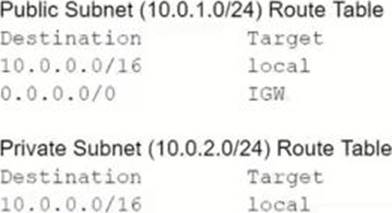
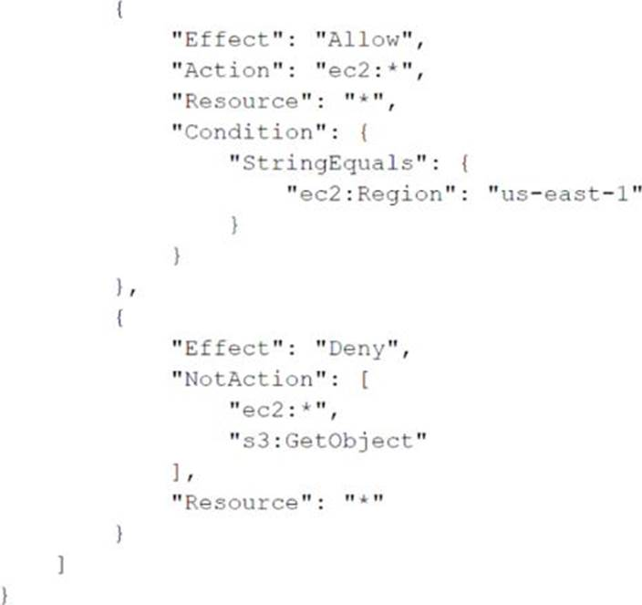

### An Amazon EC2 instance needs to be reachable from the internet. The EC2 instance is in a subnet with the following route table. Which entry must a SysOps administrator add to the route table to meet this requirement?

- [ ] A route for 0.0.0.0/0 that points to a NAT gateway.
- [ ] A route for 0.0.0.0/0 that points to an egress-only internet gateway.
- [x] A route for 0.0.0.0/0 that points to an internet gateway.
- [ ] A route for 0.0.0.0/0 that points to an elastic network interface.

### A company uses an Amazon CloudFront distribution to deliver its website Traffic togs for the website must be centrally stored and all data must be encrypted at rest. Which solution will meet these requirements?

- [ ] Create an Amazon OpenSearch Service (Amazon Elasttcsearch Service) domain with internet access and server-side encryption that uses the default AWS managed key Configure CloudFront to use the Amazon OpenSearch Service (Amazon Elasticsearch Service) domain as a log destination.
- [ ] eate an Amazon OpenSearch Service (Amazon Elasticsearch Service) domain with VPC access and server-side encryption that uses AES-256 Configure CloudFront to use the Amazon OpenSearch Service (Amazon Elastcsearch Service) domain as a log destination.
- [x] Create an Amazon S3 bucket that is configured with default server side encryption that uses AES-256 Configure CloudFront to use the S3 bucket as a log destination.
- [ ] Create an Amazon S3 bucket that is configured with no default encryption Enable encryption in the CloudFront dtstnbubon and use the S3 bucket as a log destination.

### A company's public website is hosted in an Amazon S3 bucket in the us-east-1 Region behind an Amazon CloudFront distribution. The company wants to ensure that the website is protected from DDoS attacks. A SysOps administrator needs to deploy a solution that gives the company the ability to maintain control over the rate limit at which DDoS protections are applied. Which solution will meet these requirements?

- [ ] Deploy a global-scoped AWS WAF web ACL with an allow default action. Configure an AWS WAF rate-based rule to block matching traffic. Associate the web ACL with the CloudFront distribution.
- [x] Deploy an AWS WAF web ACL with an allow default action in us-east-1. Configure an AWS WAF rate-based rule to block matching traffic. Associate the web ACL with the S3 bucket.
- [ ] Deploy a global-scoped AWS WAF web ACL with a block default action. Configure an AWS WAF rate-based rule to allow matching traffic. Associate the web ACL with the CloudFront distribution.
- [ ] Deploy an AWS WAF web ACL with a block default action in us-east-1. Configure an AWS WAF rate-based rule to allow matching traffic. Associate the web ACL with the S3 bucket.

### A company hosts an online shopping portal in the AWS Cloud. The portal provides HTTPS security by using a TLS certificate on an Elastic Load Balancer (ELB). Recently, the portal suffered an outage because the TLS certificate expired. A SysOps administrator must create a solution to automatically renew certificates to avoid this issue in the future. What is the MOST operationally efficient solution that meets these requirements?

- [ ] Request a public certificate by using AWS Certificate Manager (ACM). Associate the certificate from ACM with the ELB. Write a scheduled AWS Lambda function to renew the certificate every 18 months.
- [x] Request a public certificate by using AWS Certificate Manager (ACM). Associate the certificate from ACM with the ELB. ACM will automatically manage the renewal of the certificate.
- [ ] Register a certificate with a third-party certificate authority (CA). Import this certificate into AWS Certificate Manager (ACM). Associate the certificate from ACM with the ELB. ACM will automatically manage the renewal of the certificate.

- [ ] Register a certificate with a third-party certificate authority (CA). Configure the ELB to import the certificate directly from the CA. Set the certificate refresh cycle on the ELB to refresh when the certificate is within 3 months of the expiration date.

### With the threat of ransomware viruses encrypting and holding company data hostage, which action should be taken to protect an Amazon S3 bucket?

- [ ] Deny Post. Put. and Delete on the bucket.
- [x] Enable server-side encryption on the bucket.
- [ ]Enable Amazon S3 versioning on the bucket.
- [ ] Enable snapshots on the bucket.

### A company is partnering with an external vendor to provide data processing services. For this integration, the vendor must host the company's data in an Amazon S3 bucket in the vendor's AWS account. The vendor is allowing the company to provide an AWS Key Management Service (AWS KMS) key to encrypt the company's data. The vendor has provided an IAM role Amazon Resource Name (ARN) to the company for this integration. What should a SysOps administrator do to configure this integration?

- [ ] Create a new KMS key. Add the vendor's IAM role ARN to the KMS key policy. Provide the new KMS key ARN to the vendor.
B. Create a new KMS key. Create a new IAM user. Add the vendor's IAM role ARN to an inline policy that is attached to the IAM user. Provide the new IAM user ARN to the vendor.
- [ ] Configure encryption using the KMS managed S3 key. Add the vendor's IAM role ARN to the KMS managed S3 key policy. Provide the KMS managed S3 key ARN to the vendor.
- [x] Configure encryption using the KMS managed S3 key. Create an S3 bucket. Add the vendor's IAM role ARN to the S3 bucket policy. Provide the S3 bucket ARN to the vendor.

### A company hosts a database on an Amazon RDS Multi-AZ DB instance. The database is not encrypted. The company's new security policy requires all AWS resources to be encrypted at rest and in transit. What should a SysOps administrator do to encrypt the database?

- [ ] Configure encryption on the existing DB instance.
B. Take a snapshot of the DB instance. Encrypt the snapshot. Restore the snapshot to the same DB instance.
- [x] Encrypt the standby replica in a secondary Availability Zone. Promote the standby replica to the primary DB instance.
- [ ] Take a snapshot of the DB instance. Copy and encrypt the snapshot. Create a new DB instance by restoring the encrypted copy.

### A SysOps administrator receives an alert from Amazon GuardDuty about suspicious network activity on an Amazon FC2 instance. The GuardDuty finding lists a new external IP address as a traffic destination. The SysOps administrator does not recognize the external IP address. The SysOps administrator must block traffic to the external IP address that GuardDuty identified Which solution will meet this requirement?

- [x] Create a new security group to block traffic to the external IP address. Assign the new security group to the EC2 instance.
- [ ] Use VPC flow logs with Amazon Athena to block traffic to the external IP address.
- [ ] Create a network ACL Add an outbound deny rule tor traffic to the external IP address.
- [ ] Create a new security group to block traffic to the external IP address Assign the new security group to the entire VPC.

### A company stores files on 50 Amazon S3 buckets in the same AWS Region The company wants to connect to the S3 buckets securely over a private connection from its Amazon EC2 instances The company needs a solution that produces no additional cost. Which solution will meet these requirements?

- [ ] Create a gateway VPC endpoint lor each S3 bucket Attach the gateway VPC endpoints to each subnet inside the VPC.
- [ ] Create an interface VPC endpoint (or each S3 bucket Attach the interface VPC endpoints to each subnet inside the VPC.
- [x] Create one gateway VPC endpoint for all the S3 buckets Add the gateway VPC endpoint to the VPC route table.
- [ ] Create one interface VPC endpoint for all the S3 buckets Add the interface VPC endpoint to the VPC route table.

### A SysOps administrator has enabled AWS CloudTrail in an AWS account. If CloudTrail is disabled, it must be re-enabled immediately.  What should the SysOps administrator do to meet these requirements WITHOUT writing custom code?

- [ ] Add the AWS account to AWS Organizations. Enable CloudTrail in the management account.
- [ ] Create an AWS Config rule that is invoked when CloudTrail configuration changes.
Apply the AWS-ConfigureCloudTrailLogging automatic remediation action.
- [ ] Create an AWS Config rule that is invoked when CloudTrail configuration changes.
Configure the rule to invoke an AWS Lambda function to enable CloudTrail.
- [x] . Create an Amazon EventBridge (Amazon CloudWatch Events) hourly rule with a schedule pattern to run an AWS Systems Manager Automation document to enable CloudTrail.

### A SysOps administrator needs to give users the ability to upload objects to an Amazon S3 bucket. The SysOps administrator creates a presigned URL and provides the URL to a user, but the user cannot upload an object to the S3 bucket. The presigned URL has not expired, and no bucket policy is applied to the S3 bucket. Which of the following could be the cause of this problem?

- [ ] The user has not properly configured the AWS CLI with their access key and secret access key.
- [x] The SysOps administrator does not have the necessary permissions to upload the object to the S3 bucket.
- [ ] The SysOps administrator must apply a bucket policy to the S3 bucket to allow the user to upload the object.
- [ ] The object already has been uploaded through the use of the presigned URL, so the presigned URL is no longer valid.

### A company runs a web application on three Amazon EC2 instances behind an Application Load Balancer (ALB). The company notices that random periods of increased traffic cause a degradation in the application's performance. A SysOps administrator must scale the application to meet the increased traffic. Which solution meets these requirements?

- [ ] Create an Amazon CloudWatch alarm to monitor application latency and increase the size of each EC2 instance if the desired threshold is reached.
- [ ] Create an Amazon EventBridge (Amazon CloudWatch Events) rule to monitor application latency and add an EC2 instance to the ALB if the desired threshold is reached.
- [x] Deploy the application to an Auto Scaling group of EC2 instances with a target tracking scaling policy. Attach the ALB to the Auto Scaling group.
- [ ] Deploy the application to an Auto Scaling group of EC2 instances with a scheduled scaling policy. Attach the ALB to the Auto Scaling group.

### A company uses an Amazon Elastic File System (Amazon EFS) file system to share files across many Linux Amazon EC2 instances. A SysOps administrator notices that the file system's PercentIOLimit metric is consistently at 100% for 15 minutes or longer. The SysOps administrator also notices that the application that reads and writes to that file system is performing poorly. They application requires high throughput and IOPS while accessing the file system. What should the SysOps administrator do to remediate the consistently high PercentIOLimit metric?

- [x] Create a new EFS file system that uses Max I/O performance mode. Use AWS DataSync to migrate data to the new EFS file system.
- [ ] Create an EFS lifecycle policy to transition future files to the Infrequent Access (IA) storage class to improve performance. Use AWS DataSync to migrate existing data to IA storage.
- [ ] . Modify the existing EFS file system and activate Max I/O performance mode.
- [ ] Modify the existing EFS file system and activate Provisioned Throughput mode.

### A company needs to restrict access to an Amazon S3 bucket to Amazon EC2 instances in a VPC only. All traffic must be over the AWS private network. What actions should the SysOps administrator take to meet these requirements?

- [ ] Create a VPC endpoint for the S3 bucket, and create an IAM policy that conditionally limits all S3 actions on the bucket to the VPC endpoint as the source.
- [x] Create a VPC endpoint for the S3 bucket, and create an S3 bucket policy that conditionally limits all S3 actions on the bucket to the VPC endpoint as the source.
- [ ] Create a service-linked role for Amazon EC2 that allows the EC2 instances to interact directly with Amazon S3, and attach an IAM policy to the role that allows the EC2 instances full access to the S3 bucket.
- [ ] Create a NAT gateway in the VPC, and modify the VPC route table to route all traffic destined for Amazon S3 through the NAT gateway.

### A company is managing multiple AWS accounts in AWS Organizations. The company is reviewing internal security of its AWS environment. The company's security administrator has their own AWS account and wants to review the VPC configuration of developer AWS accounts. Which solution will meet these requirements in the MOST secure manner?

- [ ] Create an IAM policy in each developer account that has read-only access related to VPC resources Assign the policy to an IAM user. Share the user credentials with the security administrator.
- [ ] Create an IAM policy in each developer account that has administrator access to all Amazon EC2 actions, including VPC actions. Assign the policy to an IAM user. Share the user credentials with the security administrator.
- [ ] Create an IAM policy in each developer account that has administrator access related to
VPC resources. Assign the policy to a cross-account IAM role. Ask the security administrator to assume the role from their account.
- [x] Create an IAM policy in each developer account that has read-only access related to VPC resources Assign the policy to a cross-account IAM role Ask the security administrator to assume the role from their account.

### A company migrated an I/O intensive application to an Amazon EC2 general purpose instance. The EC2 instance has a single General Purpose SSD Amazon Elastic Block Store (Amazon EBS) volume attached.Application users report that certain actions that require intensive reading and writing to the disk are taking much longer than normal or are failing completely. After reviewing the performance metrics of the EBS volume, a SysOps administrator notices that the VolumeQueueLength metric is consistently high during the same times in which the users are reporting issues. The SysOps administrator needs to resolve this problem to restore full performance to the application. Which action will meet these requirements?

- [ ] Modify the instance type to be storage optimized.
- [ ] Modify the volume properties by deselecting Auto-Enable Volume 10.
- [x] Modify the volume properties to increase the IOPS.
- [ ] Modify the instance to enable enhanced networking.

### A company has multiple AWS Site-to-Site VPN connections between a VPC and its branch offices. The company manages an Amazon Elasticsearch Service (Amazon ES) domain that is configured with public access. The Amazon ES domain has an open domain access policy. A SysOps administrator needs to ensure that Amazon ES can be accessed only from the branch offices while preserving existing data. Which solution will meet these requirements?

- [ ] Configure an identity-based access policy on Amazon ES. Add an allow statement to the policy that includes the Amazon Resource Name (ARN) for each branch office VPN connection.
- [x] Configure an IP-based domain access policy on Amazon ES. Add an allow statement to the policy that includes the private IP CIDR blocks from each branch office network.
- [ ] Deploy a new Amazon ES domain in private subnets in a VPC, and import a snapshot from the old domain. Create a security group that allows inbound traffic from the branch office CIDR blocks.
- [ ] Reconfigure the Amazon ES domain in private subnets in a VPC. Create a security group that allows inbound traffic from the branch office CIDR blocks.

### A company is managing many accounts by using a single organization in AWS Organizations. The organization has all features enabled. The company wants to turn on AWS Config in all the accounts of the organization and in all AWS Regions. What should a Sysops administrator do to meet these requirements in the MOST operationally efficient way?

- [ ] Use AVVS CloudFormation StackSets to deploy stack instances that turn on AWS Config in all accounts and in all Regions.
- [ ] Use AWS CloudFormation StackSets to deploy stack policies that turn on AWS Config in all accounts and in all Regions.
- [x] Use service control policies (SCPs) to configure AWS Config in all accounts and in all Regions.
- [ ] Create a script that uses the AWS CLI to turn on AWS Config in all accounts in the organization. Run the script from the organization's management account.

### A company's SysOps administrator deploys four new Amazon EC2 instances by using the standard Amazon Linux 2 Amazon Machine Image (AMI). The company needs to be able to use AWS Systems Manager to manage the instances The SysOps administrator notices that the instances do not appear in the Systems Manager console. What must the SysOps administrator do to resolve this issue?

- [ ] Connect to each instance by using SSH Install Systems Manager Agent on each instance Configure Systems Manager Agent to start automatically when the instances start up.
- [ ] Use AWS Certificate Manager (ACM) to create a TLS certificate Import the certificate into each instance Configure Systems Manager Agent to use the TLS certificate for secure communications.
- [ ] Connect to each instance by using SSH Create an ssm-user account Add the ssm-user account to the /etcsudoers d directory.
- [x] Attach an IAM instance profile to the instances Ensure that the instance profile contains the AmazonSSMManagedinstanceCore policy.

### A development team recently deployed a new version of a web application to production. After the release, penetration testing revealed a cross-site scripting vulnerability that could expose user data. Which AWS service will mitigate this issue?

- [x] AWS Shield Standard.
- [ ] AWS WAF.
- [ ] Elastic Load Balancing.
- [ ] Amazon Cognito.

### An Amazon EC2 instance is running an application that uses Amazon Simple Queue Service (Amazon SQS) queues A SysOps administrator must ensure that the application can read, write, and delete messages from the SQS queues. Which solution will meet these requirements in the MOST secure manner?

- [ ] Create an IAM user with an IAM policy that allows the sqs SendMessage permission, the sqs ReceiveMessage permission, and the sqs DeleteMessage permission to the appropriate queues Embed the IAM user's credentials in the application's configuration.
- [ ] Create an IAM user with an IAM policy that allows the sqs SendMessage permission, the sqs ReceiveMessage permission, and the sqs DeleteMessage permission to the appropriate queues Export the IAM user's access key and secret access key as environment variables on the EC2 instance.
- [ ] Create and associate an IAM role that allows EC2 instances to call AWS services Attach an IAM policy to the role that allows sqs." permissions to the appropriate queues.
- [x] Create and associate an IAM role that allows EC2 instances to call AWS services Attach an IAM policy to the role that allows the sqs SendMessage permission, the sqs ReceiveMessage permission, and the sqs DeleteMessage permission to the appropriate queues.

### A company has a policy that requires all Amazon EC2 instances to have a specific set of tags. If an EC2 instance does not have the required tags, the noncompliant instance should be terminated. What is the MOST operationally efficient solution that meets these requirements?

- [ ] Create an Amazon EventBridge (Amazon CloudWatch Events) rule to send all EC2 instance state changes to an AWS Lambda function to determine if each instance is compliant. Terminate any noncompliant instances.
- [ ] Create an 1AM policy that enforces all EC2 instance tag requirements. If the required tags are not in place for an instance, the policy will terminate noncompliant instance.
- [x] Create an AWS Lambda function to determine if each EC2 instance is compliant and terminate an instance if it is noncompliant. Schedule the Lambda function to invoke every 5 minutes.
- [ ] Create an AWS Config rule to check if the required tags are present. If an EC2 instance is noncompliant, invoke an AWS Systems Manager Automation document to terminate the instance.

### A SysOps administrator wants to upload a file that is 1 TB in size from on-premises to an Amazon S3 bucket using multipart uploads. What should the SysOps administrator do to meet this requirement?

- [ ] Upload the file using the S3 console.
- [ ] Use the s3api copy-object command.
- [ ] Use the s3api put-object command.
- [x] Use the s3 cp command.

### A SysOps administrator launches an Amazon EC2 Linux instance in a public subnet. When the instance is running, the SysOps administrator obtains the public IP address and attempts to remotely connect to the instance multiple times. However, the SysOps administrator always receives a timeout error. Which action will allow the SysOps administrator to remotely connect to the instance?

- [ ] Add a route table entry in the public subnet for the SysOps administrator's IP address.
- [ ] Add an outbound network ACL rule to allow TCP port 22 for the SysOps administrator's IP address.
- [x] Modify the instance security group to allow inbound SSH traffic from the SysOps administrator's IP address.
- [ ] Modify the instance security group to allow outbound SSH traffic to the SysOps administrator's IP address.

### A SysOps administrator has used AWS Cloud Formal ion to deploy a serverless application Into a production VPC. The application consists of an AWS Lambda function an Amazon DynamoDB table, and an Amazon API Gateway API. The SysOps administrator must delete the AWS Cloud Formation stack without deleting the DynamoDB table. Which action should the SysOps administrator take before deleting the AWS Cloud Formation stack?

- [x] Add a Retain deletion policy to the DynamoDB resource in the AWS CloudFormation stack.
- [ ] Add a Snapshot deletion policy to the DynamoDB resource in the AWS CloudFormation stack.
- [ ] Enable termination protection on the AWS Cloud Formation stack.
- [ ] Update the application's IAM policy with a Deny statement for the dynamodb:DeleteTabie action.

### A SysOps administrator wants to manage a web server application with AWS Elastic Beanstalk. The Elastic Beanstalk service must maintain full capacity for new deployments at all times. Which deployment policies satisfy this requirement? (Select TWO.)

- [ ] All at once.
- [x] Immutable.
- [ ] Rebuild.
- [ ] Rolling.
- [x] Rolling with additional batch.

### A company asks a SysOps administrator to ensure that AWS CloudTrail files are not tampered with after they are created. Currently, the company uses AWS Identity and Access Management (IAM) to restrict access to specific trails. The company's security team needs the ability to trace the integrity of each file. What is the MOST operationally efficient solution that meets these requirements?

- [ ] Create an Amazon EventBridge (Amazon CloudWatch Events) rule that invokes an AWS Lambda function when a new file is delivered. Configure the Lambda function to compute an MD5 hash check on the file and store the result in an Amazon DynamoDB table. The security team can use the values that are stored in DynamoDB to verify the integrity of the delivered files.
- [ ] Create an AWS Lambda function that is invoked each time a new file is delivered to the CloudTrail bucket. Configure the Lambda function to compute an MD5 hash check on the file and store the result as a tag in an Amazon S3 object. The security team can use the information in the tag to verify the integrity of the delivered files.
- [ ] Enable the CloudTrail file integrity feature on an Amazon S3 bucket. Create an IAM policy that grants the security team access to the file integrity logs that are stored in the S3 bucket.
- [x] Enable the CloudTrail file integrity feature on the trail. The security team can use the digest file that is created by CloudTrail to verify the integrity of the delivered files.

### A company has multiple Amazon EC2 instances that run a resource-intensive application in a development environment. A SysOps administrator is implementing a solution to stop these EC2 instances when they are not in use. Which solution will meet this requirement?

- [ ] Assess AWS CloudTrail logs to verify that there is no EC2 API activity. Invoke an AWS Lambda function to stop the EC2 instances.
- [x] Create an Amazon CloudWatch alarm to stop the EC2 instances when the average CPU utilization is lower than 5% for a 30-minute period.
- [ ] Create an Amazon CloudWatch metric to stop the EC2 instances when the VolumeReadBytes metric is lower than 500 for a 30-minute period.
- [ ] Use AWS Config to invoke an AWS Lambda function to stop the EC2 instances based on resource configuration changes.

### A company creates custom AMI images by launching new Amazon EC2 instances from an AWS CloudFormation template it installs and configure necessary software through AWS OpsWorks and takes images of each EC2 instance. The process of installing and configuring software can take between 2 to 3 hours but at limes the process stalls due to installation errors. The SysOps administrator must modify the CloudFormation template so if the process stalls, the entire stack will tail and roil back. Based on these requirements what should be added to the template?

- [ ] Conditions with a timeout set to 4 hours.
- [x] CreationPolicy with timeout set to 4 hours.
- [ ] DependsOn a timeout set to 4 hours.
- [ ] Metadata with a timeout set to 4 hours.

### A database is running on an Amazon RDS Mufti-AZ DB instance. A recent security audit found the database to be out of compliance because it was not encrypted. Which approach will resolve the encryption requirement?

- [ ] Log in to the RDS console and select the encryption box to encrypt the database.
- [ ] Create a new encrypted Amazon EBS volume and attach it to the instance.
- [ ] Encrypt the standby replica in the secondary Availability Zone and promote it to the primary instance.
- [x] Take a snapshot of the RDS instance, copy and encrypt the snapshot and then restore to the new RDS instance.

### A SysOps administrator is responsible for a legacy. CPU-heavy application The application can only be scaled vertically Currently, the application is deployed on a single t2 large Amazon EC2 instance The system is showing 90% CPU usage and significant performance latency after a few minutes. What change should be made to alleviate the performance problem?

- [ ] Change the Amazon EBS volume to Provisioned lOPs.
- [x] Upgrade to a compute-optimized instance.
- [ ] Add additional 12 large instances to the application.
- [ ] Purchase Reserved Instances.

### A company is managing multiple AWS accounts in AWS Organizations The company is reviewing internal security of Its AWS environment The company's security administrator has their own AWS account and wants to review the VPC configuration of developer AWS accounts. Which solution will meet these requirements in the MOST secure manner?

- [ ] Create an IAM policy in each developer account that has read-only access related to VPC resources Assign the policy to an IAM user Share the user credentials with the security administrator.
- [ ] Create an IAM policy in each developer account that has administrator access to all Amazon EC2 actions, including VPC actions Assign the policy to an IAM user Share the user credentials with the security administrator.
- [ ] Create an IAM policy in each developer account that has administrator access related to VPC resources Assign the policy to a cross-account IAM role Ask the security administrator to assume the role from their account.
- [x] Create an IAM policy m each developer account that has read-only access related to VPC resources Assign the policy to a cross-account IAM role Ask the security administrator to assume the role from their account.

### A SysOps administrator is trying to set up an Amazon Route 53 domain name to route traffic to a website hosted on Amazon S3. The domain name of the website is <www.anycompany.com> and the S3 bucket name is anycompany-static. After the record set is set up in Route 53, the domain name <www.anycompany.com> does not seem to work, and the static website is not displayed in the browser. Which of the following is a cause of this?

- [ ] The S3 bucket must be configured with Amazon CloudFront first.
- [ ] The Route 53 record set must have an IAM role that allows access to the S3 bucket.
- [ ] The Route 53 record set must be in the same region as the S3 bucket.
- [x] The S3 bucket name must match the record set name in Route 53.

### A company has a critical serverless application that uses multiple AWS Lambda functions. Each Lambda function generates 1 GB of log data daily in its own Amazon CloudWatch Logs log group. The company's security team asks for a count of application errors, grouped by type, across all of the log groups. What should a SysOps administrator do to meet this requirement?

- [x] Perform a CloudWatch Logs Insights query that uses the stats command and count function.
- [ ] Perform a CloudWatch Logs search that uses the groupby keyword and count function.
- [ ] Perform an Amazon Athena query that uses the SELECT and GROUP BY keywords.
- [ ] Perform an Amazon RDS query that uses the SELECT and GROUP BY keywords.

### A SysOps administrator applies the following policy to an AWS CloudFormation stack. What is the result of this policy?

- [ ] Users that assume an IAM role with a logical ID that begins with "Production" are prevented from running the update-stack command.
- [x] Users can update all resources in the stack except for resources that have a logical ID that begins with "Production".
- [ ] Users can update all resources in the stack except for resources that have an attribute that begins with "Production".
- [ ] Users in an IAM group with a logical ID that begins with "Production" are prevented from running the update-stack command.

### A SysOps administrator is deploying an application on 10 Amazon EC2 instances. The application must be highly available. The instances must be placed on distinct underlying hardware. What should the SysOps administrator do to meet these requirements?

- [ ] Launch the instances into a cluster placement group in a single AWS Region.
- [ ] Launch the instances into a partition placement group in multiple AWS Regions.
- [ ] Launch the instances into a spread placement group in multiple AWS Regions.
- [x] Launch the instances into a spread placement group in single AWS Region.

### A company is tunning a website on Amazon EC2 instances thai are in an Auto Scaling group When the website traffic increases, additional instances lake several minutes to become available because ot a long-running user data script that installs software A SysOps administrator must decrease the time that is required (or new instances to become available. Which action should the SysOps administrator take to meet this requirement?

- [ ] Reduce the scaling thresholds so that instances are added before traffic increases.
- [ ] Purchase Reserved Instances to cover 100% of the maximum capacity of the Auto Scaling group.
- [ ] Update the Auto Scaling group to launch instances that have a storage optimized instance type.
- [x] Use EC2 Image Builder to prepare an Amazon Machine Image (AMI) that has pre-installed software.

### A SysOps administrator has launched a large general purpose Amazon EC2 instance to regularly process large data files. The instance has an attached 1 TB General Purpose SSD (gp2) Amazon Elastic Block Store (Amazon EBS) volume. The instance also is EBS-optimized. To save costs, the SysOps administrator stops the instance each evening and restarts the instance each morning. When data processing is active, Amazon CloudWatch metrics on the instance show a consistent 3.000 VolumeReadOps. The SysOps administrator must improve the I/O performance while ensuring data integrity. Which action will meet these requirements?

- [ ] Change the instance type to a large, burstable, general purpose instance.
- [ ] Change the instance type to an extra large general purpose instance.
- [x] Increase the EBS volume to a 2 TB General Purpose SSD (gp2) volume.
- [ ] Move the data that resides on the EBS volume to the instance store.

### A company runs workloads on 90 Amazon EC2 instances in the eu-west-1 Region in an AWS account. In 2 months, the company will migrate the workloads from eu-west-1 to the eu-west-3 Region. The company needs to reduce the cost of the EC2 instances. The company is willing to make a 1-year commitment that will begin next week. The company must choose an EC2 Instance purchasing option that will provide discounts for the 90 EC2 Instances regardless of Region during the 1-year period. Which solution will meet these requirements?

- [ ] Purchase EC2 Standard Reserved Instances.
- [x] Purchase an EC2 Instance Savings Plan.
- [ ] Purchase EC2 Convertible Reserved Instances.
- [ ] Purchase a Compute Savings Plan.

### A company uses Amazon Elasticsearch Service (Amazon ES) to analyze sales and customer usage data. Members of the company's geographically dispersed sales team are traveling. They need to log in to Kibana by using their existing corporate credentials that are stored in Active Directory. The company has deployed Active Directory Federation Services (AD FS) to enable authentication to cloud services. Which solution will meet these requirements?

- [ ] Configure Active Directory as an authentication provider in Amazon ES. Add the Active Directory server's domain name to Amazon ES. Configure Kibana to use Amazon ES authentication.
- [x] Deploy an Amazon Cognito user pool. Configure Active Directory as an external identity provider for the user pool. Enable Amazon Cognito authentication for Kibana on Amazon ES.
- [ ] Enable Active Directory user authentication in Kibana. Create an IP-based custom domain access policy in Amazon ES that includes the Active Directory server's IP address.
- [ ] Establish a trust relationship with Kibana on the Active Directory server. Enable Active Directory user authentication in Kibana. Add the Active Directory server's IP address to Kibana.

### A company uses AWS Organizations. A SysOps administrator wants to use AWS Compute Optimizer and AWS tag policies in the management account to govern all member accounts in the billing family. The SysOps administrator navigates to the AWS Organizations console but cannot activate tag policies through the management account. What could be the reason for this issue?

- [ ] All features have not been enabled in the organization.
- [ ] Consolidated billing has not been enabled.
- [x] The member accounts do not have tags enabled for cost allocation.
- [ ] The member accounts have not manually enabled trusted access for Compute Optimizer.

### A SysOps administrator is attempting to download patches from the internet into an instance in a private subnet. An internet gateway exists for the VPC, and a NAT gateway has been deployed on the public subnet; however, the instance has no internet connectivity. The resources deployed into the private subnet must be inaccessible directly from the public internet. What should be added to the private subnet's route table in order to address this issue, given the information provided?

- [ ] 0.0.0.0/0 IGW.
- [x] 0.0.0.0/0 NAT.
- [ ] 10.0.1.0/24 IGW.
- [ ] 10.0.1.0/24 NAT.

### A company has a stateless application that is hosted on a fleet of 10 Amazon EC2 On-Demand Instances in an Auto Scaling group. A minimum of 6 instances are needed to meet service requirements. Which action will maintain uptime for the application MOST cost-effectively?

- [x] Use a Spot Fleet with an On-Demand capacity of 6 instances.
- [ ] Update the Auto Scaling group with a minimum of 6 On-Demand Instances and a maximum of 10 On-Demand Instances.
- [ ] Update the Auto Scaling group with a minimum of 1 On-Demand Instance and a maximum of 6 On-Demand Instances.
- [ ] Use a Spot Fleet with a target capacity of 6 instances.

### A large company is using AWS Organizations to manage its multi-account AWS environment. According to company policy, all users should have read-level access to a particular Amazon S3 bucket in a central account. The S3 bucket data should not be available outside the organization. A SysOps administrator must set up the permissions and add a bucket policy to the S3 bucket. Which parameters should be specified to accomplish this in the MOST efficient manner?

- [x] Specify "' as the principal and PrincipalOrgld as a condition.
- [ ] Specify all account numbers as the principal.
- [ ] Specify PrincipalOrgld as the principal.
- [ ] Specify the organization's management account as the principal.

### SysOps administrator needs to create alerts that are based on the read and write metrics of Amazon Elastic Block Store (Amazon EBS) volumes that are attached to an Amazon EC2 instance. The SysOps administrator creates and enables Amazon CloudWatch alarms for the DiskReadBytes metric and the DiskWriteBytes metric. A custom monitoring tool that is installed on the EC2 instance with the same alarm configuration indicates that the volume metrics have exceeded the threshold. However, the CloudWatch alarms were not in ALARM state. Which action will ensure that the CloudWatch alarms function correctly?

- [ ] Install and configure the CloudWatch agent on the EC2 instance to capture the desired metrics.
- [ ] Install and configure AWS Systems Manager Agent on the EC2 instance to capture the desired metrics.
- [x] Reconfigure the CloudWatch alarms to use the VolumeReadBytes metric and the VolumeWriteBytes metric for the EBS volumes.
- [ ] Reconfigure the CloudWatch alarms to use the VolumeReadBytes metric and the VolumeWriteBytes metric for the EC2 instance.

### A company updates its security policy to prohibit the public exposure of any data in Amazon S3 buckets in the company's account. What should a SysOps administrator do to meet this requirement?

- [x] Turn on S3 Block Public Access from the account level.
- [ ] Create an Amazon EventBridge (Amazon CloudWatch Events) rule to
- [ enforce that all S3 objects are private.
- [ ] Use Amazon Inspector to search for S3 buckets and to automatically reset S3 ACLs if any public S3 buckets are found.
- [ ] Use S3 Object Lambda to examine S3 ACLs and to change any public S3 ACLs to private.

### An Amazon S3 Inventory report reveals that more than 1 million objects in an S3 bucket are not encrypted These objects must be encrypted, and all future objects must be encrypted at the time they are written. Which combination of actions should a SysOps administrator take to meet these requirements? (Select TWO)

- [ ] Create an AWS Config rule that runs evaluations against configuration changes to the S3 bucket When an unencrypted object is found run an AWS Systems Manager Automation document to encrypt the object in place.
- [x] Edit the properties of the S3 bucket to enable default server-side encryption.
- [x] Filter the S3 Inventory report by using S3 Select to find all objects that are not encrypted Create an S3 Batch Operations job to copy each object in place with en cryption enabled.
- [ ] Filter the S3 Inventory report by using S3 Select to find all objects that are not encrypted Send each object name as a message to an Amazon Simple Queue Service (Amazon SQS) queue Use the SQS queue to invoke an AWS Lambda function to tag each object with a key of "Encryption" and a value of "SSE-KMS"
- [ ] Use S3 Event Notifications to invoke an AWS Lambda function on all new object-created events for the S3 bucket Configure the Lambda function to check whether the object is encrypted and to run an AWS Systems Manager Automation document to encrypt the object in place when an unencrypted object is found.

### A company has an internal web application that runs on Amazon EC2 instances behind an Application Load Balancer. The instances run in an Amazon EC2 Auto Scaling group in a single Availability Zone. A SysOps administrator must make the application highly available. Which action should the SysOps administrator take to meet this requirement?

- [ ] Increase the maximum number of instances in the Auto Scaling group to meet the capacity that is required at peak usage.
- [ ] Increase the minimum number of instances in the Auto Scaling group to meet the capacity that is required at peak usage.
- [x] Update the Auto Scaling group to launch new instances in a second Availability Zone in the same AWS Region.
- [ ] Update the Auto Scaling group to launch new instances in an Availability Zone in a second AWS Region.

### An application accesses data through a file system interface. The application runs on Amazon EC2 instances in multiple Availability Zones, all of which must share the same data. While the amount of data is currently small, the company anticipates that it will grow to tens of terabytes over the lifetime of the application. What is the MOST scalable storage solution to fulfill this requirement?

- [ ] Connect a large Amazon EBS volume to multiple instances and schedule snapshots.
- [x] Deploy Amazon EFS in the VPC and create mount targets in multiple subnets.
- [ ] Launch an EC2 instance and share data using SMB/CIFS or NFS.
- [ ] Deploy an AWS Storage Gateway cached volume on Amazon EC2.

### A company is expanding its use of AWS services across its portfolios The company wants to provision AWS accounts for each team to ensure a separation of business processes for security compliance and billing Account creation and bootstrapping should be completed m a scalable and efficient way so new accounts are created with a defined baseline and governance guardrails in place A SysOps administrator needs to design a provisioning process that saves time and resources Which action should be taken to meet these requirements?

- [ ] Automate using AWS Elastic Beanstalk to provision the AWS accounts set up infrastructure and integrate with AWS Organizations.
- [ ] Create bootstrapping scripts in AWS OpsWorks and combine them with AWS CloudFormation templates to provision accounts and infrastructure.
- [x] Use AWS Config to provision accounts and deploy instances using AWS Service Catalog.
- [ ] Use AWS Control Tower to create a template in Account Factory and use the template to provision new accounts.

### A company hosts a web portal on Amazon EC2 instances. The web portal uses an Elastic Load Balancer (ELB) and Amazon Route 53 for its public DNS service. The ELB and the EC2 instances are deployed by way of a single AWS CloudFormation stack in the us-east-1 Region. The web portal must be highly available across multiple Regions. Which configuration will meet these requirements?

- [ ] Deploy a copy of the stack in the us-west-2 Region. Create a single start of authority (SOA) record in Route 53 that includes the IP address from each ELB. Configure the SOA record with health checks. Use the ELB in us-east-1 as the primary record and the ELB in us-west-2 as the secondary record.
- [x] Deploy a copy of the stack in the us-west-2 Region. Create an additional A record in Route 53 that includes the ELB in us-west-2 as an alias target. Configure the A records with a failover routing policy and health checks. Use the ELB in us-east-1 as the primary record and the ELB in us-west-2 as the secondary record.
- [ ] Deploy a new group of EC2 instances in the us-west-2 Region. Associate the new EC2 instances with the existing ELB, and configure load balancer health checks on all EC2 instances. Configure the ELB to update Route 53 when EC2 instances in us-west-2 fail health checks.
- [ ] Deploy a new group of EC2 instances in the us-west-2 Region. Configure EC2 health checks on all EC2 instances in each Region. Configure a peering connection between the VPCs. Use the VPC in us-east-1 as the primary record and the VPC in us-west-2 as the secondary record.

### A company needs to view a list of security groups that are open to the internet on port 3389. What should a SysOps administrator do to meet this requirement?

- [ ] Configure Amazon GuardDuly to scan security groups and report unrestricted access on port 3389.
- [ ] Configure a service control policy (SCP) to identify security groups that allow unrestricted access on port 3389.
- [ ] Use AWS Identity and Access Management Access Analyzer to find any instances that have unrestricted access on port 3389.
- [x] Use AWS Trusted Advisor to find security groups that allow unrestricted access on port 3389.

### A company is planning to host its stateful web-based applications on AWS A SysOps administrator is using an Auto Scaling group of Amazon EC2 instances The web applications will run 24 hours a day 7 days a week throughout the year The company must be able to change the instance type within the same instance family later in the year based on the traffic and usage patterns. Which EC2 instance purchasing option will meet these requirements MOST cost-effectively?

- [x] Convertible Reserved Instances.
- [ ] On-Demand instances.
- [ ] Spot instances.
- [ ] Standard Reserved instances.

### A recent organizational audit uncovered an existing Amazon RDS database that is not currently configured for high availability. Given the critical nature of this database, it must be configured for high availability as soon as possible. How can this requirement be met?

- [ ] Switch to an active/passive database pair using the create-db-instance-read-replica with the –availability-zone flag.
- [ ] Specify high availability when creating a new RDS instance, and live-migrate the data.
- [x] Modify the RDS instance using the console to include the Multi-AZ option.
- [ ] Use the modify-db-instance command with the –na flag.

### A SysOps administrator is deploying a test site running on Amazon EC2 instances. The application requires both incoming and outgoing connectivity to the internet. Which combination of steps are required to provide internet connectivity to the EC2 instances? (Choose two.)

- [ ] Add a NAT gateway to a public subnet.
- [ ] Attach a private address to the elastic network interface on the EC2 instance.
- [ ] Attach an Elastic IP address to the internet gateway.
- [x] Add an entry to the route table for the subnet that points to an internet gateway.
- [x] Create an internet gateway and attach it to a VPC.

### A company is testing Amazon Elasticsearch Service (Amazon ES) as a solution for analyzing system logs from a fleet of Amazon EC2 instances. During the test phase, the domain operates on a single-node cluster. A SysOps administrator needs to transition the test domain into a highly available production-grade deployment. Which Amazon ES configuration should the SysOps administrator use to meet this requirement?

- [ ] Use a cluster of four data nodes across two AWS Regions. Deploy four dedicated master nodes in each Region.
- [x] Use a cluster of six data nodes across three Availability Zones. Use three dedicated master nodes.
- [ ] Use a cluster of six data nodes across three Availability Zones. Use six dedicated master nodes.
- [ ] Use a cluster of eight data nodes across two Availability Zones. Deploy four master nodes in a failover AWS Region.

### A SysOps administrator is investigating why a user has been unable to use RDP to connect over the internet from their home computer to a bastion server running on an Amazon EC2 Windows instance. Which of the following are possible causes of this issue? (Choose two.)

- [x] A network ACL associated with the bastion's subnet is blocking the network traffic.
- [ ] The instance does not have a private IP address.
- [x] The route table associated with the bastion's subnet does not have a route to the internet gateway.
- [ ] The security group for the instance does not have an inbound rule on port 22.
- [ ] The security group for the instance does not have an outbound rule on port 3389.

### 31.16.139. When the SysOps administrator tries to ping the instance's public IP address from the remote IP address 203.0.113.12, the response is "request timed out." The flow logs contain the following information. What is one cause of the problem?

- [ ] Inbound security group deny rule.
- [ ] Outbound security group deny rule.
- [ ] Network ACL inbound rules.
- [x] Network ACL outbound rules.

### global company handles a large amount of personally identifiable information (Pll) through an internal web portal. The company's application runs in a corporate data center that is connected to AWS through an AWS Direct Connect connection. The application stores the Pll in Amazon S3. According to a compliance requirement, traffic from the web portal to Amazon S3 must not travel across the internet. What should a SysOps administrator do to meet the compliance requirement?

- [ ] Provision an interface VPC endpoint for Amazon S3. Modify the application to use the interface endpoint. B Configure AWS Network Firewall to redirect traffic to the internal S3 address.
- [x] Modify the application to use the S3 path-style endpoint.
- [ ] Set up a range of VPC network ACLs to redirect traffic to the Internal S3 address.

### An application runs on multiple Amazon EC2 instances in an Auto Scaling group The Auto Scaling group is configured to use the latest version of a launch template A SysOps administrator must devise a solution that centrally manages the application logs and retains the logs for no more than 90 days. Which solution will meet these requirements?

- [ ] Launch an Amazon Machine Image (AMI) that is preconfigured with the Amazon CloudWatch Logs agent to send logs to an Amazon S3 bucket Apply a 90-day S3 Lifecycle policy on the S3 bucket to expire the application logs.
- [ ] Launch an Amazon Machine Image (AMI) that is preconfigured with the Amazon CloudWatch Logs agent to send logs to a log group Create an Amazon EventBridge (Amazon CloudWatch Events) scheduled rule to perform an instance refresh every 90 days.
- [x] Update the launch template user data to install and configure the Amazon CloudWatch Logs agent to send logs to a log group Configure the retention period on the log group to be 90 days.
- [ ] Update the launch template user data to install and configure the Amazon CloudWatch Logs agent to send logs to a log group Set the log rotation configuration of the EC2 instances to 90 days.

### company is running a flash sale on its website. The website is hosted on burstable performance Amazon EC2 instances in an Auto Scaling group. The Auto Scaling group is configured to launch instances when the CPU utilization is above 70%. A couple of hours into the sale, users report slow load times and error messages for refused connections. A SysOps administrator reviews Amazon CloudWatch metrics and notices that the CPU utilization is at 20% across the entire fleet of instances. The SysOps administrator must restore the website's functionality without making changes to the network infrastructure. Which solution will meet these requirements?

- [ ] Activate unlimited mode for the instances in the Auto Scaling group.
- [x] Implement an Amazon CloudFront distribution to offload the traffic from the Auto Scaling group.
- [ ] Move the website to a different AWS Region that is closer to the users.
- [ ] Reduce the desired size of the Auto Scaling group to artificially increase CPU average utilization.

### A company has attached the following policy to an IAM user. Which of the following actions are allowed for the IAM user?

- [ ] Amazon RDS DescribeDBInstances action in the us-east-1 Region.
- [ ] Amazon S3 Putobject operation in a bucket named testbucket.
- [x] Amazon EC2 Describe Instances action in the us-east-1 Region.
- [ ] Amazon EC2 AttachNetworkinterf ace action in the eu-west-1 Region.

### A company has launched a social media website that gives users the ability to upload images directly to a centralized Amazon S3 bucket. The website is popular in areas that are geographically distant from the AWS Region where the S3 bucket is located. Users are reporting that uploads are slow. A SysOps administrator must improve the upload speed. What should the SysOps administrator do to meet these requirements?

- [ ] Create S3 access points in Regions that are closer to the users.
- [ ] Create an accelerator in AWS Global Accelerator for the S3 bucket.
- [x] Enable S3 Transfer Acceleration on the S3 bucket.
- [ ] Enable cross-origin resource sharing (CORS) on the S3 bucket.

### SysOps administrator is using AWS Systems Manager Patch Manager to patch a fleet of Amazon EC2 instances. The SysOps administrator has configured a patch baseline and a maintenance window. The SysOps administrator also has used an instance tag to identify which instances to patch. The SysOps administrator must give Systems Manager the ability to access the EC2 instances. Which additional action must the SysOps administrator perform to meet this requirement?

- [x] Add an inbound rule to the instances' security group.
- [ ] Attach an 1AM instance profile with access to Systems Manager to the instances.
- [ ] Create a Systems Manager activation Then activate the fleet of instances.
- [ ] Manually specify the instances to patch Instead of using tag-based selection.

### company is using Amazon Elastic Container Sen/ice (Amazon ECS) to run a containerized application on Amazon EC2 instances. A SysOps administrator needs to monitor only traffic flows between the ECS tasks. Which combination of steps should the SysOps administrator take to meet this requirement? (Select TWO.)

- [x] Configure Amazon CloudWatch Logs on the elastic network interface of each task.
- [ ] Configure VPC Flow Logs on the elastic network interface of each task.
- [ ] Specify the awsvpc network mode in the task definition.
- [ ] Specify the bridge network mode in the task definition.
- [x] Specify the host network mode in the task definition.

### A company has a mobile app that uses Amazon S3 to store images The images are popular for a week, and then the number of access requests decreases over time The images must be highly available and must be immediately accessible upon request A SysOps administrator must reduce S3 storage costs for the company. Which solution will meet these requirements MOST cost-effectively?

- [ ] Create an S3 Lifecycle policy to transition the images to S3 Glacier after 7 days.
- [ ] Create an S3 Lifecycle policy to transition the images to S3 One Zone-Infrequent Access (S3 One Zone-IA) after 7 days.
- [ ] Create an S3 Lifecycle policy to transition the images to S3 Standard after 7 days.
- [x] Create an S3 Lifecycle policy to transition the images to S3 Standard after 7 days.

### A SysOps administrator is unable to authenticate an AWS CLI call to an AWS service. Which of the following is the cause of this issue?

- [ ] The IAM password is incorrect.
- [ ] The server certificate is missing.
- [x] The SSH key pair is incorrect.
- [ ] There is no access key.

### A SysOps administrator is setting up a fleet of Amazon EC2 instances in an Auto Scaling group for an application. The fleet should have 50% CPU available at that times to accommodate bursts of traffic. The load will increase significantly between the hours of 09:00 and 17:00,7 days a week. How should the SysOps administrator configure the scaling of the EC2 instances to meet these requirements?

- [ ] Create a target tracking scaling policy that runs when the CPU utilization is higher than 90%.
- [x] Create a target tracking scaling policy that runs when the CPU utilization is higher than 50%. Create a scheduled scaling policy that ensures that the fleet is available at 09:00 Create a second scheduled scaling policy that scales in the fleet at 17:00.
- [ ] Set the Auto Scaling group to start with 2 instances by setting the desired instances maximum instances, and minimum instances to 2 Create a scheduled scaling policy that ensures that the fleet is available at 09:00.
- [ ] Create a scheduled scaling policy that ensures that the fleet is available at 09.00. Create a second scheduled scaling policy that scales in the fleet at 17:00.

### A SysOps administrator has created an AWS Service Catalog portfolio and has shared the portfolio with a second AWS account in the company. The second account is controlled by a different administrator. Which action will the administrator of the second account be able to perform?

- [x] Add a product from the imported portfolio to a local portfolio.
- [ ] Add new products to the imported portfolio.
- [ ] Change the launch role for the products contained in the imported portfolio.
- [ ] Customize the products in the imported portfolio.

### A company uses AWS Organizations to manage multiple AWS accounts with consolidated billing enabled. Organization member account owners want the benefits of Reserved Instances (RIs) but do not want to share RIs with other accounts. Which solution will meet these requirements?

- [x] Purchase RIs in individual member accounts. Disable Rl discount sharing in the management account.
- [ ] Purchase RIs in individual member accounts. Disable Rl discount sharing in the member accounts.
- [ ] Purchase RIs in the management account. Disable Rl discount sharing in the management account.
- [ ] Purchase RIs in the management account. Disable Rl discount sharing in the member accounts.

### A gaming application is deployed on four Amazon EC2 instances in a default VPC. The SysOps administrator has noticed consistently high latency in responses as data is transferred among the four instances. There is no way for the administrator to alter the application code. The MOST effective way to reduce latency is to relaunch the EC2 instances in

- [ ] a dedicated VPC.
- [ ] a single subnet inside the VPC.
- [x] a placement group.
- [ ] a single Availability Zone.

### A company has a stateful web application that is hosted on Amazon EC2 instances in an Auto Scaling group. The instances run behind an Application Load Balancer (ALB) that has a single target group. The ALB is configured as the origin in an Amazon CloudFront distribution. Users are reporting random logouts from the web application. Which combination of actions should a SysOps administrator take to resolve this problem? (Select TWO.)

- [ ] Change to the least outstanding requests algorithm on the ALB target group.
- [x] Configure cookie forwarding in the CloudFront distribution cache behavior.
- [ ] Configure header forwarding in the CloudFront distribution cache behavior.
- [ ] Enable group-level stickiness on the ALB listener rule.
- [x] Enable sticky sessions on the ALB target group.

### A SysOps administrator Is troubleshooting an AWS Cloud Formation template whereby multiple Amazon EC2 instances are being created. The template is working In us-east-1. but it is failing In us-west-2 with the error code. How should the administrator ensure that the AWS Cloud Formation template is working in every region?

- [X] Copy the source region's Amazon Machine Image (AMI) to the destination region and assign it the same ID.
- [ ] Edit the AWS CloudFormatton template to specify the region code as part of the fully qualified AMI ID.
- [ ] Edit the AWS CloudFormatton template to offer a drop-down list of all AMIs to the user by using the aws :: EC2:: ami :: imageiD control.
- [ ] Modify the AWS CloudFormation template by including the AMI IDs in the "Mappings" section. Refer to the proper mapping within the template for the proper AMI ID.

### A company has a critical serverless application that uses multiple AWS Lambda functions. Each Lambda function generates 1 GB of log data daily in tts own Amazon CloudWatch Logs log group. The company's security team asks for a count of application errors, grouped by type, across all of the log groups. What should a SysOps administrator do to meet this requirement?

- [x] Perform a CloudWatch Logs Insights query that uses the stats command and count function.
- [ ] Perform a CloudWatch Logs search that uses the groupby keyword and count function.
- [ ] Perform an Amazon Athena query that uses the SELECT and GROUP BY keywords.
- [ ] Perform an Amazon RDS query that uses the SELECT and GROUP BY keywords.

### A company's financial department needs to view the cost details of each project in an AWS account A SysOps administrator must perform the initial configuration that is required to view cost for each project in Cost Explorer. Which solution will meet this requirement?

- [x] Activate cost allocation tags Add a project tag to the appropriate resources.
- [ ] Configure consolidated billing Create AWS Cost and Usage Reports.
- [ ] Use AWS Budgets Create AWS Budgets reports.
- [ ] Use cost categories to define custom groups that are based on AWS cost and usage dimensions.

### SysOps administrator needs to secure the credentials for an Amazon RDS database that is created by an AWS CloudFormation template. The solution must encrypt the credentials and must support automatic rotation. Which solution will meet these requirements?

- [ ] Create an AWS::SecretsManager::Secret resource in the CloudFormation template. Reference the credentials in the AWS::RDS::DBInstance resource by using the resolve:secretsmanager dynamic reference.
- [ ] Create an AWS::SecretsManager::Secret resource in the CloudFormation template. Reference the credentials in the AWS::RDS::DBInstance resource by using the resolve:ssm-secure dynamic reference.
- [x] Create an AWS::SSM::Parameter resource in the CloudFormation template. Reference the credentials in the AWS::RDS::DBInstance resource by using the resolve:ssm dynamic reference.
- [ ] Create parameters for the database credentials in the CloudFormation template. Use the Ref intrinsic function to provide the credentials to the AWS::RDS::DBInstance resource.

### A company is expanding its fleet of Amazon EC2 instances before an expected increase of traffic. When a SysOps administrator attempts to add more instances, an InstanceLimitExceeded error is returned. What should the SysOps administrator do to resolve this error?

- [ ] Add an additional CIDR block to the VPC.
- [ ] Launch the EC2 instances in a different Availability Zone.
- [ ] Launch new EC2 instances in another VPC.
- [x] Use Service Quotas to request an EC2 quota increase.

### SysOps administrator is provisioning an Amazon Elastic File System (Amazon EFS) file system to provide shared storage across multiple Amazon EC2 instances The instances all exist in the same VPC across multiple Availability Zones. There are two instances In each Availability Zone. The SysOps administrator must make the file system accessible to each instance with the lowest possible latency. Which solution will meet these requirements?

- [ ] Create a mount target for the EFS file system in the VPC. Use the mount target to mount the file system on each of the instances.
- [ ] Create a mount target for the EFS file system in one Availability Zone of the VPC. Use the mount target to mount the file system on the instances in that Availability Zone. Share the directory with the other instances.
- [ ] Create a mount target for each instance. Use each mount target to mount the EFS file system on each respective instance.
- [x] Create a mount target in each Availability Zone of the VPC Use the mount target to mount the EFS file system on the Instances in the respective
Availability Zone.

### A compliance team requires all administrator passwords tor Amazon RDS DB instances to be changed at toast annually. Which solution meets this requirement in the MOST operationally efficient manned

- [x] Store the database credentials in AWS Secrets Manager Configure automate rotation for the secret every 365 days.
- [ ] Store the database credentials as a parameter in the RDS parameter group Create a database trigger to rotate the password every 365 days.
- [ ] Store the database credentials in a private Amazon S3 bucket Schedule an AWS Lambda function to generate a new set of credentials every 365 days.
- [ ] Store the database credentials in AWS Systems Manager Parameter Store as a secure string parameter Configure automatic rotation for the parameter every 365 days.

### A company uses an Amazon Simple Queue Service (Amazon SQS) standard queue with its application. The application sends messages to the queue with unique message bodies The company decides to switch to an SQS FIFO queue. What must the company do to migrate to an SQS FIFO queue?

- [x] Create a new SQS FIFO gueue Turn on content based deduplication on the new FIFO queue Update the application to include a message group ID in the messages.
- [ ] Create a new SQS FIFO queue Update the application to include the DelaySeconds parameter in the messages.
- [ ] Modify the queue type from SQS standard to SQS FIFO Turn off content-based deduplication on the queue Update the application to include a message group ID in the messages.
- [ ] Modify the queue type from SQS standard to SQS FIFO Update the application to send messages with identical message bodies and to include the DelaySeconds parameter in the messages.

### A SysOps administrator created an AWS Cloud Formation template that provisions Amazon EC2 instances, an Elastic Load Balancer (ELB), and an Amazon RDS DB instance. During stack creation, the creation of the EC2 instances and the creation of the ELB are successful. However, the creation of the DB instance fails.. What is the default behavior of CloudFormation in this scenario?

- [ ] CloudFormation will roll back the stack and delete the stack.
- [ ] CloudFormation will roll back the stack but will not delete the stack.
- [x] CloudFormation will prompt the user to roll back the stack or continue.
- [ ] CloudFormation will successfully complete the stack but will report a failed status for the DB instance.

### A SysOps administrator has enabled AWS CloudTrail in an AWS account If CloudTrail is disabled it must be re-enabled immediately. What should the SysOps administrator do to meet these requirements WITHOUT writing custom code”

- [ ] Add the AWS account to AWS Organizations Enable CloudTrail in the management account.
- [x] Create an AWS Config rule that is invoked when CloudTrail configuration changes Apply the AWS-ConfigureCloudTrailLogging automatic remediation action.
- [ ] Create an AWS Config rule that is invoked when CloudTrail configuration changes Configure the rule to invoke an AWS Lambda function to enable CloudTrail.
- [ ] Create an Amazon EventBridge (Amazon CloudWatch Events) hourly rule with a schedule pattern to run an AWS Systems Manager Automation document to enable CloudTrail

### A company is using Amazon Elastic File System (Amazon EFS) to share a file system among several Amazon EC2 instances. As usage increases, users report that file retrieval from the EFS file system is slower than normal. Which action should a SysOps administrator take to improve the performance of the file system?

- [x] Configure the file system for Provisioned Throughput.
- [ ] Enable encryption in transit on the file system.
- [ ] Identify any unused files in the file system, and remove the unused files.
- [ ] Resize the Amazon Elastic Block Store (Amazon EBS) volume of each of the EC2 instances.

### A company hosts several write-intensive applications. These applications use a MySQL database that runs on a single Amazon EC2 instance. The company asks a SysOps administrator to implement a highly available database solution that is ideal for multi-tenant workloads. Which solution should the SysOps administrator implement to meet these requirements?

- [ ] Create a second EC2 instance for MySQL. Configure the second instance to be a read replica.
- [ ] Migrate the database to an Amazon Aurora DB cluster. Add an Aurora Replica.
- [x] Migrate the database to an Amazon Aurora multi-master DB cluster.
- [ ] Migrate the database to an Amazon RDS for MySQL DB instance.

### A SysOps administrator is evaluating Amazon Route 53 DNS options to address concerns about high availability for an on-premises website. The website consists of two servers: a primary active server and a secondary passive server. Route 53 should route traffic to the primary server if the associated health check returns 2xx or 3xx HTTP codes. All other traffic should be directed to the secondary passive server. The failover record type, set ID. and routing policy have been set appropriately for both primary and secondary servers. Which next step should be taken to configure Route 53?

- [x] Create an A record for each server. Associate the records with the Route 53 HTTP health check.
- [ ] Create an A record for each server. Associate the records with the Route 53 TCP health check.
- [ ] Create an alias record for each server with evaluate target health set to yes. Associate the records with the Route 53 HTTP health check.
- [ ] Create an alias record for each server with evaluate target health set to yes. Associate the records with the Route 53 TCP health check.

### A company must ensure that any objects uploaded to an S3 bucket are encrypted. Which of the following actions will meet this requirement? (Choose two.)

- [ ] Implement AWS Shield to protect against unencrypted objects stored in S3 buckets.
- [ ] Implement Object access control list (ACL) to deny unencrypted objects from being uploaded to the S3 bucket.
- [x] Implement Amazon S3 default encryption to make sure that any object being uploaded is encrypted before it is stored.
- [ ] Implement Amazon Inspector to inspect objects uploaded to the S3 bucket to make sure that they are encrypted.
- [x] Implement S3 bucket policies to deny unencrypted objects from being uploaded to the buckets.

### A SysOps administrator is reviewing VPC Flow Logs to troubleshoot connectivity issues in a VPC. While reviewing the togs the SysOps administrator notices that rejected traffic is not listed. What should the SysOps administrator do to ensure that all traffic is logged?

- [x] Create a new flow tog that has a titter setting to capture all traffic.
- [ ] Create a new flow log set the tog record format to a custom format Select the proper fields to include in the tog.
- [ ] Edit the existing flow log Change the fitter setting to capture all traffic.
- [ ] Edit the existing flow log. Set the log record format to a custom format Select the proper fields to include in the tog.

### A  company wants to collect data from an application to use for analytics. For the first 90 days, the data will be infrequently accessed but must remain highly available. During this time, the company's analytics team requires access to the data in milliseconds. However, after 90 days, the company must retain the data for the long term at a lower cost. The retrieval time after 90 days must be less than 5 hours. Which solution will meet these requirements MOST cost-effectively?

- [ ] Store the data in S3 Standard-Infrequent Access (S3 Standard-IA) for the first 90 days.
Set up an S3 Lifecycle rule to move the data to S3 Glacier Flexible Retrieval after 90 days.
- [x] Store the data in S3 One Zone-Infrequent Access (S3 One Zone-IA) for the first 90 days.
Set up an S3 Lifecycle rule to move the data to S3 Glacier Deep Archive after 90 days.
- [ ] Store the data in S3 Standard for the first 90 days. Set up an S3 Lifecycle rule to move the data to S3 Glacier Flexible Retrieval after 90 days.
- [ ] Store the data in S3 Standard for the first 90 days. Set up an S3 Lifecycle rule to move the data to S3 Glacier Deep Archive after 90 days.

### A manufacturing company uses an Amazon RDS DB instance to store inventory of all stock items. The company maintains several AWS Lambda functions that interact with the database to add, update, and delete items. The Lambda functions use hardcoded credentials to connect to the database. A SysOps administrator must ensure that the database credentials are never stored in plaintext and that the password is rotated every 30 days. Which solution will meet these requirements in the MOST operationally efficient manner?

- [ ] Store the database password as an environment variable for each Lambda function. Create a new Lambda function that is named PasswordRotate. Use Amazon EventBridge (Amazon CloudWatch Events) to schedule the PasswordRotate function every 30 days to change the database password and update the environment variable for each Lambda function.
- [ ] Use AWS Key Management Service (AWS KMS) to encrypt the database password and to store the encrypted password as an environment variable for each Lambda function. Grant each Lambda function access to the KMS key so that the database password can be decrypted when required. Create a new Lambda function that is named PasswordRotate to change the password every 30 days.
- [x] Use AWS Secrets Manager to store credentials for the database. Create a Secrets Manager secret, and select the database so that Secrets Manager will use a Lambda function to update the database password automatically. Specify an automatic rotation schedule of 30 days. Update each Lambda function to access the database password from SecretsManager.
- [ ] Use AWS Systems Manager Parameter Store to create a secure string to store credentials for the database. Create a new Lambda function called PasswordRotate. Use Amazon EventBridge (Amazon CloudWatch Events) to schedule the PasswordRotate function every 30 days to change the database password and to update the secret within Parameter Store. Update each Lambda function to access the database password from Parameter Store.

### A Sysops administrator creates an Amazon Elastic Kubernetes Service (Amazon EKS) cluster that uses AWS Fargate. The cluster is deployed successfully. The Sysops administrator needs to manage the cluster by using the kubect1 command line tool. Which of the following must be configured on the Sysops administrator's machine so that kubect1 can communicate with the cluster API server?

- [x] The kubeconfig file.
- [ ] The kube-proxy Amazon EKS add-on.
- [ ] The Fargate profile.
- [ ] The eks-connector.yaml file.

### A Sysops administrator needs to configure automatic rotation for Amazon RDS database credentials. The credentials must rotate every 30 days. The solution must integrate with Amazon RDS. Which solution will meet these requirements with the LEAST operational overhead?

- [ ] Store the credentials in AWS Systems Manager Parameter Store as a secure string. Configure automatic rotation with a rotation interval of 30 days.
- [x] Store the credentials in AWS Secrets Manager. Configure automatic rotation with a rotation interval of 30 days.
- [ ] Store the credentials in a file in an Amazon S3 bucket. Deploy an AWS Lambda function to automatically rotate the credentials every 30 days.
- [ ] Store the credentials in AWS Secrets Manager. Deploy an AWS Lambda function to automatically rotate the credentials every 30 days.

### A company has an application that runs only on Amazon EC2 Spot Instances. The instances run in an Amazon EC2 Auto Scaling group with scheduled scaling actions. However, the capacity does not always increase at the scheduled times, and instances terminate many times a day. A Sysops administrator must ensure that the instances launch on time and have fewer interruptions. Which action will meet these requirements?

- [x] Specify the capacity-optimized allocation strategy for Spot Instances. Add more instance types to the Auto Scaling group.
- [ ] Specify the capacity-optimized allocation strategy for Spot Instances. Increase the size of the instances in the Auto Scaling group.
- [ ] Specify the lowest-price allocation strategy for Spot Instances. Add more instance types to the Auto Scaling group.
- [ ] Specify the lowest-price allocation strategy for Spot Instances. Increase the size of the instances in the Auto Scaling group.

### A company stores its data in an Amazon S3 bucket. The company is required to classify the data and find any sensitive personal information in its S3 files. Which solution will meet these requirements?

- [ ] Create an AWS Config rule to discover sensitive personal information in the S3 files and mark them as noncompliant.
- [ ] Create an S3 event-driven artificial intelligence/machine learning (AI/ML) pipeline to classify sensitive personal information by using Amazon Recognition.
- [ ]  Enable Amazon GuardDuty. Configure S3 protection to monitor all data inside Amazon S3.
- [x] Enable Amazon Macie. Create a discovery job that uses the managed data identifier.

### A company has an application that customers use to search for records on a website. The application's data is stored in an Amazon Aurora DB cluster. The application's usage varies by season and by day of the week. The website's popularity is increasing, and the website is experiencing slower performance because of increased load on the DB cluster during periods of peak activity. The application logs show that the performance issues occur when users are searching for information. The same search is rarely performed multiple times. A SysOps administrator must improve the performance of the platform by using a solution that maximizes resource efficiency. Which solution will meet these requirements?

- [ ] Deploy an Amazon ElastiCache for Redis cluster in front of the DB cluster. Modify the application to check the cache before the application issues new queries to the database. Add the results of any queries to the cache.
- [x] Deploy an Aurora Replica for the DB cluster. Modify the application to use the reader endpoint for search operations. Use Aurora Auto Scaling to scale the number of replicas based on load. Most Voted.
- [ ] Use Provisioned IOPS on the storage volumes that support the DB cluster to improve performance sufficiently to support the peak load on the application.
- [ ] Increase the instance size in the DB cluster to a size that is sufficient to support the peak load on the application. Use Aurora Auto Scaling to scale the instance size based on load.

### The security team is concerned because the number of AWS Identity and Access Management (IAM) policies being used in the environment is increasing. The team tasked a SysOps administrator to report on the current number of IAM policies in use and the total available IAM policies. Which AWS service should the administrator use to check how current IAM policy usage compares to current service limits?

- [x] AWS Trusted Advisor.
- [ ] Amazon Inspector.
- [ ] AWS Config.
- [ ] AWS Organizations.

### A SysOps administrator noticed that a large number of Elastic IP addresses are being created on the company's AWS account, but they are not being associated with Amazon EC2 instances, and are incurring Elastic IP address charges in the monthly bill. How can the administrator identify who is creating the Elastic IP addresses?

- [ ] Attach a cost-allocation tag to each requested Elastic IP address with the IAM user name of the developer who creates it.
- [x] Query AWS CloudTrail logs by using Amazon Athena to search for Elastic IP address events.
- [ ] Create a CloudWatch alarm on the ElPCreated metric and send an Amazon SNS notification when the alarm triggers.
- [ ] Use Amazon Inspector to get a report of all Elastic IP addresses created in the last 30 days.

### A company has an Amazon CloudFront distribution that uses an Amazon S3 bucket as its origin. During a review of the access logs, the company determines that some requests are going directly to the S3 bucket by using the website hosting endpoint. A SysOps administrator must secure the S3 bucket to allow requests only from CloudFront. What should the SysOps administrator do to meet this requirement?

- [x] Create an origin access identity (OAI) in CloudFront. Associate the OAI with the distribution. Remove access to and from other principals in the S3 bucket policy. Update the S3 bucket policy to allow access only from the OAI.
- [ ] Create an origin access identity (OAI) in CloudFront. Associate the OAI with the distribution. Update the S3 bucket policy to allow access only from the OAI. Create a new origin, and specify the S3 bucket as the new origin. Update the distribution behavior to use the new origin. Remove the existing origin.
- [ ] Create an origin access identity (OAI) in CloudFront. Associate the OAI with the distribution. Update the S3 bucket policy to allow access only from the OAI. Disable website hosting. Create a new origin, and specify the S3 bucket as the new origin. Update the distribution behavior to use the new origin. Remove the existing origin.
- [ ] Update the S3 bucket policy to allow access only from the CloudFront distribution. Remove access to and from other principals in the S3 bucket policy. Disable website hosting. Create a new origin, and specify the S3 bucket as the new origin. Update the distribution behavior to use the new origin. Remove the existing origin.

### A SysOps administrator must create an IAM policy for a developer who needs access to specific AWS services. Based on the requirements, the SysOps administrator creates the following policy: Which actions does this policy allow? (Select TWO.)

- [ ] Create an AWS Storage Gateway.
- [ ] Create an IAM role for an AWS Lambda function.
- [ ] Delete an Amazon Simple Queue Service (Amazon SQS) queue.
- [x] Describe AWS load balancers.
- [x] Invoke an AWS Lambda function.

### A company is trying to connect two applications. One application runs in an on-premises data center that has a hostname of hostl .onprem.private. The other application runs on an Amazon EC2 instance that has a hostname of hostl.awscloud.private. An AWS Site-to-Site VPN connection is in place between the on-premises network and AWS. The application that runs in the data center tries to connect to the application that runs on the EC2 instance, but DNS resolution fails. A SysOps administrator must implement DNS resolution between on-premises and AWS resources. Which solution allows the on-premises application to resolve the EC2 instance hostname?

- [ ] Set up an Amazon Route 53 inbound resolver endpoint with a forwarding rule for the onprem.private hosted zone. Associate the resolver with the VPC of the EC2 instance. Configure the on-premises DNS resolver to forward onprem.private DNS queries to the inbound resolver endpoint.
- [ ] Set up an Amazon Route 53 inbound resolver endpoint. Associate the resolver with the VPC of the EC2 instance. Configure the on-premises DNS resolver to forward awscloud.private DNS queries to the inbound resolver endpoint.
- [x] Set up an Amazon Route 53 outbound resolver endpoint with a forwarding rule for the onprem.private hosted zone. Associate the resolver with the AWS Region of the EC2 instance. Configure the on-premises DNS resolver to forward onprem.private DNS queries to the outbound resolver endpoint.
- [ ] Set up an Amazon Route 53 outbound resolver endpoint. Associate the resolver with the AWS Region of the EC2 instance. Configure the on-premises DNS resolver to forward awscloud.private DNS queries to the outbound resolver endpoint.

### While setting up an AWS managed VPN connection, a SysOps administrator creates a customer gateway resource in AWS. The customer gateway device resides in a data center with a NAT gateway in front of it. What address should be used to create the customer gateway resource?

- [ ] The private IP address of the customer gateway device.
- [ ] The MAC address of the NAT device in front of the customer gateway device.
- [ ] The public IP address of the customer gateway device.
- [x] The public IP address of the NAT device in front of the customer gateway device.

### A SysOps administrator is attempting to download patches from the internet into an instance in a private subnet. An internet gateway exists for the VPC, and a NAT gateway has been deployed on the public subnet; however, the instance has no internet connectivity. The resources deployed into the private subnet must be inaccessible directly from the public internet. What should be added to the private subnet's route table in order to address this issue, given the information provided?

- [ ] B

### A SysOps administrator applies the following policy to an AWS CloudFormation stack: What is the result of this policy?

- [ ] Users that assume an IAM role with a logical ID that begins with "Production" are prevented from running the update-stack command.
- [x] Users can update all resources in the stack except for resources that have a logical ID that begins with "Production".
- [ ] Users can update all resources in the stack except for resources that have an attribute that begins with "Production".
- [ ] Users in an IAM group with a logical ID that begins with "Production" are prevented from running the update-stack command.

### A company's IT department noticed an increase in the spend of their developer AWS account. There are over 50 developers using the account, and the finance team wants to determine the service costs incurred by each developer. What should a SysOps administrator do to collect this information? (Select TWO.)

- [x] Activate the createdBy tag in the account.
- [ ] Analyze the usage with Amazon CloudWatch dashboards.
- [x] Analyze the usage with Cost Explorer.
- [ ] Configure AWS Trusted Advisor to track resource usage.
- [ ] Create a billing alarm in AWS Budgets.

### Acompany website contains a web tier and a database tier on AWS. The web tier consists of Amazon EC2 instances that run in an Auto Scaling group across two Availability Zones. The database tier runs on an Amazon ROS for MySQL Multi-AZ DB instance. The database subnet network ACLs are restricted to only the web subnets that need access to the database. The web subnets use the default network ACL with the default rules. The company's operations team has added a third subnet to the Auto Scaling group configuration. After an Auto Scaling event occurs, some users report that they intermittently receive an error message. The error message states that the server cannot connect to the database. The operations team has confirmed that the route tables are correct and that the required ports are open on all security groups. Which combination of actions should a SysOps administrator take so that the web servers can communicate with the DB instance? (Select TWO.)

- [ ] On the default ACL. create inbound Allow rules of type TCP with the ephemeral port range and the source as the database subnets.
- [ ] On the default ACL, create outbound Allow rules of type MySQL/Aurora (3306). Specify the destinations as the database subnets.
- [x] On the network ACLs for the database subnets, create an inbound Allow rule of type MySQL/Aurora (3306). Specify the source as the third web subnet.
- [x] On the network ACLs for the database subnets, create an outbound Allow rule of type TCP with the ephemeral port range and the destination as the third web subnet.
- [ ] On the network ACLs for the database subnets, create an outbound Allow rule of type MySQL/Aurora (3306). Specify the destination as the third web subnet.

### A company is running an application on a fleet of Amazon EC2 instances behind an Application Load Balancer (ALB). The EC2 instances are launched by an Auto Scaling group and are automatically registered in a target group. A SysOps administrator must set up a notification to alert application owners when targets fail health checks. What should the SysOps administrator do to meet these requirements?

- [x] Create an Amazon CloudWatch alarm on the UnHealthyHostCount metric. Configure an action to send an Amazon Simple Notification Service (Amazon SNS) notification when the metric is greater than 0.
- [ ] Configure an Amazon EC2 Auto Scaling custom lifecycle action to send an Amazon Simple Notification Service (Amazon SNS) notification when an instance is in the Pending:Wait state.
- [ ] Update the Auto Scaling group. Configure an activity notification to send an Amazon Simple Notification Service (Amazon SNS) notification for the Unhealthy event type.
- [ ] Update the ALB health check to send an Amazon Simple Notification Service (Amazon SNS) notification when an instance is unhealthy.

### A company wants to build a solution for its business-critical Amazon RDS for MySQL database. The database requires high availability across different geographic locations. A SysOps administrator must build a solution to handle a disaster recovery (DR) scenario with the lowest recovery time objective (RTO) and recovery point objective (RPO). Which solution meets these requirements?

- [ ] Create automated snapshots of the database on a schedule. Copy the snapshots to the DR Region.
- [x] Create a cross-Region read replica for the database.
- [ ] Create a Multi-AZ read replica for the database.
- [ ] Schedule AWS Lambda functions to create snapshots of the source database and to copy the snapshots to a DR Region.

### A SysOps administrator is using Amazon EC2 instances to host an application. The SysOps administrator needs to grant permissions for the application to access an Amazon DynamoDB table. Which solution will meet this requirement?

- [ ] Create access keys to access the DynamoDB table. Assign the access keys to the EC2 instance profile.
- [ ] Create an EC2 key pair to access the DynamoDB table. Assign the key pair to the EC2 instance profile.
- [ ] Create an IAM user to access the DynamoDB table. Assign the IAM user to the EC2 instance profile.
- [x] Create an IAM role to access the DynamoDB table. Assign the IAM role to the EC2 instance profile.

### A company has a web application with a database tier that consists of an Amazon EC2 instance that runs MySQL. A SysOps administrator needs to minimize potential data loss and the time that is required to recover in the event of a database failure. What is the MOST operationally efficient solution that meets these requirements?

- [ ] Create an Amazon CloudWatch alarm for the StatusCheckFailed_System metric to invoke an AWS Lambda function that stops and starts the EC2 instance.
- [x] Create an Amazon RDS for MySQL Multi-AZ DB instance. Use a MySQL native backup that is stored in Amazon S3 to restore the data to the new database. Update the connection string in the web application.
- [ ] Create an Amazon RDS for MySQL Single-AZ DB instance with a read replica. Use a MySQL native backup that is stored in Amazon S3 to restore the data to the new database. Update the connection string in the web application.
- [ ] Use Amazon Data Lifecycle Manager (Amazon DLM) to take a snapshot of the Amazon Elastic Block Store (Amazon EBS) volume every hour. In the event of an EC2 instance failure, restore the EBS volume from a snapshot.

### A company migrated an I/O intensive application to an Amazon EC2 general purpose instance. The EC2 instance has a single General Purpose SSD Amazon Elastic Block Store (Amazon EBS) volume attached. Application users report that certain actions that require intensive reading and writing to the disk are taking much longer than normal or are failing completely. After reviewing the performance metrics of the EBS volume, a SysOps administrator notices that the VolumeQueueLength metric is consistently high during the same times in which the users are reporting issues. The SysOps administrator needs to resolve this problem to restore full performance to the application. Which action will meet these requirements?

- [ ] Modify the instance type to be storage optimized.
- [ ] Modify the volume properties by deselecting Auto-Enable Volume 10.
- [x] Modify the volume properties to increase the IOPS.
- [ ] Modify the instance to enable enhanced networking.

### An Amazon EC2 instance needs to be reachable from the internet. The EC2 instance is in a subnet with the following route table: Which entry must a SysOps administrator add to the route table to meet this requirement?

- [ ] A route for 0.0.0.0/0 that points to a NAT gateway.
- [ ] A route for 0.0.0.0/0 that points to an egress-only internet gateway.
- [x] A route for 0.0.0.0/0 that points to an internet gateway.
- [ ] A route for 0.0.0.0/0 that points to an elastic network interface.

### A SysOps administrator has enabled AWS CloudTrail in an AWS account. If CloudTrail is disabled, it must be re-enabled immediately. What should the SysOps administrator do to meet these requirements WITHOUT writing custom code?

- [ ] Add the AWS account to AWS Organizations. Enable CloudTrail in the management account.
- [ ] Create an AWS Config rule that is invoked when CloudTrail configuration changes. Apply the AWS-ConfigureCloudTrailLogging automatic remediation action.
- [ ] Create an AWS Config rule that is invoked when CloudTrail configuration changes. Configure the rule to invoke an AWS Lambda function to enable CloudTrail.
- [x] Create an Amazon EventBridge (Amazon CloudWatch Events) hourly rule with a schedule pattern to run an AWS Systems Manager Automation document to enable CloudTrail.

### A company has a stateless application that runs on four Amazon EC2 instances. The application requires tour instances at all times to support all traffic. A SysOps administrator must design a highly available, fault-tolerant architecture that continually supports all traffic if one Availability Zone becomes unavailable. Which configuration meets these requirements?

- [ ] Deploy two Auto Scaling groups in two Availability Zones with a minimum capacity of two instances in each group.
- [ ] Deploy an Auto Scaling group across two Availability Zones with a minimum capacity of four instances
- [x] Deploy an Auto Scaling group across three Availability Zones with a minimum capacity of four instances.
- [ ] Deploy an Auto Scaling group across three Availability Zones with a minimum capacity of six instances.

### A company's backend infrastructure contains an Amazon EC2 instance in a private subnet. The private subnet has a route to the internet through a NAT gateway in a public subnet. The instance must allow connectivity to a secure web server on the internet to retrieve data at regular intervals. The client software times out with an error message that indicates that the client software could not establish the TCP connection. What should a SysOps administrator do to resolve this error?

- [ ] Add an inbound rule to the security group for the EC2 instance with the following parameters: Type – HTTP, Source – 0.0.0.0/0.
- [ ] Add an inbound rule to the security group for the EC2 instance with the following parameters: Type – HTTPS, Source – 0.0.0.0/0.
- [ ] Add an outbound rule to the security group for the EC2 instance with the following parameters: Type – HTTP, Destination – 0.0.0.0/0.
- [x] Add an outbound rule to the security group for the EC2 instance with the following parameters: Type – HTTPS. Destination – 0.0.0.0/0.

### A software development company has multiple developers who work on the same product. Each developer must have their own development environment, and these development environments must be identical. Each development environment consists of Amazon EC2 instances and an Amazon RDS DB instance. The development environments should be created only when necessary, and they must be terminated each night to minimize costs. What is the MOST operationally efficient solution that meets these requirements?

- [ ] Provide developers with access to the same AWS CloudFormation template so that they can provision their development environment when necessary. Schedule a nightly cron job on each development instance to stop all running processes to reduce CPU utilization to nearly zero.
- [x] Provide developers with access to the same AWS CloudFormation template so that they can provision their development environment when necessary. Schedule a nightly Amazon EventBridge (Amazon CloudWatch Events) rule to invoke an AWS Lambda function to delete the AWS CloudFormation stacks.
- [ ] Provide developers with CLI commands so that they can provision their own development environment when necessary. Schedule a nightly Amazon EventBridge (Amazon CloudWatch Events) rule to invoke an AWS Lambda function to terminate all EC2 instances and the DB instance.
- [ ] Provide developers with CLI commands so that they can provision their own development environment when necessary. Schedule a nightly Amazon EventBridge (Amazon CloudWatch Events) rule to cause AWS CloudFormation to delete all of the development environment resources.

### A company runs a stateless application that is hosted on an Amazon EC2 instance. Users are reporting performance issues. A SysOps administrator reviews the Amazon CloudWatch metrics for the application and notices that the instance's CPU utilization frequently reaches 90% during business hours. What is the MOST operationally efficient solution that will improve the application's responsiveness?

- [ ] Configure CloudWatch logging on the EC2 instance. Configure a CloudWatch alarm for CPU utilization to alert the SysOps administrator when CPU utilization goes above 90%.
- [ ] Configure an AWS Client VPN connection to allow the application users to connect directly to the EC2 instance private IP address to reduce latency.
- [x] Create an Auto Scaling group, and assign it to an Application Load Balancer. Configure a target tracking scaling policy that is based on the average CPU utilization of the Auto Scaling group.
- [ ] Create a CloudWatch alarm that activates when the EC2 instance's CPU utilization goes above 80%. Configure the alarm to invoke an AWS Lambda function that vertically scales the instance.

### A company recently acquired another corporation and all of that corporation's AWS accounts. A financial analyst needs the cost data from these accounts. A SysOps administrator uses Cost Explorer to generate cost and usage reports. The SysOps administrator notices that "No Tagkey" represents 20% of the monthly cost. What should the SysOps administrator do to tag the "No Tagkey" resources?

- [ ] Add the accounts to AWS Organizations. Use a service control policy (SCP) to tag all the untagged resources.
- [ ] Use an AWS Config rule to find the untagged resources. Set the remediation action to terminate the resources.
- [ ] Use Cost Explorer to find and tag all the untagged resources.
- [x] Use Tag Editor to find and taq all the untaqqed resources.

### A SysOps administrator is helping a development team deploy an application to AWS Trie AWS CloudFormat on temp ate includes an Amazon Linux EC2 Instance an Amazon Aurora DB cluster and a hard coded database password that must be rotated every 90 days. What is the MOST secure way to manage the database password?

- [x] Use the AWS SecretsManager Secret resource with the GenerateSecretString property to automatically generate a password Use the AWS SecretsManager RotationSchedule resource lo define a rotation schedule lor the password Configure the application to retrieve the secret from AWS Secrets Manager access the database.
- [ ] Use me AWS SecretsManager Secret resource with the SecretStrmg property Accept a password as a CloudFormation parameter Use the AllowedPatteen property of the CloudFormaton parameter to require e minimum length, uppercase and lowercase letters and special characters Configure me application to retrieve the secret from AWS Secrets Manager to access the database.
- [ ] Use the AWS SSM Parameter resource Accept input as a Qoudformatton parameter to store the parameter as a secure sting Configure the application to retrieve the parameter from AWS Systems Manager Parameter Store to access the database.
- [ ] Use the AWS SSM Parameter resource Accept input as a Cloudf ormetton parameter to store the parameter as a string Configure the application to retrieve the parameter from AWS Systems Manager Parameter Store to access the database.

### An application team uses an Amazon Aurora MySQL DB cluster with one Aurora Replica. The application team notices that the application read performance degrades when user connections exceed 200. The number of user connections is typically consistent around 180. with occasional sudden increases above 200 connections. The application team wants the application to automatically scale as user demand increases or decreases. Which solution will meet these requirements?

- [ ] Migrate to a new Aurora multi-master DB cluster. Modify the application database connection string.
- [ ] Modify the DB cluster by changing to serverless mode whenever user connections exceed 200.
- [x] Create an auto scaling policy with a target metric of 195 DatabaseConnections.
- [ ] Modify the DB cluster by increasing the Aurora Replica instance size.

### A company's SysOps administrator has created an Amazon EC2 instance with custom software that will be used as a template for all new EC2 instances across multiple AWS accounts. The Amazon Elastic Block Store (Amazon EBS) volumes that are attached to the EC2 instance are encrypted with AWS managed keys. The SysOps administrator creates an Amazon Machine Image (AMI) of the custom EC2 instance and plans to share the AMI with the company's other AWS accounts. The company requires that all AMIs are encrypted with AWS Key Management Service (AWS KMS) keys and that only authorized AWS accounts can access the shared AMIs. Which solution will securely share the AMI with the other AWS accounts?

- [ ] In the account where the AMI was created, create a customer master key (CMK). Modify the key policy to provide kms:DescribeKey, kms ReEncrypf, kms:CreateGrant, and kms:Decrypt permissions to the AWS accounts that the AMI will be shared with. Modify the AMI permissions to specify the AWS account numbers that the AMI will be shared with.
- [x] In the account where the AMI was created, create a customer master key (CMK). Modify the key policy to provide kms:DescribeKey, kms:ReEncrypt*. kms:CreateGrant, and kms;Decrypt permissions to the AWS accounts that the AMI will be shared with. Create a copy of the AMI. and specify the CMK. Modify the permissions on the copied AMI to specify the AWS account numbers that the AMI will be shared with.
- [ ] In the account where the AMI was created, create a customer master key (CMK). Modify the key
policy to provide kms:DescrlbeKey, kms:ReEncrypt kms:CreateGrant, and kms:Decrypt permissions to the AWS accounts that the AMI will be shared with. Create a copy of the AMI. and specify the CMK. Modify the permissions on the copied AMI to make it public.
- [ ] In the account where the AMI was created, modify the key policy of the AWS managed key to provide kms:DescnbeKey. kms:ReEncrypt kms:CreateGrant, and kms:Decrypt permissions to the AWS accounts that the AMI will be shared with. Modify the AMI permissions to specify the AWS account numbers that the AMI will be shared with.

### A SysOps administrator is provisioning an Amazon Elastic File System (Amazon EFS) file system to provide shared storage across multiple Amazon EC2 instances The instances all exist in the same VPC across multiple Availability Zones. There are two instances In each Availability Zone. The SysOps administrator must make the file system accessible to each instance with the lowest possible latency. Which solution will meet these requirements?

- [ ] Create a mount target for the EFS file system in the VPC. Use the mount target to mount the file system on each of the instances.
- [ ] Create a mount target for the EFS file system in one Availability Zone of the VPC. Use the mount target to mount the file system on the instances in that Availability Zone. Share the directory with the other instances.
- [ ] Create a mount target for each instance. Use each mount target to mount the EFS file system on each respective instance.
- [x] Create a mount target in each Availability Zone of the VPC Use the mount target to mount the EFS file system on the Instances in the respective Availability Zone.

### A SysOps administrator Is troubleshooting an AWS Cloud Formation template whereby multiple Amazon EC2 instances are being created. The template is working In us-east-1. but it is failing. In us-west-2 with the error code: `AMI [ami-12345678] does not exist`. How should the administrator ensure that the AWS Cloud Formation template is working in every region?

- [ ] Copy the source region's Amazon Machine Image (AMI) to the destination region and assign it the same ID.
- [ ] Edit the AWS CloudFormatton template to specify the region code as part of the fully qualified AMI ID.
- [ ] Edit the AWS CloudFormatton template to offer a drop-down list of all AMIs to the user by using the aws :: EC2:: ami :: imageiD control.
- [x] Modify the AWS CloudFormation template by including the AMI IDs in the "Mappings" section. Refer to the proper mapping within the template for the proper AMI ID.

### A company runs us Infrastructure on Amazon EC2 Instances that run In an Auto Scaling group. Recently, the company promoted faulty code to the entire EC2 fleet. This faulty code caused the Auto Scaling group to scale the instances before any of the application logs could be retrieved. What should a SysOps administrator do to retain the application logs after instances are terminated?

- [ ] Configure an Auto Scaling lifecycle hook to create a snapshot of the ephemeral storage upon termination of the instances.
- [x] Create a new Amazon Machine Image (AMI) that has the Amazon CloudWatch agent installed and configured to send logs to Amazon CloudWatch Logs. Update the launch template to use the new AMI.
- [ ] Create a new Amazon Machine Image (AMI) that has a custom script configured to send logs to AWS CloudTrail. Update the launch template to use the new AMI.
- [ ] Install the Amazon CloudWatch agent on the Amazon Machine Image (AMI) that is defined in the launch template. Configure the CloudWatch agent to back up the logs to ephemeral storage.

### A company has a critical serverless application that uses multiple AWS Lambda functions. Each Lambda function generates 1 GB of log data daily in tts own Amazon CloudWatch Logs log group. The company's security team asks for a count of application errors, grouped by type, across all of the log groups. What should a SysOps administrator do to meet this requirement?

- [x] Perform a CloudWatch Logs Insights query that uses the stats command and count function.
- [ ] Perform a CloudWatch Logs search that uses the groupby keyword and count function.
- [ ] Perform an Amazon Athena query that uses the SELECT and GROUP BY keywords.
- [ ] Perform an Amazon RDS query that uses the SELECT and GROUP BY keywords.

### A company monitors its account activity using AWS CloudTrail. and is concerned that some log files are being tampered with after the logs have been delivered to the account's Amazon S3 bucket. Moving forward, how can the SysOps administrator confirm that the log files have not been modified after being delivered to the S3 bucket?

- [ ] Stream the CloudTrail logs to Amazon CloudWatch Logs to store logs at a secondary location.
- [x] Enable log file integrity validation and use digest files to verify the hash value of the log file.
- [ ] Enable log file integrity validation and use digest files to verify the hash value of the log file.
- [ ] Enable S3 server access logging to track requests made to the log bucket for security audits.

### A team of On-call engineers frequently needs to connect to Amazon EC2 Instances In a private subnet to troubleshoot and run commands. The Instances use either the latest AWS-provided Windows Amazon Machine Images (AMIs) or Amazon Linux AMIs. The team has an existing IAM role for authorization. A SysOps administrator must provide the team with access to the Instances by granting IAM permissions to this

- [x] Add a statement to the IAM role policy to allow the ssm:StartSession action on the instances. Instruct the team to use AWS Systems Manager Session Manager to connect to the Instances by using the assumed IAM role.
- [ ] Associate an Elastic IP address and a security group with each instance. Add the engineers' IP addresses to the security group inbound rules. Add a statement to the IAM role policy to allow the ec2:AuthoflzeSecurityGroupIngress action so that the team can connect to the Instances.
- [ ] Create a bastion host with an EC2 Instance, and associate the bastion host with the VPC. Add a statement to the IAM role policy to allow the ec2:CreateVpnConnection action on the bastion host. Instruct the team to use the bastion host endpoint to connect to the instances.
- [ ] Create an internet-facing Network Load Balancer. Use two listeners. Forward port 22 to a target group of Linux instances. Forward port 3389 to a target group of Windows Instances. Add a statement to the IAM role policy to allow the ec2:CreateRoute action so that the team can connect to the Instances.

### A company has an AWS Cloud Formation template that creates an Amazon S3 bucket. A user authenticates to the corporate AWS account with their Active Directory credentials and attempts to deploy the Cloud Formation template. However, the stack creation fails. Which factors could cause this failure? (Select TWO.)

- [x] The user's IAM policy does not allow the cloudformation:CreateStack action.
- [ ] The user's IAM policy does not allow the cloudformation:CreateStackSet action.
- [x] The user's IAM policy does not allow the s3:CreateBucket action.
- [ ] The user's IAM policy explicitly denies the s3:ListBucket action.
- [ ] The user's IAM policy explicitly denies the s3:PutObject action.

### A company runs a web application on three Amazon EC2 instances behind an Application Load Balancer (ALB). The company notices that random periods of increased traffic cause a degradation in the application's performance. A SysOps administrator must scale the application to meet the increased traffic. Which solution meets these requirements?

- [ ] Create an Amazon CloudWatch alarm to monitor application latency and increase the size of each EC2 instance If the desired threshold is reached.
- [ ] Create an Amazon EventBridge (Amazon CloudWatch Events) rule to monitor application latency and add an EC2 instance to the ALB if the desired threshold is reached.
- [x] Deploy the application to an Auto Scaling group of EC2 instances with a target tracking scaling policy. Attach the ALB to the Auto Scaling group.
- [ ] Deploy the application to an Auto Scaling group of EC2 instances with a scheduled scaling policy. Attach the ALB to the Auto Scaling group.

### A company has a new requirement stating that all resources In AWS must be tagged according to a set policy. Which AWS service should be used to enforce and continually Identify all resources that are not in compliance with the policy?

- [ ] AWS CloudTrail.
- [ ] Amazon Inspector.
- [x] AWS Config.
- [ ] AWS Systems Manager.

### A SysOps administrator is setting up an automated process to recover an Amazon EC2 instance In the event of an underlying hardware failure. The recovered instance must have the same private IP address and the same Elastic IP address that the original instance had. The SysOps team must receive an email notification when the recovery process is initiated. Which solution will meet these requirements?

- [ ] Create an Amazon CloudWatch alarm for the EC2 instance, and specify the SiatusCheckFailedjnstance metric. Add an EC2 action to the alarm to recover the instance. Add an alarm notification to publish a message to an Amazon Simple Notification Service (Amazon SNS> topic. Subscribe the SysOps team email address to the SNS topic.
- [x] Create an Amazon CloudWatch alarm for the EC2 Instance, and specify the StatusCheckFailed_System metric. Add an EC2 action to the alarm to recover the instance. Add an alarm notification to publish a message to an Amazon Simple Notification Service (Amazon SNS) topic. Subscribe the SysOps team email address to the SNS topic.
- [ ] Create an Auto Scaling group across three different subnets in the same Availability Zone with a minimum, maximum, and desired size of 1. Configure the Auto Seating group to use a launch template that specifies the private IP address and the Elastic IP address. Add an activity notification for the Auto Scaling group to send an email message to the SysOps team through Amazon Simple Email Service (Amazon SES)
- [ ] Create an Auto Scaling group across three Availability Zones with a minimum, maximum, and desired size of 1. Configure the Auto Scaling group to use a launch template that specifies the private IP address and the Elastic IP address. Add an activity notification for the Auto Scaling group to publish a message to an Amazon Simple Notification Service (Amazon SNS) topic. Subscribe the SysOps team email address to the SNS topic.

### A SysOps administrator must create a solution that immediately notifies software developers if an AWS Lambda function experiences an error. Which solution will meet this requirement?

- [x] Create an Amazon Simple Notification Service (Amazon SNS) topic with an email subscription for each developer. Create an Amazon CloudWatch alarm by using the Errors metric and the Lambda function name as a dimension. Configure the alarm to send a notification to the SNS topic when the alarm state reaches ALARM.
- [ ] Create an Amazon Simple Notification Service (Amazon SNS) topic with a mobile subscription for each developer. Create an Amazon EventBridge (Amazon CloudWatch Events) alarm by using LambdaError as the event pattern and the SNS topic name as a resource. Configure the alarm to send a notification to the SNS topic when the alarm state reaches ALARM.
- [ ] Verify each developer email address in Amazon Simple Email Service (Amazon SES). Create an Amazon CloudWatch rule by using the LambdaError metric and developer email addresses as dimensions. Configure the rule to send an email through Amazon SES when the rule state reaches ALARM.
- [ ] Verify each developer mobile phone in Amazon Simple Email Service {Amazon SES). Create an Amazon EventBridge (Amazon CloudWatch Events) rule by using Errors as the event pattern and the Lambda function name as a resource. Configure the rule to send a push notification through Amazon SES when the rule state reaches ALARM.

### A SysOps administrator developed a Python script that uses the AWS SDK to conduct several maintenance tasks. The script needs to run automatically every night. What is the MOST operationally efficient solution that meets this requirement?

- [x] Convert the Python script to an AWS Lambda (unction. Use an Amazon EventBridge (Amazon CloudWatch Events) rule to invoke the function every night.
- [ ] Convert the Python script to an AWS Lambda function. Use AWS CloudTrail to invoke the function every night.
- [ ] Deploy the Python script to an Amazon EC2 Instance. Use Amazon EventBridge (Amazon CloudWatch Events) to schedule the instance to start and stop every night.
- [ ] Deploy the Python script to an Amazon EC2 instance. Use AWS Systems Manager to schedule the instance to start and stop every night.

### A SysOps administrator must create a solution that automatically shuts down any Amazon EC2 instances that have less than 10% average CPU utilization for 60 minutes or more. Which solution will meet this requirement In the MOST operationally efficient manner?

- [ ]  Implement a cron job on each EC2 instance to run once every 60 minutes and calculate the current CPU utilization. Initiate an instance shutdown If CPU utilization is less than 10%.
- [x] Implement an Amazon CloudWatch alarm for each EC2 instance to monitor average CPU utilization. Set the period at 1 hour, and set the threshold at 10%. Configure an EC2 action on the alarm to stop the instance.
- [ ] Install the unified Amazon CloudWatch agent on each EC2 instance, and enable the Basic level predefined metric set. Log CPU utilization every 60 minutes, and initiate an instance shutdown if CPU utilization is less than 10%.
- [ ] Use AWS Systems Manager Run Command to get CPU utilization from each EC2 instance every 60 minutes. Initiate an instance shutdown if CPU utilization is less than 10%.

### A company uses AWS Cloud Formation templates to deploy cloud infrastructure. An analysis of all the company's templates shows that the company has declared the same components in multiple templates. A SysOps administrator needs to create dedicated templates that have their own parameters and conditions for these common components. Which solution will meet this requirement?

- [ ] Develop a CloudFormaiion change set.
- [ ] Develop CloudFormation macros.
- [x] Develop CloudFormation nested stacks.
- [ ] Develop CloudFormation stack sets.

### A company has deployed AWS Security Hub and AWS Config in a newly implemented organization in AWS Organizations. A SysOps administrator must implement a solution to restrict all member accounts in the organization from deploying Amazon EC2 resources in the ap-southeast-2 Region. The solution must be implemented from a single point and must govern an current and future accounts. The use of root credentials also must be restricted in member accounts. Which AWS feature should the SysOps administrator use to meet these requirements?

- [ ] AWS Config aggregator.
- [ ] IAM user permissions boundaries.
- [x] AWS Organizations service control policies (SCPs).
- [ ] AWS Security Hub conformance packs.

### A SysOps administrator has used AWS Cloud Formation to deploy a sereness application into a production VPC. The application consists of an AWS Lambda function, an Amazon DynamoOB table, and an Amazon API Gateway API. The SysOps administrator must delete the AWS Cloud Formation stack without deleting the DynamoOB table. Which action should the SysOps administrator take before deleting the AWS Cloud Formation stack?

- [x] Add a Retain deletion policy to the DynamoOB resource in the AWS CloudFormation stack.
- [ ] Add a Snapshot deletion policy to the DynamoOB resource In the AWS CloudFormation stack.
- [ ] Enable termination protection on the AWS Cloud Formation stack.
- [ ] Update the application's IAM policy with a Deny statement for the dynamodb:DeleteTabie action.

### A company has a critical serverless application that uses multiple AWS Lambda functions. Each Lambda function generates 1 GB of log data daily in its own Amazon CloudWatch Logs log group. The company's security team asks for a count of application errors, grouped by type, across all of the log groups. What should a SysOps administrator do to meet this requirement?

- [x] Perform a CloudWatch Logs Insights query that uses the stats command and count function.
- [ ] Perform a CloudWatch Logs search that uses the groupby keyword and count function.
- [ ] Perform an Amazon Athena query that uses the SELECT and GROUP BY keywords.
- [ ] Perform an Amazon RDS query that uses the SELECT and GROUP BY keywords.

### A SysOps administrator is notified that an Amazon EC2 instance has stopped responding The AWS Management Console indicates that the system status checks are failing. What should the administrator do first to resolve this issue?

- [ ] Reboot the EC2 instance so it can be launched on a new host.
- [x] Stop and then start the EC2 instance so that it can be launched on a new host.
- [ ] Terminate the EC2 instance and relaunch it.
- [ ] View the AWS CloudTrail log to investigate what changed on the EC2 instance.

### A recent audit found that most resources belonging to the development team were in violation of patch compliance standards The resources were properly tagged. Which service should be used to quickly remediate the issue and bring the resources back into compliance?

- [ ] AWS Config.
- [ ] Amazon Inspector.
- [ ] AWS Trusted Advisor.
- [x] AWS Systems Manager.

### An Amazon EC2 instance is running an application that uses Amazon Simple Queue Service (Amazon SQS} queues A SysOps administrator must ensure that the application can read, write, and delete messages from the SQS queues. Which solution will meet these requirements in the MOST secure manner?

- [ ] Create an IAM user with an IAM policy that allows the sqs SendMessage permission, the sqs ReceiveMessage permission, and the sqs DeleteMessage permission to the appropriate queues Embed the IAM user's credentials in the application's configuration.
- [ ] Create an IAM user with an IAM policy that allows the sqs SendMessage permission, the sqs ReceiveMessage permission, and the sqs DeleteMessage permission to the appropriate queues Export the IAM user's access key and secret access key as environment variables on the EC2 instance.
- [ ] Create and associate an IAM role that allows EC2 instances to call AWS services Attach an IAM policy to the role that allows sqs." permissions to the appropriate queues.
- [x] Create and associate an IAM role that allows EC2 instances to call AWS services Attach an IAM policy to the role that allows the sqs SendMessage permission, the sqs ReceiveMessage permission, and the sqs DeleteMessage permission to the appropriate queues.

### A development team recently deployed a new version of a web application to production After the release, penetration testing revealed a cross-site scripting vulnerability that could expose user data. Which AWS service will mitigate this issue?

- [ ] AWS Shield Standard.
- [x] AWS WAF.
- [ ] Elastic Load Balancing.
- [ ] Amazon Cognito.

### A company uses an AWS CloudFormation template to provision an Amazon EC2 instance and an Amazon RDS DB instance A SysOps administrator must update the template to ensure that the DB instance is created before the EC2 instance is launched. What should the SysOps administrator do to meet this requirement?

- [ ] Add a wait condition to the template Update the EC2 instance user data script to send a signal after the EC2 instance is started.
- [x] Add the DependsOn attribute to the EC2 instance resource, and provide the logical name of the RDS resource
- [ ] Change the order of the resources in the template so that the RDS resource is listed before the EC2 instance resource.
- [ ] Create multiple templates Use AWS CloudFormation StackSets to wait for one stack to complete before the second stack is created.

### A company has an existing web application that runs on two Amazon EC2 instances behind an Application Load Balancer (ALB) across two Availability Zones The application uses an Amazon RDS Multi-AZ DB Instance Amazon Route 53 record sets route requests tor dynamic content to the load balancer and requests for static content to an Amazon S3 bucket Site visitors are reporting extremely long loading times. Which actions should be taken to improve the performance of the website? (Select TWO)

- [x] Add Amazon CloudFront caching for static content.
- [ ] Change the load balancer listener from HTTPS to TCP.
- [ ] Enable Amazon Route 53 latency-based routing.
- [x] Implement Amazon EC2 Auto Scaling for the web servers.
- [ ] Move the static content from Amazon S3 to the web servers.

### A company is running an application on premises and wants to use AWS for data backup All of the data must be available locally. The backup application can write only to block-based storage that is compatible with the Portable Operating System Interface (POSIX). Which backup solution will meet these requirements?

- [ ] Configure the backup software to use Amazon S3 as the target for the data backups.
- [ ] Configure the backup software to use Amazon S3 Glacier as the target for the data backups.
- [ ] Use AWS Storage Gateway, and configure it to use gateway-cached volumes.
- [x] Use AWS Storage Gateway, and configure it to use gateway-stored volumes.

### An organization created an Amazon Elastic File System (Amazon EFS) volume with a file system ID of fs-85ba4Kc. and it is actively used by 10 Amazon EC2 hosts. The organization has become concerned that the file system is not encrypted.How can this be resolved?

- [ ] Enable encryption on each host's connection to the Amazon EFS volume Each connection must be recreated for encryption to take effect.
- [ ] Enable encryption on the existing EFS volume by using the AWS Command Line Interface.
- [ ] Enable encryption on each host's local drive Restart each host to encrypt the drive.
- [x] Enable encryption on a newly created volume and copy all data from the original volume Reconnect each host to the new volume.

### While setting up an AWS managed VPN connection, a SysOps administrator creates a customer gateway resource in AWS The customer gateway device resides in a data center with a NAT gateway in front of it. What address should be used to create the customer gateway resource?

- [ ] The private IP address of the customer gateway device.
- [ ] The MAC address of the NAT device in front of the customer gateway device.
- [ ] The public IP address of the customer gateway device.
- [x] The public IP address of the NAT device in front of the customer gateway device.

### An errant process is known to use an entire processor and run at 100% A SysOps administrator wants to automate restarting the instance once the problem occurs for more than 2 minutes. How can this be accomplished?

- [ ] Create an Amazon CloudWatch alarm for the Amazon EC2 instance with basic monitoring Enable an action to restart the instance.
- [x] Create a CloudWatch alarm for the EC2 instance with detailed monitoring Enable an action to restart the instance.
- [ ] Create an AWS Lambda function to restart the EC2 instance triggered on a scheduled basis every 2 minutes.
- [ ] Create a Lambda function to restart the EC2 instance, triggered by EC2 health checks.

### A SysOps administrator notices a scale-up event for an Amazon EC2 Auto Scaling group Amazon CloudWatch shows a spike in the RequestCount metric for the associated Application Load Balancer The administrator would like to know the IP addresses for the source of the requests. Where can the administrator find this information?

- [ ] Auto Scaling logs.
- [ ] AWS CloudTrail logs.
- [ ] EC2 instance logs.
- [x] Elastic Load Balancer access logs.

### An organization with a large IT department has decided to migrate to AWS With different job functions in the IT department it is not desirable to give all users access to all AWS resources Currently the organization handles access via LDAP group membership. What is the BEST method to allow access using current LDAP credentials?

- [ ] Create an AWS Directory Service Simple AD Replicate the on-premises LDAP directory to Simple AD.
- [ ] Create a Lambda function to read LDAP groups and automate the creation of IAM users.
- [ ] Use AWS CloudFormation to create IAM roles Deploy Direct Connect to allow access to the on-premises LDAP server.
- [x] Federate the LDAP directory with IAM using SAML Create different IAM roles to correspond to different LDAP groups to limit permissions.

### A company is using an AWS KMS customer master key (CMK) with imported key material The company references the CMK by its alias in the Java application to encrypt data The CMK must be rotated every 6 months. What is the process to rotate the key?

- [ ] Enable automatic key rotation for the CMK and specify a period of 6 months.
- [x] Create a new CMK with new imported material, and update the key alias to point to the new CMK.
- [ ] Delete the current key material, and import new material into the existing CMK.
- [ ] Import a copy of the existing key material into a new CMK as a backup, and set the rotation schedule for 6 months.

### A company is running a serverless application on AWS Lambda The application stores data in an Amazon RDS for MySQL DB instance Usage has steadily increased and recently there have been numerous "too many connections" errors when the Lambda function attempts to connect to the database The company already has configured the database to use the maximum max_connections value that is possible. What should a SysOps administrator do to resolve these errors?

- [ ] Create a read replica of the database Use Amazon Route 53 to create a weighted DNS record that contains both databases.
- [x] Use Amazon RDS Proxy to create a proxy Update the connection string in the Lambda function.
- [ ] Increase the value in the max_connect_errors parameter in the parameter group that the database uses.
- [ ] Update the Lambda function's reserved concurrency to a higher value.

### A company stores files on 50 Amazon S3 buckets in the same AWS Region The company wants to connect to the S3 buckets securely over a private connection from its Amazon EC2 instances. The company needs a solution that produces no additional cost. Which solution will meet these requirements?

- [ ] Create a gateway VPC endpoint lor each S3 bucket Attach the gateway VPC endpoints to each subnet inside the VPC.
- [ ] Create an interface VPC endpoint (or each S3 bucket Attach the interface VPC endpoints to each subnet inside the VPC.
- [x] Create one gateway VPC endpoint for all the S3 buckets Add the gateway VPC endpoint to the VPC route table.
- [ ] Create one interface VPC endpoint for all the S3 buckets Add the interface VPC endpoint to the VPC route table.

### A company uses AWS CloudFormation to deploy its application infrastructure Recently, a user accidentally changed a property of a database in a CloudFormation template and performed a stack update that caused an interruption to the application A SysOps administrator must determine how to modify the deployment process to allow the DevOps team to continue to deploy the infrastructure, but prevent against accidental modifications to specific resources. Which solution will meet these requirements?

- [ ] Set up an AWS Config rule to alert based on changes to any CloudFormation stack An AWS Lambda function can then describe the stack to determine if any protected resources were modified and cancel the operation.
- [x] Set up an Amazon CloudWatch Events event with a rule to trigger based on any CloudFormation API call An AWS Lambda function can then describe the stack to determine if any protected resources were modified and cancel the operation.
- [ ] Launch the CloudFormation templates using a stack policy with an explicit allow for all resources and an explicit deny of the protected resources with an action of Update.
- [ ] Attach an IAM policy to the DevOps team role that prevents a CloudFormation stack from updating, with a condition based on the specific Amazon Resource Names (ARNs) of the protected resources.

### A company's financial department needs to view the cost details of each project in an AWS account A SysOps administrator must perform the initial configuration that is required to view cost for each project in Cost Explorer. Which solution will meet this requirement?

- [x] Activate cost allocation tags Add a project tag to the appropriate resources.
- [ ] Configure consolidated billing Create AWS Cost and Usage Reports.
- [ ] Use AWS Budgets Create AWS Budgets reports.
- [ ] Use cost categories to define custom groups that are based on AWS cost and usage dimensions.

### A company is managing multiple AWS accounts in AWS Organizations The company is reviewing internal security of Its AWS environment The company's security administrator has their own AWS account and wants to review the VPC configuration of developer AWS accounts. Which solution will meet these requirements in the MOST secure manner?

- [ ] Create an IAM policy in each developer account that has read-only access related to VPC resources Assign the policy to an IAM user Share the user credentials with the security administrator.
- [ ] Create an IAM policy in each developer account that has administrator access to all Amazon EC2 actions, including VPC actions Assign the policy to an IAM user Share the user credentials with the security administrator.
- [ ] Create an IAM policy in each developer account that has administrator access related to VPC resources Assign the policy to a cross-account IAM role Ask the security administrator to assume the role from their account.
- [x] Create an IAM policy m each developer account that has read-only access related to VPC resources Assign the policy to a cross-account IAM role Ask the security administrator to assume the role from their account.

### A SysOps administrator receives notification that an application that is running on Amazon EC2 instances has failed to authenticate to an Amazon RDS database. To troubleshoot, the SysOps administrator needs to investigate AWS Secrets Manager password rotation. Which Amazon CloudWatch log will provide insight into the password rotation?

- [ ] AWS CloudTrail logs.
- [x] EC2 instance application logs.
- [ ] AWS Lambda function logs.
- [ ] RDS database logs.

### An AWS Lambda function is intermittently failing several times a day A SysOps administrator must find out how often this error has occurred in the last 7 days. Which action will meet this requirement in the MOST operationally efficient manner?

- [ ] Use Amazon Athena to query the Amazon CloudWatch logs that are associated with the Lambda function.
- [ ] Use Amazon Athena to query the AWS CloudTrail logs that are associated with the Lambda function.
- [x] Use Amazon CloudWatch Logs Insights to query the associated Lambda function logs.
- [ ] Use Amazon Elasticsearch Service (Amazon ES) to stream the Amazon CloudWatch logs for the Lambda function.

### A SysOps administrator is building a process for sharing Amazon RDS database snapshots between different accounts associated with different business units within the same company. All data must be encrypted at rest. How should the administrator implement this process?

- [ ] Write a script to download the encrypted snapshot, decrypt it using the AWS KMS encryption key used to encrypt the snapshot, then create a new volume in each account.
- [x] Update the key policy to grant permission to the AWS KMS encryption key used to encrypt the snapshot with all relevant accounts, then share the snapshot with those accounts.
- [ ] Create an Amazon EC2 instance based on the snapshot, then save the instance's Amazon EBS volume as a snapshot and share it with the other accounts. Require each account owner to create a new volume from that snapshot and encrypt it.
- [ ] Create a new unencrypted RDS instance from the encrypted snapshot, connect to the instance using SSH/RDP. export the database contents into a file, then share this file with the other accounts.

### A SysOps administrator has an AWS CloudFormation template of the company's existing infrastructure in us-west-2. The administrator attempts to use the template to launch a new stack in eu-west-1, but the stack only partially deploys, receives an error message, and then rolls back. Why would this template fail to deploy? (Select TWO.)

- [ ] The template referenced an IAM user that is not available in eu-west-1.
- [x] The template referenced an Amazon Machine Image (AMI) that is not available in eu-west-1.
- [ ] The template did not have the proper level of permissions to deploy the resources.
- [x] The template requested services that do not exist in eu-west-1.
- [ ] CloudFormation templates can be used only to update existing services.

### A company is using an Amazon DynamoDB table for data. A SysOps administrator must configure replication of the table to another AWS Region for disaster recovery. What should the SysOps administrator do to meet this requirement?

- [ ] Enable DynamoDB Accelerator (DAX).
- [ ] Enable DynamoDB Streams, and add a global secondary index (GSI).
- [x] Enable DynamoDB Streams, and-add a global table Region.
- [ ] Enable point-in-time recovery.

### A SysOps administrator must set up notifications for whenever combined billing exceeds a certain threshold for all AWS accounts within a company. The administrator has set up AWS Organizations and enabled Consolidated Billing. Which additional steps must the administrator perform to set up the billing alerts?

- [ ] In the payer account: Enable billing alerts in the Billing and Cost Management console; publish an Amazon SNS message when the billing alert triggers.
- [ ] In each account: Enable billing alerts in the Billing and Cost Management console; set up a billing alarm in Amazon CloudWatch; publish an SNS message when the alarm triggers.
- [ ] In the payer account: Enable billing alerts in the Billing and Cost Management console; set up a billing alarm in the Billing and Cost Management console to publish an SNS message when the alarm triggers.
- [x] In the payer account: Enable billing alerts in the Billing and Cost Management console; set up a billing alarm in Amazon CloudWatch; publish an SNS message when the alarm triggers.

### A SysOps administrator is troubleshooting connection timeouts to an Amazon EC2 instance that has a public IP address. The instance has a private IP address of 172.31.16.139. When the SysOps administrator tries to ping the instance's public IP address from the remote IP address 203.0.113.12, the response is "request timed out." The flow logs contain the following information: What is one cause of the problem?

- [ ] Inbound security group deny rule.
- [ ] Outbound security group deny rule.
- [ ] Network ACL inbound rules.
- [x] Network ACL outbound rules.

### A SysOps administrator needs to configure a solution that will deliver digital content to a set of authorized users through Amazon CloudFront. Unauthorized users must be restricted from access. Which solution will meet these requirements?

- [ ] Store the digital content in an Amazon S3 bucket that does not have public access blocked. Use signed URLs to access the S3 bucket through CloudFront.
- [x] Store the digital content in an Amazon S3 bucket that has public access blocked. Use an origin access identity (OAI) to deliver the content through CloudFront. Restrict S3 bucket access with signed URLs in CloudFront.
- [ ] Store the digital content in an Amazon S3 bucket that has public access blocked. Use an origin access identity (OAI) to deliver the content through CloudFront. Enable field-level encryption.
- [ ] Store the digital content in an Amazon S3 bucket that does not have public access blocked. Use signed cookies for restricted delivery of the content through CloudFront.

### A company has attached the following policy to an IAM user: Which of the following actions are allowed for the IAM user?

- [ ] Amazon RDS DescribeDBInstances action in the us-east-1 Region.
- [ ] Amazon S3 Putobject operation in a bucket named testbucket.
- [ ] Amazon EC2 Describe Instances action in the us-east-1 Region.
- [ ] Amazon EC2 AttachNetworkinterf ace action in the eu-west-1 Region.

### A company hosts an internal application on Amazon EC2 instances. All application data and requests route through an AWS Site-to-Site VPN connection between the on-premises network and AWS. The company must monitor the application for changes that allow network access outside of the corporate network. Any change that exposes the application externally must be restricted automatically. Which solution meets these requirements in the MOST operationally efficient manner?

- [ ] Create an AWS Lambda function that updates security groups that are associated with the elastic network interface to remove inbound rules with noncorporate CIDR ranges. Turn on VPC Flow Logs, and send the logs to Amazon CloudWatch Logs. Create an Amazon CloudWatch alarm that matches traffic from noncorporate CIDR ranges, and publish a message to an Amazon Simple Notification Service (Amazon SNS) topic with the Lambda function as a target.
- [ ] Create a scheduled Amazon EventBridge (Amazon CloudWatch Events) rule that targets an AWS Systems Manager Automation document to check for public IP addresses on the EC2 instances. If public IP addresses are found on the EC2 instances, initiate another Systems Manager Automation document to terminate the instances.
- [x] Configure AWS Config and a custom rule to monitor whether a security group allows inbound
requests from noncorporate CIDR ranges. Create an AWS Systems Manager Automation document to remove any noncorporate CIDR ranges from the application security groups.
- [ ] Configure AWS Config and the managed rule for monitoring public IP associations with the EC2 instances by tag. Tag the EC2 instances with an identifier. Create an AWS Systems Manager Automation document to remove the public IP association from the EC2 instances.

### A company has a stateless application that is hosted on a fleet of 10 Amazon EC2 On-Demand Instances in an Auto Scaling group. A minimum of 6 instances are needed to meet service requirements. Which action will maintain uptime for the application MOST cost-effectively?

- [ ] Use a Spot Fleet with an On-Demand capacity of 6 instances.
- [ ] Update the Auto Scaling group with a minimum of 6 On-Demand Instances and a maximum of 10 On-Demand Instances.
- [ ] Update the Auto Scaling group with a minimum of 1 On-Demand Instance and a maximum of 6 On-Demand Instances.
- [ ] Use a Spot Fleet with a target capacity of 6 instances.
Reveal Solution Hide Solution

### A company website contains a web tier and a database tier on AWS. The web tier consists of Amazon EC2 instances that run in an Auto Scaling group across two Availability Zones. The database tier runs on an Amazon ROS for MySQL Multi-AZ DB instance. The database subnet network ACLs are restricted to only the web subnets that need access to the database. The web subnets use the default network ACL with the default rules. The company's operations team has added a third subnet to the Auto Scaling group configuration. After an Auto Scaling event occurs, some users report that they intermittently receive an error message. The error message states that the server cannot connect to the database. The operations team has confirmed that the route tables are correct and that the required ports are open on all security groups. Which combination of actions should a SysOps administrator take so that the web servers can communicate with the DB instance? (Select TWO.)

- [ ] On the default ACL. create inbound Allow rules of type TCP with the ephemeral port range and the source as the database subnets.
- [ ] On the default ACL, create outbound Allow rules of type MySQL/Aurora (3306). Specify the destinations as the database subnets.
- [ ] On the network ACLs for the database subnets, create an inbound Allow rule of type MySQL/Aurora (3306). Specify the source as the third web subnet.
- [ ] On the network ACLs for the database subnets, create an outbound Allow rule of type TCP with the ephemeral port range and the destination as the third web subnet.
- [ ] On the network ACLs for the database subnets, create an outbound Allow rule of type MySQL/Aurora (3306). Specify the destination as the third web subnet.

### A SysOps administrator is trying to set up an Amazon Route 53 domain name to route traffic to a website hosted on Amazon S3. The domain name of the website is <www.anycompany.com> and the S3 bucket name is anycompany-static. After the record set is set up in Route 53, the domain name <www.anycompany.com> does not seem to work, and the static website is not displayed in the browser. Which of the following is a cause of this?

- [ ] The S3 bucket must be configured with Amazon CloudFront first.
- [ ] The Route 53 record set must have an IAM role that allows access to the S3 bucket.
- [ ] The Route 53 record set must be in the same region as the S3 bucket.
- [ ] The S3 bucket name must match the record set name in Route 53.

### A SysOps administrator Is troubleshooting an AWS Cloud Formation template whereby multiple Amazon EC2 instances are being created. The template is working In us-east-1. but it is failing In us-west-2 with the error code: How should the administrator ensure that the AWS Cloud Formation template is working in every region?

 

- [ ] Copy the source region's Amazon Machine Image (AMI) to the destination region and assign it the same ID.
- [ ] Edit the AWS CloudFormatton template to specify the region code as part of the fully qualified AMI ID.
- [ ] Edit the AWS CloudFormatton template to offer a drop-down list of all AMIs to the user by using the aws :: EC2:: ami :: imageiD control.
- [ ] Modify the AWS CloudFormation template by including the AMI IDs in the "Mappings" section. Refer to the proper mapping within the template for the proper AMI ID.

### A team of On-call engineers frequently needs to connect to Amazon EC2 Instances In a private subnet to troubleshoot and run commands. The Instances use either the latest AWS-provided Windows Amazon Machine Images (AMIs) or Amazon Linux AMIs. The team has an existing IAM role for authorization. A SysOps administrator must provide the team with access to the Instances by granting IAM permissions to this Which solution will meet this requirement?

- [ ] Add a statement to the IAM role policy to allow the ssm:StartSession action on the instances. Instruct the team to use AWS Systems Manager Session Manager to connect to the Instances by using the assumed IAM role.
- [ ] Associate an Elastic IP address and a security group with each instance. Add the engineers' IP addresses to the security group inbound rules. Add a statement to the IAM role policy to allow the ec2:AuthoflzeSecurityGroupIngress action so that the team can connect to the Instances.
- [ ] Create a bastion host with an EC2 Instance, and associate the bastion host with the VPC. Add a statement to the IAM role policy to allow the ec2:CreateVpnConnection action on the bastion host. Instruct the team to use the bastion host endpoint to connect to the instances.
- [ ] Create an internet-facing Network Load Balancer. Use two listeners. Forward port 22 to a target group of Linux instances. Forward port 3389 to a target group of Windows Instances. Add a statement to the IAM role policy to allow the ec2:CreateRoute action so that the team can connect to the Instances.

### A SysOps administrator is responsible for a legacy. CPU-heavy application The application can only be scaled vertically Currently, the application is deployed on a single t2 large Amazon EC2 instance The system is showing 90% CPU usage and significant performance latency after a few minutes What change should be made to alleviate the performance problem?

- [ ] Change the Amazon EBS volume to Provisioned lOPs.
- [ ] Upgrade to a compute-optimized instance.
- [ ] Add additional t3. large instances to the application.
- [ ] Purchase Reserved Instances.

### A company stores files on 50 Amazon S3 buckets in the same AWS Region The company wants to connect to the S3 buckets securely over a private connection from its Amazon EC2 instances. The company needs a solution that produces no additional cost. hich solution will meet these requirements?

- [ ] Create a gateway VPC endpoint lor each S3 bucket Attach the gateway VPC endpoints to each subnet inside the VPC.
- [ ] Create an interface VPC endpoint (or each S3 bucket Attach the interface VPC endpoints to each subnet inside the VPC.
- [ ] Create one gateway VPC endpoint for all the S3 buckets Add the gateway VPC endpoint to the VPC route table.
- [ ] Create one interface VPC endpoint for all the S3 buckets Add the interface VPC endpoint to the VPC route table.

### A company's financial department needs to view the cost details of each project in an AWS account A SysOps administrator must perform the initial configuration that is required to view cost for each project in Cost Explorer Which solution will meet this requirement?

- [ ] Activate cost allocation tags Add a project tag to the appropriate resources.
- [ ] Configure consolidated billing Create AWS Cost and Usage Reports.
- [ ] Use AWS Budgets Create AWS Budgets reports.
- [ ] Use cost categories to define custom groups that are based on AWS cost and usage dimensions.

### A company's public website is hosted in an Amazon S3 bucket in the us-east-1 Region behind an Amazon CloudFront distribution. The company wants to ensure that the website is protected from DDoS attacks. A SysOps administrator needs to deploy a solution that gives the company the ability to maintain control over the rate limit at which DDoS protections are applied. Which solution will meet these requirements?

- [ ] Deploy a global-scoped AWS WAF web ACL with an allow default action. Configure an AWS WAF rate-based rule to block matching traffic. Associate the web ACL with the CloudFront distribution.
- [ ] Deploy an AWS WAF web ACL with an allow default action in us-east-1. Configure an AWS WAF rate-based rule to block matching traffic. Associate the web ACL with the S3 bucket.
- [ ] Deploy a global-scoped AWS WAF web ACL with a block default action. Configure an AWS WAF rate-based rule to allow matching traffic. Associate the web ACL with the CloudFront distribution.
- [ ] Deploy an AWS WAF web ACL with a block default action in us-east-1. Configure an AWS WAF rate-based rule to allow matching traffic. Associate the web ACL with the S3 bucket.
